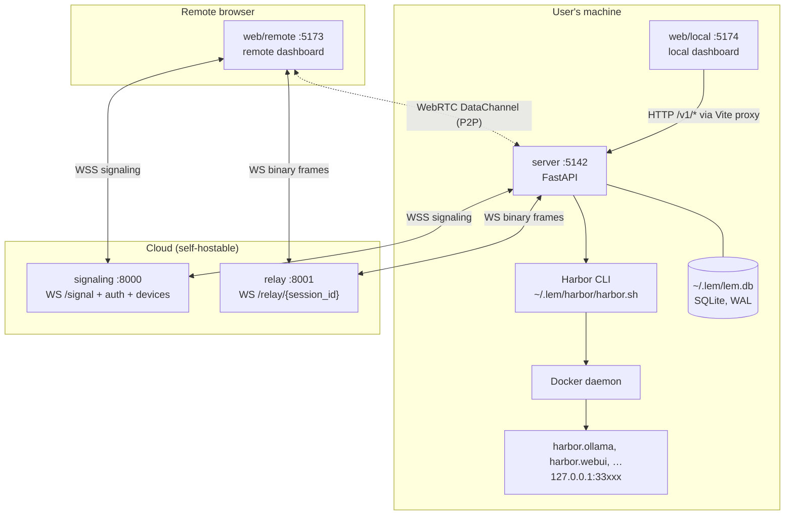
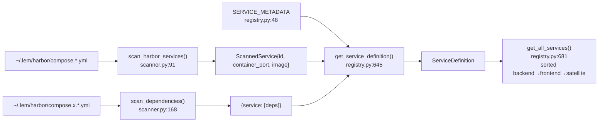
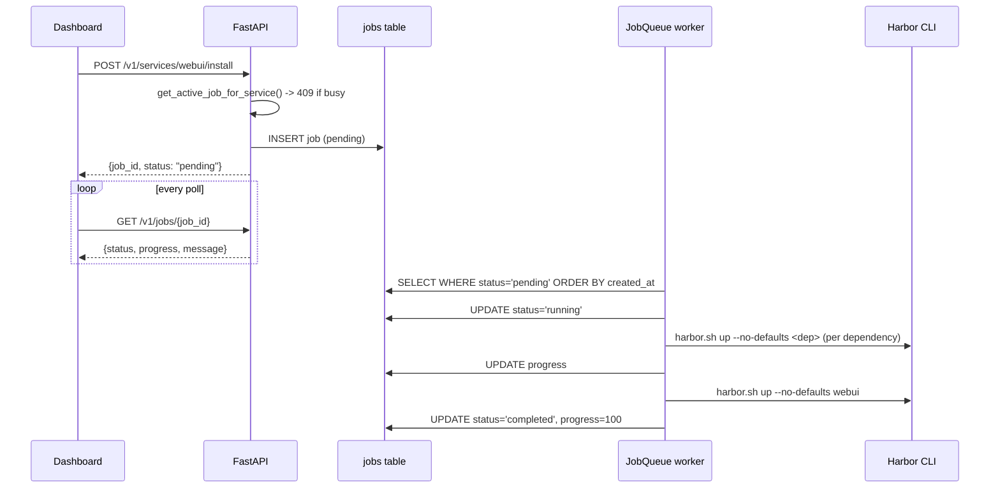
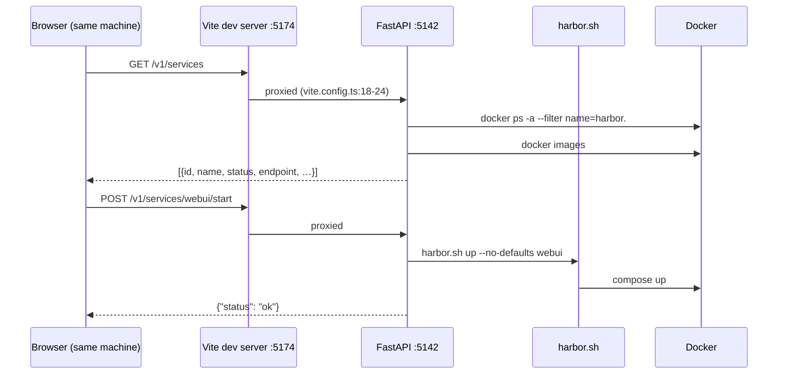
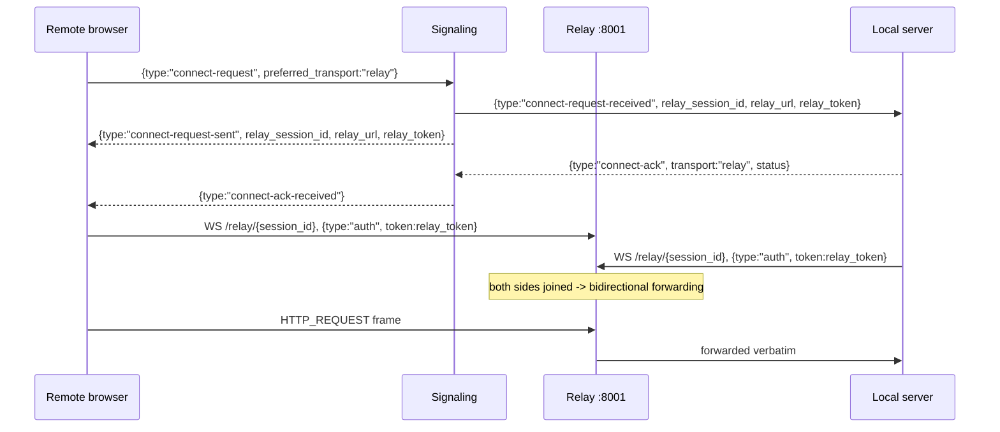

# Lem Architecture

**Scope**: what the code in this repository does today, on branch `main`, plus what is claimed
but not yet true. Every statement below is traceable to a file and line. Where something is
broken, it says so and points at the defect.

**Companion docs**: [`api.md`](./api.md) (endpoint contracts), [`platform.md`](./platform.md)
(OS and Docker differences), [`tunnel-proxy-spec.md`](./tunnel-proxy-spec.md) (the design that
makes remote app viewing work), [`implementation_plan.md`](./implementation_plan.md) (roadmap
reconciled with reality).

**Legend**

| Mark | Meaning |
|---|---|
| **Implemented** | Works, exercised by code paths that run today. |
| **Partial** | Ships, but with a named defect. |
| **Planned** | Designed or claimed, not built. |

---

## 1. The five components

| # | Component | Path | Port | Language | Status |
|---|---|---|---|---|---|
| 1 | Local server | `server/` | 5142 | Python 3.11+, FastAPI | **Implemented** |
| 2 | Local dashboard | `web/local/` | 5174 | React 19 + Vite | **Implemented** |
| 3 | Remote dashboard | `web/remote/` | 5173 | React 19 + Vite | **Partial** — control plane works; app viewing is implemented but unverified end to end ([#6](https://github.com/lem-app/lem/issues/6)) |
| 4 | Cloud signaling | `cloud/signaling/` | 8000 | Python, FastAPI | **Implemented** |
| 5 | Cloud relay | `cloud/relay/` | 8001 | Python, FastAPI | **Partial** — reachable, but auto-fallback cannot trigger ([#12](https://github.com/lem-app/lem/issues/12)) |

Ports are the defaults in `server/app/main.py:24`, `web/local/vite.config.ts:16`,
`web/remote/vite.config.ts:14`, `cloud/signaling/app/core/config.py` (`port: int = 8000`), and
`cloud/relay/app/core/config.py` (`port: int = 8001`).



---

## 2. Local server (`server/`)

FastAPI app created in `server/app/main.py:130-137`. Startup and shutdown are driven by the
`lifespan` context manager (`main.py:87-126`), which in order:

1. `init_db()` — creates `~/.lem/lem.db` and its four tables (`app/db.py:48-102`).
2. `init_job_queue()` + `register_job_handlers()` — starts the background worker
   (`app/jobs/queue.py:235-247`, `app/services/lifecycle.py:421`).
3. Constructs `TunnelManager` and wires it into the auth router
   (`app/tunnel/manager.py`, `app/api/v1/auth.py:52-59`).
4. Attempts `tunnel_manager.start()`, which is a no-op unless stored auth exists
   (`manager.py:74-78`).

### 2.1 Module map

```
server/app/
├── main.py                  # 26 endpoints + lifespan  (main.py:160-726)
├── api/v1/auth.py           # 4 endpoints, /v1/auth/*  (auth.py:203-436)
├── db.py                    # SQLite: settings, device, auth, jobs
├── crypto.py                # Ed25519 keypair, challenge signing
├── catalog/
│   ├── scanner.py           # reads ~/.lem/harbor/compose.*.yml
│   ├── registry.py          # curated metadata + merge
│   └── models.py            # ServiceDefinition, Service, ServiceStatus
├── services/
│   ├── status.py            # docker ps / docker images -> ServiceStatus
│   └── lifecycle.py         # harbor up/down/rm, job handlers
├── jobs/                    # queue.py, db.py, models.py
├── drivers/
│   ├── harbor_wrapper.py    # Harbor CLI subprocess wrapper
│   ├── runners/ollama.py    # legacy per-service driver
│   └── clients/openwebui.py # legacy per-service driver
└── tunnel/
    ├── manager.py           # TunnelAgent lifecycle for FastAPI
    ├── webrtc_client.py     # aiortc peer connection + signaling WS
    ├── relay_client.py      # WebSocket relay transport
    ├── message_dispatcher.py# frame_type -> handler
    ├── http_proxy.py        # HTTP frames -> aiohttp -> HTTP frames
    ├── ws_proxy.py          # WS frames -> upstream WebSocket
    ├── router.py            # path/?client= -> upstream base URL
    └── http_frame.py, ws_frame.py   # binary wire format (v2)
```

### 2.2 Harbor catalog scan pipeline — **Implemented**

Lem does not ship a service list. It derives one by reading Harbor's compose files.



Details that matter:

- **Filename is the service id.** `compose.ollama.yml` → `ollama`, via the regex at
  `scanner.py:127`. Extension files (`.x.` in the name) and the base `compose.yml` are skipped
  (`scanner.py:119-124`).
- **Container port** is the right-hand side of the first parseable `ports:` mapping
  (`scanner.py:40-72`), so `"${HARBOR_OLLAMA_HOST_PORT}:11434"` yields `11434`.
- **Dependencies** come from extension filenames: `compose.x.webui.ollama.yml` means "webui
  integrates with ollama" (`scanner.py:186-199`). `nvidia`, `cdi`, and `rocm` are filtered out
  because they are GPU variants, not dependencies (`scanner.py:193-195`).
- **Metadata** is a hand-curated dict keyed by service id (`registry.py:48-624`). A service
  with no entry gets a generated title-cased name and lands in the `satellite` category
  (`registry.py:627-642`), so an unknown Harbor service still appears rather than vanishing.
- **Caching**: `scan_harbor_services` is `@lru_cache(maxsize=1)` (`scanner.py:90`);
  `clear_cache()` (`scanner.py:205`) exists but nothing calls it, so adding a Harbor service
  requires a server restart to appear.

Runtime status is layered on separately (`services/status.py`):

| Condition | Status | Source |
|---|---|---|
| `docker ps -a --filter name=harbor.` shows `State == running` | `running` | `status.py:59-88`, `:207-214` |
| container present but `exited`/`created`/`paused` | `stopped` | `status.py:211-212` |
| no container, but an image name contains the service id | `stopped` | `status.py:98-152`, `:217-218` |
| otherwise | `not_installed` | `status.py:220` |

The endpoint URL for a running service is `http://127.0.0.1:<host_port>`, parsed out of
Docker's `Ports` string (`status.py:155-185`, `:246-249`). **This URL is meaningful only on the
machine running the server** — handing it to a remote browser is defect #1 of
[#6](https://github.com/lem-app/lem/issues/6).

Two known rough edges, both **Partial**:

- Image detection is a substring match with hand-rolled variations (`status.py:126-146`), so a
  service named `ui` matches almost any image.
- `_get_docker_env()` hardcodes `~/.docker/run/docker.sock` (`status.py:36`, `:39-44`, and again
  at `services/lifecycle.py:57-62`), which is the macOS Docker Desktop path. On Linux and WSL2
  the socket is `/var/run/docker.sock`, so every Docker call fails. This is
  [#10](https://github.com/lem-app/lem/issues/10); the fix is the `app.config.platform` module
  documented in [`platform.md`](./platform.md).

### 2.3 Job queue — **Implemented**

Long operations (image pulls, removals) are asynchronous jobs so an HTTP request never blocks
for ten minutes.



- Storage is the `jobs` table in the same SQLite file (`db.py:81-96`, mirrored in
  `jobs/db.py:35-62`), so jobs survive a restart.
- The worker is a single `asyncio.Task` polling every second (`jobs/queue.py:142-165`) and
  processes **one job at a time** — deliberate, since concurrent `harbor up` runs would fight
  over Docker.
- Handlers are registered per `JobType` (`queue.py:74-83`); today `install` and `remove`
  (`lifecycle.py:421-430`). `JobType.PULL_MODEL` is declared (`jobs/models.py:40`) but has no
  handler — a `pull_model` job would fail with "No handler registered"
  (`queue.py:181-186`). Model pulls currently go through the synchronous
  `POST /v1/runners/ollama/models/pull` instead.
- Install expands dependencies first, weighting progress 80/20 between dependencies and the
  main service (`lifecycle.py:186-215`).
- Jobs older than 7 days in a terminal state are deleted on worker start
  (`queue.py:147`, `jobs/db.py:312-340`).

### 2.4 Data model — **Implemented**

`~/.lem/lem.db`, SQLite in WAL mode (`db.py:59`). No migrations by design for v0.1
(`db.py:27`).

| Table | Columns | Purpose | Defined at |
|---|---|---|---|
| `settings` | `key` PK, `value` | Generic key/value. `get_setting`/`set_setting` exist (`db.py:124-165`) but have no caller anywhere in `server/app` — the table is unused today. | `db.py:64-67` |
| `device` | `id` PK, `pubkey`, `privkey`, `created_at` | This machine's identity. Single row — `register_device` deletes all rows first (`db.py:236`). | `db.py:69-74` |
| `auth` | `id` PK `CHECK (id = 1)`, `state_json` | One row holding `{email, jwt_token, device_id, signaling_url}` (`db.py:265-317`). | `db.py:76-79` |
| `jobs` | `id` PK, `type`, `service_id`, `status`, `progress`, `message`, `error`, `extra_json`, `created_at`, `updated_at` | Background job records; indexed on `status`, `service_id`, `created_at`. | `db.py:81-96` |

The Ed25519 keypair is generated on first login/register (`api/v1/auth.py:62-88`) and stored
base64-encoded in `device.pubkey` / `device.privkey`. The public key is uploaded to the
signaling server, and **the private key is used**: `crypto.py::sign_challenge` (`:108-125`)
loads it via `load_keypair_from_b64` (`:139`) and signs the server's registration challenge
(`auth.py:134`) and every signaling-connect challenge
(`app/tunnel/webrtc_client.py:754-793`). Authenticating to the cloud therefore takes both the
account JWT *and* possession of this key.

`public_key_from_b64` (`:163`) is the *verification* primitive and still has no production call
site — this process never has to verify anybody else's key, because tunnel peers are authorized
by asking the signaling server rather than by challenging them directly. That is the open half
of [#29](https://github.com/lem-app/lem/issues/29); see `app/tunnel/peer_auth.py`.

File permissions are enforced: `~/.lem` is 0700 and `lem.db` plus its WAL/SHM sidecars are 0600
(`db.py:46-47`, `:71`, `:84`); `~/.lem/api_token` is 0600 (`security.py:416`).

Signaling server storage is separate: `users` and `devices` tables in `signaling.db` (SQLite) or
PostgreSQL when `DATABASE_URL` starts with `postgresql`
(`cloud/signaling/app/db/database.py:29-30`, `:177-252`). The SQLite filename comes from
`DATABASE_FILE = os.environ.get("SQLITE_DB_FILE", "signaling.db")` (`database.py:34`), read at
call time by both consumers (`get_db()` at `:157`, `_init_sqlite()` at `:179`) so tests can
point it at a temporary directory. It was previously hardcoded, which was the cause of the
non-idempotent tests in [#20](https://github.com/lem-app/lem/issues/20); PR
[#24](https://github.com/lem-app/lem/pull/24) fixed it, and the signaling suite is now
idempotent.

---

## 3. Request flow, mode by mode

### 3.1 Local mode — **Implemented**



The local dashboard never talks to `:5142` directly in development; `web/local/vite.config.ts:18-24`
proxies `/v1` to `http://127.0.0.1:5142` (overridable with `VITE_API_TARGET`), which keeps the
browser same-origin and sidesteps CORS. The server nonetheless allows the two Vite origins plus
`:3000` explicitly (`main.py:141-154`).

Note: the local API **is** authenticated on `main` — a loopback-only default bind, a CSRF header
requirement on every state-changing request, and a bearer token required unless a loopback-only
bind was positively verified from the listening socket (`server/app/security.py`). PR
[#25](https://github.com/lem-app/lem/pull/25) merged and closed
[#7](https://github.com/lem-app/lem/issues/7). [`api.md`](./api.md) §2 has the rules.

### 3.2 Remote mode, WebRTC P2P — **Partial**

```mermaid
sequenceDiagram
  participant RB as Remote browser
  participant SIG as Signaling :8000
  participant LS as Local server (TunnelAgent)
  participant SVC as Local service

  RB->>SIG: POST /auth/login -> JWT
  RB->>SIG: POST /devices/challenge -> nonce
  RB->>SIG: POST /devices/register (device id, pubkey, signed nonce)
  RB->>SIG: GET /devices -> pick target device
  RB->>SIG: WS /signal, first message {type:"auth", token, device_id}
  SIG-->>RB: {type:"challenge", challenge, context}
  RB->>SIG: {type:"auth-response", signature}
  SIG-->>RB: {type:"connected", ice_servers}
  LS->>SIG: WS /signal (same auth handshake)
  RB->>SIG: {type:"offer", target_device_id, payload:SDP}
  SIG->>LS: same message + sender_device_id
  LS-->>SIG: {type:"answer", target_device_id, payload:SDP}
  SIG-->>RB: routed
  RB<-->LS: ICE candidates via signaling
  Note over RB,LS: RTCDataChannel opens
  RB->>LS: HTTP_REQUEST frame (0x01)
  LS->>SVC: aiohttp request
  SVC-->>LS: response
  LS-->>RB: HTTP_RESPONSE frame (0x02)
```

- Browser side: `web/remote/src/lib/webrtc.ts` + `hooks/useWebRTC.ts`; the target device is
  chosen in `DeviceSelector`, and `App.tsx:80-87` wires the hook.
- Server side: `TunnelAgent` in `server/app/tunnel/webrtc_client.py`, started by
  `TunnelManager.start()` (`manager.py:56-123`), which builds the `ws://…/signal` URL from the
  stored `signaling_url` (`manager.py:101-104`).
- Signaling never sees tunnel payload bytes; it routes JSON by `target_device_id`, and only to
  devices the sender's account owns (`cloud/signaling/app/api/signal.py:452-513`), with a 64 KiB
  per-message limit checked before parsing (`signal.py:306-307`).
- Frames are dispatched on byte 0 (`message_dispatcher.py:65-101`) into `HTTPProxyHandler` or
  `WSProxyHandler`.

Both clients implement the full handshake shown above, including the challenge step:
`web/remote/src/lib/webrtc.ts:485-489` and `:521-536` in the browser,
`server/app/tunnel/webrtc_client.py:557-561` and `:754-793` in the local server. Neither treats
the socket as usable before `connected` arrives.

**What works** once a connection is established: JSON API calls. `ServicesCatalog`,
`ClientSelector`, `APITester`, and job polling all go through `proxyFetch` and function.

**What is not yet confirmed**: viewing a service end to end. The two defects that made it
impossible are fixed — `ClientViewer` frames the same-origin `/app/<deviceId>/<serviceId>/`
path behind a Service Worker (Phase 4) instead of the local machine's `127.0.0.1:PORT`, and
proxied WebSockets reach `OPEN` now that `WS_CONNECT_ACK` exists on both sides and a shim is
injected into the framed document (Phase 5). What has *not* happened is a run against a real
Open WebUI from a second machine; the procedure that settles it is
[`testing_checklist.md`](./testing_checklist.md) §4.1. Full design:
[`tunnel-proxy-spec.md`](./tunnel-proxy-spec.md).

### 3.3 Remote mode, relay fallback — **Partial**

The relay is a dumb byte pipe: the two devices named by a session's grants are joined and frames
are forwarded verbatim (`cloud/relay/app/api/relay.py:32-121`,
`cloud/relay/app/core/session_manager.py:125-224`). It is dumb about the *payload* only — it
terminates TLS, so it sees every byte it forwards, and counts them (`:288-297`).



The mechanism functions when driven explicitly. **Automatic fallback does not trigger**
([#12](https://github.com/lem-app/lem/issues/12)):

- Server side, relay is only attempted once `webrtc_attempts >= max_webrtc_attempts`
  (`webrtc_client.py:704`, `:732-735`), but `_reconnect_full()` (`webrtc_client.py:771-865`)
  only re-opens the **signaling** WebSocket — it never waits for a peer connection — so it
  returns inside the 15 s window and `self.webrtc_attempts = 0` (`webrtc_client.py:722`) resets
  the counter every cycle. It can never reach 3.
- Even if it did, `relay_url` defaults to `ws://localhost:8001`
  (`webrtc_client.py:69`) and `TunnelManager` never overrides it (`manager.py:81`), so the
  server would dial its own machine.
- Browser side, the 10 s connection timeout sets state `failed`
  (`webrtc.ts`, `startConnectionTimeout`) but does not itself trigger reconnection, and
  `useWebRTC.ts:105-121` requires two `failed` transitions while `setState` de-duplicates
  repeats, so effective fallback latency is far longer than intended and never fires in
  `connectSignalingOnly` mode.
- After a fallback, `stopReconnection()` sets `shouldReconnect = false`
  (`webrtc.ts:239-241`) and nothing sets it back — WebRTC reconnection is dead for the rest of
  the session.

Also note: on the relay path frames are sent **in plaintext** to the relay
(`relay_client.py:223-235`), which terminates TLS, forwards them in the clear and meters their
size (`cloud/relay/app/core/session_manager.py:209-218`, `:288-297`). The protection is TLS to
the relay, not end-to-end encryption, and the relay operator is trusted with the traffic. The
README used to claim "End-to-end encryption: all remote traffic is encrypted"; it no longer
does, and both [`README.md`](../README.md#-security) and
[`cloud/relay/README.md`](../cloud/relay/README.md#security) now describe this path the same
way. End-to-end encryption here is roadmap, not shipped —
[#12](https://github.com/lem-app/lem/issues/12).

---

## 4. The tunnel wire protocol (v2)

One binary framing serves both transports. Byte 0 is the frame type
(`http_frame.py:54-61`, `http-frame.ts:52-58`):

| Code | Frame | Direction |
|---|---|---|
| `0x01` | HTTP_REQUEST | remote → local |
| `0x02` | HTTP_RESPONSE | local → remote |
| `0x10` | WS_CONNECT | remote → local |
| `0x11` | WS_DATA | both |
| `0x12` | WS_CLOSE | both |

Exact byte layouts, the four defects that make it unable to carry app content (text-only
bodies, no chunking, no streaming, unbounded declared lengths), the request-id correlation bug,
and the v3 replacement are all in [`tunnel-proxy-spec.md`](./tunnel-proxy-spec.md) §4–5. That
document is the reference; this section exists so the map is complete.

Routing on the local side: `RequestRouter.route(path)` (`router.py:59-100`) looks for
`?client=<id>` and resolves `openwebui` to the discovered Open WebUI port
(`router.py:127-131`); everything else falls through to `http://localhost:5142` — the
privileged local API. Nothing in the repository actually sets `?client=`, so in practice every
proxied request reaches the local API. That fall-through is the SSRF surface addressed by PR
[#25](https://github.com/lem-app/lem/pull/25) and [#8](https://github.com/lem-app/lem/issues/8).

---

## 5. Cloud signaling (`cloud/signaling/`)

FastAPI app (`app/main.py:36-60`) with four routers: health, auth, devices, signal.

| Concern | Implementation |
|---|---|
| Auth | Email/password → JWT (`api/auth.py:27-135`), HS256, 24 h expiry, `scope`-checked at every consumer (`core/config.py`). |
| Devices | Two-step registration with ed25519 proof of possession; the key is pinned on first use and replacing it needs a rotation signature from the key on file. A device id owned by another user is a 403 (`api/devices.py:175-282`). |
| Signaling | `WS /signal`; auth is a first `{"type":"auth"}` message followed by an ed25519 `challenge` / `auth-response` exchange (`api/signal.py:315-413`). The `?token=` query parameter was removed — it wrote credentials into access logs — and a request carrying one is refused with `unsupported-client`. |
| Routing | `ConnectionManager` maps `device_id` → WebSocket (`signal.py:34-100`); one connection per device, older one closed on re-register (`signal.py:53-64`). |
| Relay coordination | `connect-request` mints a server-side session id and a per-side single-use grant, answered with `connect-request-received` to the target and `connect-request-sent` to the requester (`signal.py:516-571`); a client-supplied `relay_session_id` is ignored. `connect-ack` is rewritten to `connect-ack-received` (`signal.py:496-500`). |
| ICE config | Sent in the `connected` message from `settings.ice_servers`; defaults to Google's public STUN (`core/config.py`). |
| Storage | SQLite (`signaling.db`) or PostgreSQL via `DATABASE_URL` (`db/database.py:29-30`). |

**Authorization**: `target_device_id` must be a device the sender's account owns
(`signal.py:480-485`); anything else gets the same `target-unavailable` answer as an offline
device, so the endpoint cannot be used to probe who is online. That closed
[#16](https://github.com/lem-app/lem/issues/16). `SECRET_KEY` and `CORS_ORIGINS` are mandatory
with no defaults, the published example keys are refused, and `CORS_ORIGINS` may not contain
`*` (`core/config.py:92-130`) — that closed
[#18](https://github.com/lem-app/lem/issues/18).

---

## 6. Cloud relay (`cloud/relay/`)

FastAPI app (`app/main.py:35-57`) with two routes: `GET /health`
(`api/health.py:25-36`, reporting the live session count) and `WS /relay/{session_id}`
(`api/relay.py:32-121`).

`RelaySession` holds two WebSockets and runs two forwarding tasks until either side closes
(`core/session_manager.py:186-224`). Idle sessions time out after `session_timeout` (300 s
default, `core/config.py`).

**Authorization**: the first frame must carry a `relay-session`-scoped grant minted by the
signaling server, not an account token (`core/security.py:114-131`). The grant names one
session id, one bearer device, one permitted peer and one account, is single-use, and carries a
mandatory short expiry. A session admits exactly the two devices its grants name; a third is
refused (`core/session_manager.py:125-170`). That closed
[#15](https://github.com/lem-app/lem/issues/15).

**What the relay still is not**: it terminates TLS and forwards frames in the clear, and meters
their size (`session_manager.py:209-218`, `:288-297`). Its operator is trusted with the
traffic — see §3.3.

---

## 7. Local dashboard (`web/local/`) — **Implemented**

React 19 + Vite + Tailwind v4 + shadcn/ui. `App.tsx` composes:

| Component | Talks to |
|---|---|
| `ServicesList` / `useServices` | `/v1/services`, `/v1/services/{id}/{install,start,stop,remove}` |
| `RunnersList` / `useRunners` | `/v1/runners`, `/v1/runners/ollama/*` |
| `ClientsList` / `useClients` | `/v1/clients`, `/v1/clients/openwebui/*` |
| `ModelPull` / `useModels` | `/v1/runners/ollama/models`, `…/models/pull` |
| `RemoteAccess` / `useTunnel` | `/v1/tunnel/{status,enable,disable}`, `/v1/auth/*` |
| `useJobs` | `/v1/jobs`, `/v1/jobs/{id}` |

All requests go to relative `/v1/…` paths and are proxied by Vite (`vite.config.ts:18-24`).
There is no test script in `web/local/package.json` ([#20](https://github.com/lem-app/lem/issues/20)),
and `web/local/README.md` is still the unmodified Vite scaffold
([#21](https://github.com/lem-app/lem/issues/21)).

---

## 8. Remote dashboard (`web/remote/`) — **Partial**

```
web/remote/
├── public/lem-app-sw.js     # the Service Worker: classify, proxy, splice the shim
└── src/
    ├── App.tsx              # login -> device select -> connect -> catalog/viewer
    ├── hooks/useAuth.ts     # login state; token custody lives in lib/session.ts
    ├── hooks/useWebRTC.ts   # owns WebRTCConnectionManager + RelayClient + HTTPProxy
    ├── lib/session.ts       # JWT in a module-scoped variable (see security note below)
    ├── lib/sw-bridge.ts     # registration, swAvailable detection, page<->worker bridge
    ├── lib/sw-status.ts     # user-facing text for each degradation reason
    ├── lib/webrtc.ts        # RTCPeerConnection + signaling WebSocket
    ├── lib/relay-client.ts  # relay WebSocket transport
    ├── lib/proxy-fetch.ts   # fetch() over the tunnel  (works)
    ├── lib/http-frame.ts    # v2 codec
    ├── lib/ws-proxy.ts      # ProxiedWebSocket + WSProxyManager (v3 ack state machine)
    ├── lib/ws-frame.ts      # v3 WS codec
    ├── lib/ws-bridge.ts     # window.__lemWsBridge — the framed shim calls in here
    ├── api/device-key.ts    # non-extractable ed25519 CryptoKey in IndexedDB
    └── components/
        ├── DeviceSelector.tsx   # GET /devices on the signaling server
        ├── ConnectionStatus.tsx
        ├── ServicesCatalog.tsx  # works, over proxyFetch
        ├── ClientSelector.tsx   # works, over proxyFetch
        ├── ServiceCard.tsx      # Launch disabled + reason when the worker is unavailable
        ├── APITester.tsx        # works, over proxyFetch
        └── ClientViewer.tsx     # frames /app/<deviceId>/<serviceId>/ via the Service Worker
```

Frame routing on receipt reads byte 0 and dispatches to the HTTP proxy or the WS proxy manager,
identically for both transports (`useWebRTC.ts:123-146` and `:206-222`).

Security note relevant to the tunnel spec: the signaling JWT is held in a **module-scoped
variable** in `lib/session.ts` and is persisted nowhere. It used to live in `localStorage`, which
Phase 4 turned from a defensible choice into a live exposure — the framed app at
`/app/<deviceId>/<serviceId>/` is genuinely same-origin with the dashboard and can read Web
Storage directly ([`tunnel-proxy-spec.md`](./tunnel-proxy-spec.md) §8.4 requirement 1, landed in
Phase 6). Two consequences worth knowing before changing this code:

- **A full page reload logs the user out**, deliberately. `lib/token-persistence.test.ts` asserts
  it, so re-persisting the token "to fix reloads" fails the suite rather than passing review. The
  `HttpOnly` refresh cookie that removes the cost is
  [#79](https://github.com/lem-app/lem/issues/79) and belongs to `cloud/signaling`.
- The ESLint rule banning `localStorage`/`sessionStorage` in `web/remote/src` is a tripwire, not
  the guarantee — it is defeated by any store it does not name. The guarantee is
  `lib/token-persistence.test.ts`, which asserts the positive property: after `storeToken()` the
  token is **not reachable from `globalThis`**, checked by walking the object graph rather than
  enumerating storage APIs. An earlier version of that test *did* enumerate, and was defeated in
  review by a single `Reflect.set(window, '__lemDebugCache', token)`. The walk states its own
  boundaries (closures and function-object properties are out of scope, with the reasons and the
  measurements); IndexedDB, the Cache API and cookies are instrumented separately.

The **device** keypair is a separate matter and still lives in IndexedDB (`api/device-key.ts`):
it is a non-extractable `CryptoKey`, so framed code can neither read it nor copy it out.

---

## 9. Honest status summary

| Capability | Status | Evidence |
|---|---|---|
| Harbor service discovery (80+ services) | **Implemented** | `catalog/scanner.py`, `catalog/registry.py` |
| Install / start / stop / remove | **Implemented** on macOS | `services/lifecycle.py`; broken on Linux/WSL2 — hardcoded Docker socket at `status.py:36`, `lifecycle.py:57-62` ([#10](https://github.com/lem-app/lem/issues/10)) |
| Async jobs with progress | **Implemented** | `jobs/queue.py`, `jobs/db.py` |
| Local dashboard | **Implemented** | `web/local/` |
| WebRTC signaling + DataChannel | **Implemented** | `webrtc_client.py`, `cloud/signaling/` |
| Remote JSON API access | **Implemented** | `proxy-fetch.ts`, `http_proxy.py` |
| Remote **app viewing** | **Partial** — anonymous apps load; anything needing a login does not | `lem-app-sw.js`, `sw-bridge.ts`, `ClientViewer.tsx`; cookie transport is blocked ([`tunnel-proxy-spec.md`](./tunnel-proxy-spec.md) §5.6.2, [#72](https://github.com/lem-app/lem/issues/72)) |
| Proxied WebSockets | **Implemented, unverified end to end** | `ws-proxy.ts`, `ws-bridge.ts`, `ws_proxy.py`; ack + shim covered in-suite, socket.io needs a browser ([#6](https://github.com/lem-app/lem/issues/6)) |
| Relay transport | **Implemented** | `relay_client.py`, `cloud/relay/` |
| Relay **auto-fallback** | **Not working** | `webrtc_client.py:704-743`, `:69` ([#12](https://github.com/lem-app/lem/issues/12)) |
| Local API authentication | **Implemented** | `server/app/security.py` — CSRF header always on, bearer token required unless a loopback-only bind was verified from the socket. PR [#25](https://github.com/lem-app/lem/pull/25) merged; the posture/bind decoupling in [#29](https://github.com/lem-app/lem/issues/29) is fixed |
| Cloud authorization (session / device ownership) | **Implemented** | PR [#45](https://github.com/lem-app/lem/pull/45) merged — **breaking**, see below. Signaling routes only to devices you own (`signal.py:480-485`); relay sessions are server-minted and bound by a signed single-use grant to two devices of one account (`cloud/relay/app/core/session_manager.py:125-170`). Closed [#15](https://github.com/lem-app/lem/issues/15) and [#16](https://github.com/lem-app/lem/issues/16) |
| Ed25519 device authentication | **Implemented** | Verified server-side at registration (`cloud/signaling/app/api/devices.py:222-239`) and at `/signal` (`signal.py:401-413`), and performed by both clients: `server/app/api/v1/auth.py:89-160` and `server/app/tunnel/webrtc_client.py:754-793`; `web/remote/src/api/auth.ts:151-183` and `web/remote/src/lib/webrtc.ts:521-536`. Keys are pinned on first registration; rotation needs a second signature from the key on file. PR [#68](https://github.com/lem-app/lem/pull/68) merged, closing the client half of [#17](https://github.com/lem-app/lem/issues/17) |
| Peer verification on the tunnel | **Interim gate** | `server/app/tunnel/peer_auth.py` checks the offering `sender_device_id` against the account's registered devices and denies unknown peers. It takes the signaling server's word for the identity; ed25519 proof of possession between peers is unbuilt ([#29](https://github.com/lem-app/lem/issues/29)) |
| End-to-end encryption on the relay path | **Planned, not shipped** | plaintext to the relay (`relay_client.py:223-235`); the relay sees and meters the traffic ([#12](https://github.com/lem-app/lem/issues/12)) |
| CI | **Implemented** | `.github/workflows/ci.yml` — 7 check runs incl. DCO, license headers, per-service coverage floors. PR [#26](https://github.com/lem-app/lem/pull/26) merged. The green-baseline half of [#20](https://github.com/lem-app/lem/issues/20) is still open: format/lint gates are currently red |

**PR #45 (`fix/cloud-authz`) was a breaking signaling/relay protocol change, and it is merged.**
It replaced the guessable `${browserDeviceId}-${targetDeviceId}` relay session id with a
server-minted one, requires a per-side single-use session grant instead of the account token at
the relay, and added an ed25519 challenge/response to both device registration and the `/signal`
handshake. **PR #68 (`feat/ed25519-proof-of-possession`) then taught both clients to speak it**
and pinned each device's key on first registration, closing the client half of
[#17](https://github.com/lem-app/lem/issues/17). Anything written against the pre-#45 handshake
needs rewriting; the contract is documented in
[`cloud/signaling/README.md`](../cloud/signaling/README.md) and
[`cloud/relay/README.md`](../cloud/relay/README.md), reflected in
[`api.md`](./api.md) §12–13, and the client-side work is enumerated in
[`tunnel-proxy-spec.md`](./tunnel-proxy-spec.md) §6.1.
