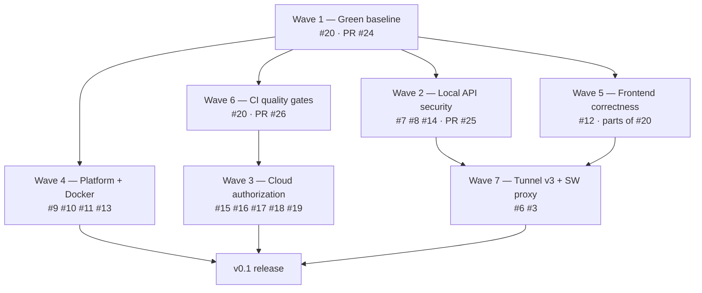

# Implementation Plan: v0.1 → v1.0

**Purpose**: a roadmap reconciled with what the code actually does. The README's roadmap marks
four of five v0.1 items complete; measured against the source, two of those are not.

Tracking epic: [#23](https://github.com/lem-app/lem/issues/23).

---

## 1. Where we actually are

| README v0.1 claim | Measured reality |
|---|---|
| ☑ Local Ollama + Open WebUI management | **True on macOS.** 80+ services discovered from Harbor compose files; install/start/stop/remove work. Broken on Linux and WSL2 — the Docker socket is hardcoded to the macOS Docker Desktop path (`server/app/services/status.py:36`, `server/app/services/lifecycle.py:57-62`), [#10](https://github.com/lem-app/lem/issues/10). |
| ☑ WebRTC P2P remote access | **Control plane only.** JSON API calls work over the DataChannel — catalog, install/start/stop, job polling, `APITester`. Viewing a service does not: `web/remote/src/components/ClientViewer.tsx:281-286` renders `<iframe src={appInfo.url}>` where the URL is the *local machine's* `127.0.0.1:PORT`, so the remote browser loads its own loopback. [#6](https://github.com/lem-app/lem/issues/6). |
| ☑ Relay fallback for restricted networks | **Cannot trigger.** Relay is attempted only after `webrtc_attempts >= 3` (`server/app/tunnel/webrtc_client.py:704`, `:732`), but `_reconnect_full()` (`:771`) only re-opens the *signaling* socket, returns inside the 15 s window, and resets the counter to 0 (`:722`) every cycle. Even if it fired, `relay_url` defaults to `ws://localhost:8001` (`:69`) and `TunnelManager` never overrides it (`manager.py:81`). [#12](https://github.com/lem-app/lem/issues/12). |
| ☑ Basic authentication and device registration | **JWT only.** The Ed25519 keypair is generated (`server/app/api/v1/auth.py:155-157`), stored, uploaded — and never used to sign anything. [#17](https://github.com/lem-app/lem/issues/17). |
| ☐ Production-ready deployment scripts | Not done, and what exists is broken. [#19](https://github.com/lem-app/lem/issues/19). |

Plus three things the roadmap does not mention:

- **`main` does not pass its own quality gates.** 5 failing server tests, 19 % coverage against
  a stated 80 % target, 9 ruff errors, non-idempotent signaling tests, 0 relay tests, and a
  `tsc --noEmit` that type-checks zero files. No CI exists.
  [#20](https://github.com/lem-app/lem/issues/20).
- **The local API that controls Docker has no authentication at all.**
  [#7](https://github.com/lem-app/lem/issues/7).
- **Three proven cross-account compromises in the cloud services**, each needing nothing but a
  free account: [#15](https://github.com/lem-app/lem/issues/15) (join any relay session),
  [#16](https://github.com/lem-app/lem/issues/16) (drive a stranger's machine into an
  attacker-chosen session), [#8](https://github.com/lem-app/lem/issues/8) (SSRF through the
  tunnel).

Corrected roadmap, for the README:

```markdown
### v0.1 (in progress)
- [x] Local service management via Harbor (80+ services)
- [x] Async job queue with progress
- [x] Local dashboard
- [x] WebRTC signaling and DataChannel transport
- [x] Remote control plane (list, install, start, stop, job status)
- [ ] Remote app viewing (#6)
- [ ] Relay auto-fallback (#12)
- [ ] Local API authentication (#7)
- [ ] Cloud authorization (#15, #16)
- [ ] Linux/WSL2 correctness (#10)
- [ ] CI and a green baseline (#20)
- [ ] One-command install
```

---

## 2. Principles

1. **No roadmap tick without a passing check.** Every item below names the test or manual step
   in [`testing_checklist.md`](./testing_checklist.md) that proves it.
2. **Security before publicity.** The three cross-account compromises must land before any
   public deployment is advertised.
3. **Green baseline first.** Repairs land on a `main` that has CI, or they regress silently —
   this is exactly how the v1→v2 frame-format drift survived five merged PRs.
4. **YAGNI.** Nothing in the plan exists because it might be useful; each item closes a named
   issue or unblocks one that does.

---

## 3. Waves

Seven waves. Waves 1–2 gate everything; 3–6 are largely parallel; wave 7 depends on 1 and 2.



### Wave 1 — Green baseline · [#20](https://github.com/lem-app/lem/issues/20) · PR [#24](https://github.com/lem-app/lem/pull/24)

Nothing else is trustworthy until the gates are.

- Repair the stale frame-format tests in both languages (they assert the v1 layout; the wire is
  v2).
- Move dev dependencies out of `[project.optional-dependencies]` so the README's own
  `uv sync && uv run pytest` works on a fresh checkout.
- Give the signaling tests a per-test temporary database (`tests/test_api.py:40` sets
  `db_module.DATABASE_FILE`, which does not exist; the code hardcodes `"signaling.db"` at
  `app/db/database.py:90`, `:112`).
- Fix ruff and eslint errors; run prettier.
- Point type-checking at `tsconfig.app.json` so it checks files.
- Correct the README's paths (`lem-app/server` and `lem/lem-app/web/local` do not exist; the
  real paths are `server/` and `web/local/`).

**Done when**: `uv run pytest`, `mypy`, `ruff`, `vitest`, `tsc -p tsconfig.app.json --noEmit`,
`eslint`, and `prettier --check` all pass in all five units on a clean checkout.

### Wave 2 — Local API security · [#7](https://github.com/lem-app/lem/issues/7) [#8](https://github.com/lem-app/lem/issues/8) [#14](https://github.com/lem-app/lem/issues/14) · PR [#25](https://github.com/lem-app/lem/pull/25)

- Bind to `127.0.0.1` by default; LAN exposure opt-in via `LEM_HOST`.
- Bearer token at `~/.lem/api_token` (mode 0600), required on `/v1/*` for non-loopback binds.
- CSRF: require `X-Lem-Client` on state-changing requests; validate `Origin` against the same
  allowlist the CORS config uses.
- Close the tunnel SSRF: validate the peer-supplied path, join rather than concatenate it onto
  the routed base URL, filter hop-by-hop and proxy-controlled request headers, stop following
  redirects.
- Cap peer-declared lengths before allocating (`MAX_BODY_BYTES` 32 MiB, `MAX_HEADERS_BYTES`
  256 KiB) and cap live WebSocket connections (`MAX_WS_CONNECTIONS` 64).
- `~/.lem` mode 0700; `lem.db` (+ WAL/SHM) and `api_token` mode 0600.

**Done when**: `tests/test_security.py` and `tests/tunnel/test_http_proxy_security.py` pass;
manual checks in [`testing_checklist.md`](./testing_checklist.md) §3.2 pass.

Wave 7 builds on this branch, not on `main` — see
[`tunnel-proxy-spec.md`](./tunnel-proxy-spec.md) §6.

### Wave 3 — Cloud authorization · [#15](https://github.com/lem-app/lem/issues/15) [#16](https://github.com/lem-app/lem/issues/16) [#17](https://github.com/lem-app/lem/issues/17) [#18](https://github.com/lem-app/lem/issues/18) [#19](https://github.com/lem-app/lem/issues/19)

- **Relay session ownership** (#15): bind a `session_id` to the account that created it and
  reject any other. Today the relay only checks that the token decodes
  (`cloud/relay/app/core/security.py:43-56`) — any account joins any session and reads or
  injects peer traffic.
- **Signaling target ownership** (#16): check that `target_device_id` belongs to the sender's
  account before routing (`cloud/signaling/app/api/signal.py:272`, `:303`).
- **Ed25519 device authentication** (#17): either use the keypair — challenge/response at
  signaling connect — or stop generating it and correct the README claim.
- **Fail-closed secrets** (#18): refuse to boot with the default
  `dev-secret-key-change-in-production` in any environment that is not explicitly local, not
  only when `ENV=production`.
- **Deployment** (#19).

**Done when**: [`testing_checklist.md`](./testing_checklist.md) §3.4's three
currently-failing security checks pass, each with a regression test.

### Wave 4 — Platform and Docker correctness · [#9](https://github.com/lem-app/lem/issues/9) [#10](https://github.com/lem-app/lem/issues/10) [#11](https://github.com/lem-app/lem/issues/11) [#13](https://github.com/lem-app/lem/issues/13) · branch `fix/platform-and-docker-correctness`

- Land `app/config/platform.py` and route every Docker and Harbor call through it. See
  [`platform.md`](./platform.md).
- Stop the destructive image removal path (#13).
- Move blocking `subprocess.run` off the event loop with `asyncio.to_thread` (#11).
- Make `/v1/health` probe Docker and Harbor for real instead of returning `"docker": "ok"`
  unconditionally (`server/app/main.py:160-174`).

**Done when**: the §3.2 manual checks pass on macOS, Linux, and WSL2, and
`tests/test_platform.py` passes without a Docker daemon.

### Wave 5 — Frontend correctness · parts of [#20](https://github.com/lem-app/lem/issues/20), [#12](https://github.com/lem-app/lem/issues/12)

- **Relay auto-fallback** (#12), both halves:
  - Server: make `_reconnect_full()` actually wait for a peer connection so the attempt counter
    can advance, and thread the real relay URL through `TunnelManager` instead of the
    `ws://localhost:8001` default.
  - Browser: trigger fallback from the 10 s timeout rather than requiring two de-duplicated
    `failed` transitions (`useWebRTC.ts:105-121`, `webrtc.ts` `startConnectionTimeout`), and
    restore `shouldReconnect` after `stopReconnection()` (`webrtc.ts:239-241`) so WebRTC
    reconnection is not dead for the rest of the session.
  - Either implement end-to-end encryption for the relay path or correct the README — frames
    reach the relay in plaintext (`server/app/tunnel/relay_client.py:141-154`).
- Connection lifecycle and token handling in `web/remote`.
- Type-checking that checks files; a test script for `web/local`.

**Done when**: §4 step 9 of [`testing_checklist.md`](./testing_checklist.md) passes with a
UDP-blocked network, fallback visible within 15 s.

### Wave 6 — CI quality gates · [#20](https://github.com/lem-app/lem/issues/20) · PR [#26](https://github.com/lem-app/lem/pull/26)

Six jobs — `server`, `cloud/signaling`, `cloud/relay`, `web/local`, `web/remote`, license
headers — plus contributor templates. Required for merge.

**Done when**: every wave-1 gate runs on every PR and blocks merge on failure.

### Wave 7 — Remote app viewing · [#6](https://github.com/lem-app/lem/issues/6) [#3](https://github.com/lem-app/lem/issues/3)

The headline feature. Full design, byte layouts, state machines, and per-phase acceptance
criteria: [`tunnel-proxy-spec.md`](./tunnel-proxy-spec.md).

| Phase | Content |
|---|---|
| 0 | One-line request-id correlation fix (`http_proxy.py:115`, `data[:4]` → `data[1:5]`) — lands independently, converts 30 s hangs into instant 500s |
| 1 | v3 frame codecs in both languages, with cross-language golden vectors |
| 2 | Server-side streaming proxy: binary bodies, chunking, backpressure, header filtering, cancellation |
| 3 | Browser streaming client + `HELLO` version negotiation |
| 4 | Service Worker, `/app/<serviceId>/` routing, `ClientViewer` rewrite |
| 5 | `WS_CONNECT_ACK` / `WS_CONNECT_ERROR`, WebSocket shim injection |
| 6 | Degradation path, security hardening, truthful UI copy |

**Done when**: §4 steps 5–8 of [`testing_checklist.md`](./testing_checklist.md) pass from a
different machine on a different network, with all local services on the remote machine stopped.

---

## 4. v0.1 definition of done

From [#23](https://github.com/lem-app/lem/issues/23), unchanged:

- [ ] Every gate in [#20](https://github.com/lem-app/lem/issues/20) green, enforced by CI
- [ ] All `critical`-labelled issues closed
- [ ] Remote access demonstrably works end to end: connect from another machine, open a service,
      stream a model response
- [ ] Coverage meets the > 80 % bar `CLAUDE.md` sets
      ([#22](https://github.com/lem-app/lem/issues/22))
- [ ] A one-command install that works on macOS, Linux, and WSL2
- [ ] README claims match measurable behaviour

Plus, from this document:

- [ ] Docs suite exists and every `CLAUDE.md` link resolves
      ([#21](https://github.com/lem-app/lem/issues/21))
- [ ] The relay path is either end-to-end encrypted or the README no longer claims it is
- [ ] The Ed25519 key is either used or removed

---

## 5. After v0.1

### v0.2 — make it pleasant

| Item | Why now | Notes |
|---|---|---|
| Per-service origins for framed apps | The same-origin Service Worker gives the framed app the dashboard's origin privileges, including its `localStorage` | [`tunnel-proxy-spec.md`](./tunnel-proxy-spec.md) §8.4, Phase 7. Needs wildcard DNS + certificate. |
| Streaming request uploads | v3 buffers request bodies in the Service Worker | Non-goal N2 of the tunnel spec |
| Model pull as a background job | `JobType.PULL_MODEL` is declared (`server/app/jobs/models.py:40`) with no handler registered (`services/lifecycle.py:421-430`), so pulls block an HTTP request for minutes | |
| Catalog cache invalidation | `scan_harbor_services` is `@lru_cache(maxsize=1)` and `clear_cache()` (`catalog/scanner.py:205`) has no caller — a new Harbor service needs a server restart to appear | `fix/platform-and-docker-correctness` adds an mtime fingerprint |
| Real RFC 7807 responses | FastAPI nests the problem detail under `detail` and sends `application/json` | [`api.md`](./api.md) §1 |
| Multi-runner support | The runner/client endpoints are hardcoded to Ollama and Open WebUI (`main.py:191-217`, `:287-313`) | The catalog already generalises; the legacy endpoints do not |
| Metering and usage | Bytes and requests per session; `RelaySession` already counts bytes (`cloud/relay/app/core/session_manager.py:42-43`) | |

### v1.0 — from the README

| Item | Prerequisite |
|---|---|
| Device sharing (invite collaborators) | Wave 3's ownership model — sharing is meaningless until ownership is enforced |
| Multi-runner support | v0.2 |
| Advanced metering and usage tracking | v0.2 |
| Mobile app (iOS/Android) | Wave 7 — the tunnel must carry app content first |
| Browser extension | Wave 7 |

---

## 6. Sequencing notes

- **Wave 7 branches from wave 2**, not from `main`. PR #25 rewrites the same two files v3
  touches (`http_proxy.py`, `http_frame.py`). Building on `main` guarantees a conflict that
  loses one side's security controls.
- **Wave 6 before wave 3.** Cloud authorization changes are exactly the kind that regress
  silently; land CI first so they cannot.
- **Wave 4 is independent** of the tunnel work and can run fully in parallel.
- **Phase 0 of wave 7 can land any time** — it is a one-line fix with an obvious test and does
  not depend on the rest of v3.
- **Do not tick a README roadmap box** until the corresponding
  [`testing_checklist.md`](./testing_checklist.md) check passes. That practice is what produced
  the gap this document exists to close.
