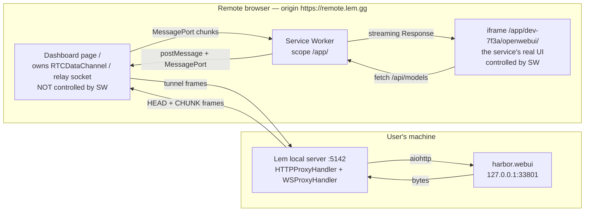
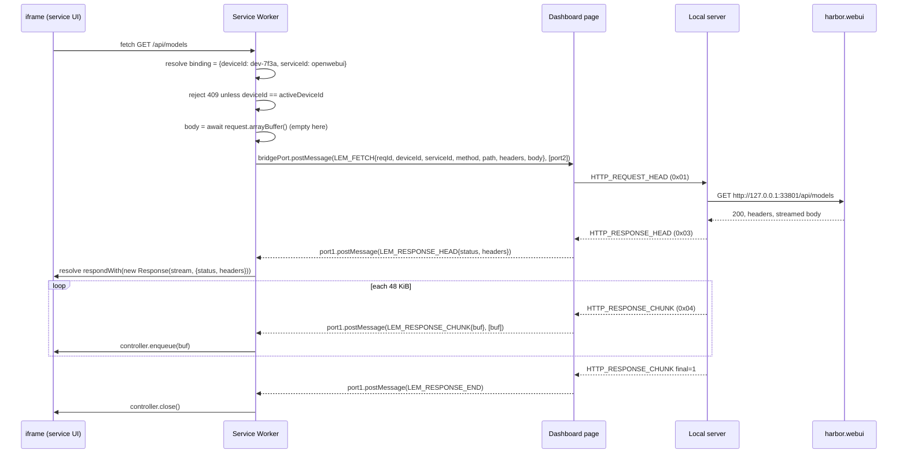
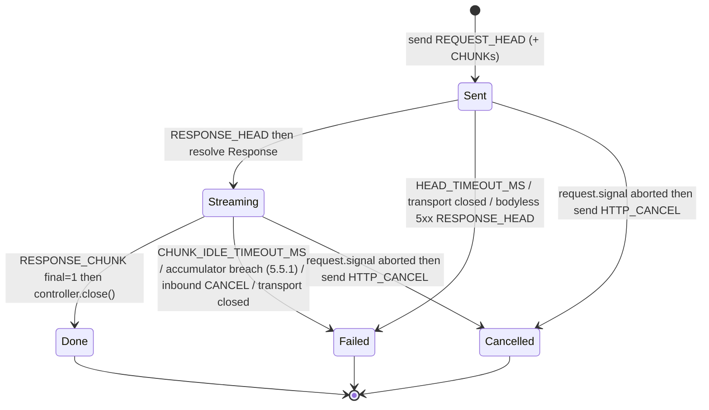
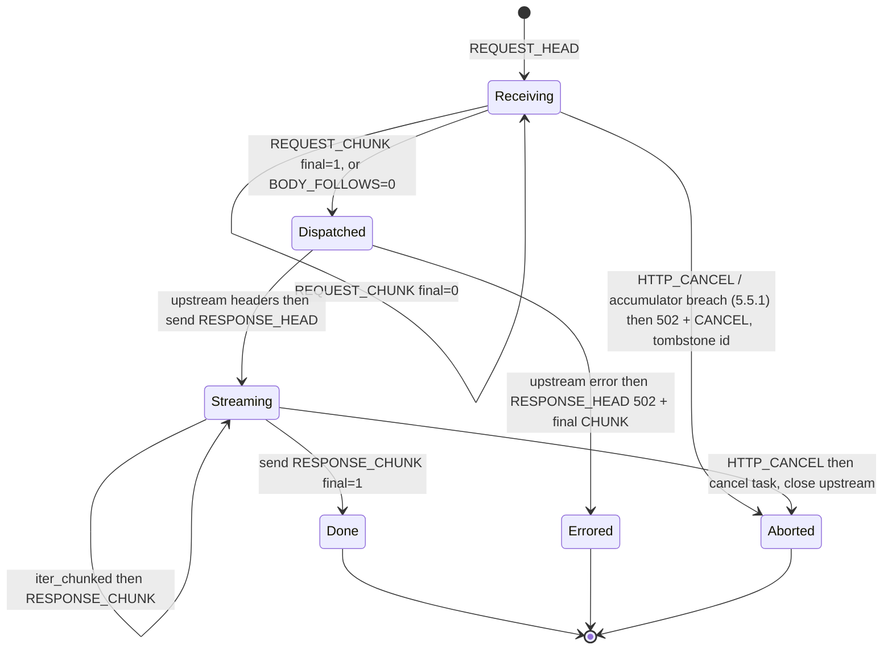
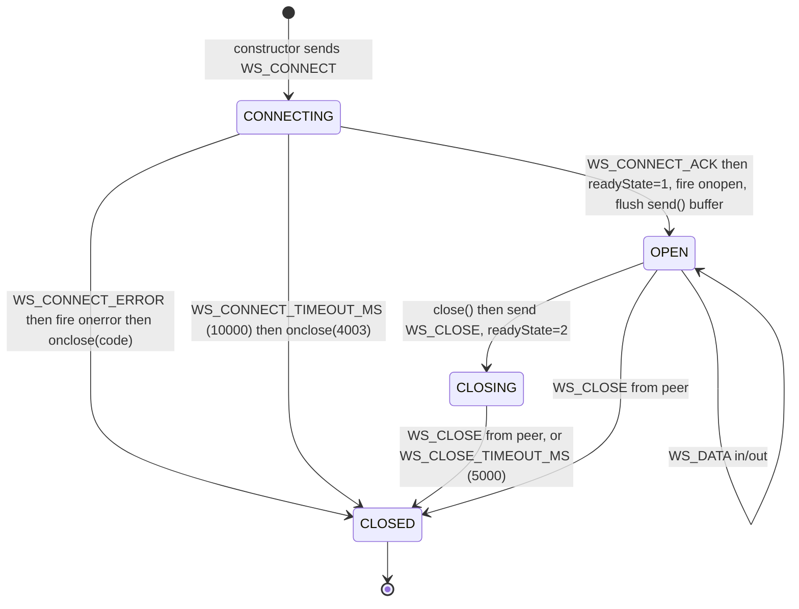
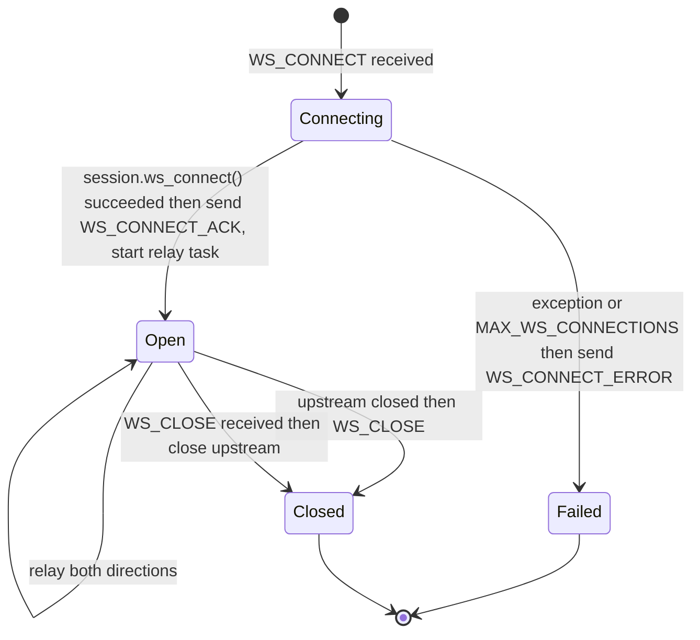

# Tunnel Proxy Spec: Same-Origin Service Worker + Tunnel Protocol v3

**Status**: Approved design, not yet implemented
**Tracks**: [#6](https://github.com/lem-app/lem/issues/6) (remote app viewing is broken), [#3](https://github.com/lem-app/lem/issues/3) (protocol v3)
**Composes with**: PR [#24](https://github.com/lem-app/lem/pull/24) (`fix/green-baseline`), PR [#25](https://github.com/lem-app/lem/pull/25) (`fix/local-api-security`)
**Audience**: the engineer implementing it. Every decision below is settled; build from it, do not re-derive it.

---

## 1. Why this document exists

Lem's headline promise is "access your home AI setup from work or travel". Today the remote
dashboard can call JSON APIs on your machine and nothing else. Opening a service shows you
*your own laptop's* localhost.

Three independent defects, each individually fatal:

1. **The iframe bypasses the tunnel entirely.**
   `web/remote/src/components/ClientViewer.tsx:281-286` renders `<iframe src={appInfo.url}>`.
   `appInfo.url` comes from the local server (`ClientViewer.tsx:83` / `:98` via `proxyFetch`)
   and is a *local-machine* URL such as `http://127.0.0.1:33801`
   (`server/app/services/status.py:247`). The remote browser resolves that against its own
   loopback. `proxyFetch` is used for metadata only — never for app content. There is no
   Service Worker, no URL rewriting, no `srcdoc`.
   Meanwhile `ClientViewer.tsx:290-293` and `ClientSelector.tsx:197-198` both tell the user
   "All HTTP requests and WebSocket connections are automatically routed through the secure
   WebRTC tunnel."

2. **Proxied WebSockets never reach OPEN.**
   `web/remote/src/lib/ws-proxy.ts:99` sends WS_CONNECT and then waits forever.
   `WSProxyManager.handleConnectionOpened()` (`ws-proxy.ts:444`) exists but nothing calls it.
   There is no ack frame type (`http-frame.ts:52-58`), and the server agrees:
   `server/app/tunnel/ws_proxy.py:146` says *"Note: We could send a WS_CONNECT_ACK frame here,
   but for simplicity, client assumes success"*. `_readyState` stays `CONNECTING`, `onopen`
   never fires, and every `send()` throws at `ws-proxy.ts:162-164`.

3. **WebSocket interception is gated on a parameter nothing sets.**
   `websocket-intercept.ts:46-79` proxies only when `?client=` is present on the page or the
   socket URL; nothing in the repo ever sets it (same dead branch at `proxy-fetch.ts:113-118`).
   And `setupWebSocketIntercept` patches `window.WebSocket` in the *parent* realm
   (`websocket-intercept.ts:140`) — a cross-origin iframe has its own realm, so the patch
   could not apply even if the flag were set.

On top of that, the wire protocol cannot carry app content even if the plumbing were right:
bodies are `str` (§4.1), a whole response is one DataChannel message (§4.2), and a 4 GiB
declared length is accepted (§4.4).

**Goal of this spec**: make "connect from another machine, open Open WebUI, stream a model
response" work, and make the wire protocol able to carry it.

---

## 2. Goals and non-goals

### Goals

| # | Goal |
|---|---|
| G1 | A remote user can open a local service's real UI in the dashboard, and every subresource (JS, CSS, fonts, images, wasm) loads through the tunnel. |
| G2 | Binary bodies survive end to end, byte for byte. |
| G3 | A response larger than the DataChannel message limit transfers successfully. |
| G4 | Streamed responses (SSE / `application/x-ndjson` / chunked LLM output) arrive **incrementally**, token by token, not buffered to completion. This is a product requirement, not a size workaround. |
| G5 | Proxied WebSockets reach `OPEN` and `send()` works, so Open WebUI's socket.io and Ollama streaming function. |
| G6 | Failures surface as errors the user can act on, promptly — never a 30 s hang or silent corruption. |
| G7 | A v2 peer and a v3 peer detect the mismatch and fail loudly instead of exchanging garbage. |
| G8 | Hard, enforced size and concurrency caps on every peer-declared length. |

### Non-goals (explicitly out of scope for v3)

| # | Non-goal | Rationale |
|---|---|---|
| N1 | Per-request flow control / credit windows on the browser→SW response stream. | Bounded by the 32 MiB per-message cap. Revisit if a real workload hits it. |
| N2 | Streaming *request* uploads from a `ReadableStream` body. | Request bodies are buffered in the Service Worker before framing. Chunked request framing exists (§5.4) so large uploads work; incremental *origination* does not. |
| N3 | HTTP/2 or HTTP/3 semantics, trailers, `100-continue`. | Nothing in the stack needs them. |
| N4 | A real security boundary between the framed app and the dashboard. | Requires per-service origins; see §8.4 and the Phase 7 note. |
| N5 | End-to-end encryption over the relay path. | Separate work; see [#12](https://github.com/lem-app/lem/issues/12). Frames are plaintext to the relay today (`server/app/tunnel/relay_client.py:141-154`). |
| N6 | Multiple simultaneous *active* tunnels in one dashboard tab. | One tunnel at a time per tab. The path **does** carry a device segment (`/app/<deviceId>/<serviceId>/`, §3.1) so that a request bound to a previous device is rejected rather than silently re-routed — but v3 does not keep two tunnels open at once. |

---

## 3. Part 1 — Same-origin Service Worker proxy

### 3.1 The decision

**A service is viewed at a same-origin path on the dashboard's own origin. A Service Worker
scoped to that path intercepts every request the framed app makes and performs it over the
tunnel.**

```
https://remote.lem.gg/app/<deviceId>/<serviceId>/<pathInsideService>
```

**The device segment is mandatory** (decided; see §10, decision 2). A path that identifies only
the service is ambiguous the moment the dashboard's active target device changes, and the
Service Worker outlives every React component that could have cleaned up after it. Concretely:
the SW's `clientBindings` store (§3.5 step 4) persists for 24 h across reloads and SW restarts;
an app-spawned `Worker`, a bfcache-restored document, or an iframe whose unmount handler did not
run can all issue a fetch after the dashboard has switched targets. Without the segment those
requests resolve to a binding written for the *old* device and are forwarded to the *new* one —
wrong content at best, and at worst one machine's request landing on another.

The Service Worker **rejects** a request whose `<deviceId>` does not match the currently active
tunnel, with `E_DEVICE_MISMATCH` → `409` (§7.1). It does **not** re-route it to the active
device, and it does not silently rewrite the path. Failing visibly is the point: a stale frame
that shows an error is diagnosable; a stale frame that quietly starts showing another machine's
data is not.

> **Honest note on the evidence.** An earlier draft cited `App.tsx:187` ("Change Device") as
> proof this race is reachable *today*. It is not: `App.tsx:154-169` returns `<ClientViewer>`
> in an early branch, so while a service is being viewed the only affordance rendered is "Back
> to Dashboard", which unmounts the iframe first. The justification above does not depend on
> that button — it rests on Service Worker and IndexedDB lifetimes, which are the parts of the
> Phase-4 design that genuinely outlive React state.

The iframe's `src` is *always* same-origin. `appInfo.url` — the local `http://127.0.0.1:PORT`
endpoint — is never given to the browser as a URL to load. It is used only server-side, by the
router, to pick an upstream.

Why a Service Worker and not the alternatives:

| Alternative | Why rejected |
|---|---|
| Rewrite HTML/CSS/JS URLs in the proxy | Cannot catch runtime-constructed URLs (`fetch('/api/' + id)`), dynamic `import()`, or worker scripts. Endless whack-a-mole. |
| `srcdoc` + inline everything | Same problem, plus opaque origin kills `localStorage`/IndexedDB that real apps need. |
| Patch `fetch`/`XMLHttpRequest` in the iframe realm | Misses ``, `<link>`, CSS `url()`, `<script src>`, wasm streaming, and anything a nested worker does. |
| Service Worker | Intercepts **every** fetch a controlled client makes, at the platform level, including subresources, workers, and navigations. |

### 3.2 The scope rule that makes it work

A Service Worker controls *documents whose URL is inside its scope*. Once it controls a
document, its `fetch` handler sees **every** request that document makes — including requests
whose URL is outside the scope, and cross-origin requests.

This single fact is what solves the absolute-path problem (§3.5) and is the reason the design
works at all.

- SW script: `web/remote/public/lem-app-sw.js`, served at `/lem-app-sw.js`.
- Registered scope: `/app/`.
  The script sits at the origin root, so it may claim any sub-path; no
  `Service-Worker-Allowed` header is needed.
- The dashboard's own document (`/`) is **outside** `/app/` and is therefore never controlled.
  The dashboard's own fetches — signaling, `proxyFetch` over the DataChannel, its own bundle —
  are untouched by the SW. This is deliberate and load-bearing (see §8.2).

### 3.3 Components



Responsibilities:

| Component | Owns |
|---|---|
| Dashboard page | The tunnel (`WebRTCConnectionManager` / `RelayClient`), the `HTTPProxy` correlation table, service session registration, the WebSocket bridge. |
| Service Worker | URL resolution, prefix stripping, the SW↔page bridge, constructing `Response` objects, the security refusals of §3.8. |
| iframe | Nothing Lem-specific except the injected WebSocket shim (§3.7). |

The Service Worker deliberately holds **no** tunnel state. It cannot: a `RTCDataChannel`
cannot be transferred into a worker, and the SW can be killed and restarted at any moment. All
tunnel ownership stays in the page.

> **Correction: the SW does call `clients.matchAll()`, for one thing.** §3.4 step 2 says the SW
> "never searches for its page with `clients.matchAll()`", and for *finding the bridge port* that
> is right — the page pushes the port. But `LEM_BRIDGE_HELLO` (§3.5) is defined as a broadcast to
> all clients on `activate`, and there is no other way to reach them. The rule is therefore
> narrower than it was stated: the SW never uses `matchAll` to *obtain a port*, only to ask pages
> to send it one.

### 3.4 Registration and session lifecycle

1. On mount, the dashboard calls
   `navigator.serviceWorker.register('/lem-app-sw.js', { scope: '/app/' })`.
   If registration rejects or `navigator.serviceWorker` is absent → degraded mode (§3.9).
2. The dashboard awaits `navigator.serviceWorker.ready`, creates a `MessageChannel`, and sends
   `{ type: 'LEM_BRIDGE_INIT' }` with `port2` transferred to the SW. The SW stores `port2` as
   `bridgePort`. The SW never searches for its page with `clients.matchAll()`; the page pushes
   the port.
3. Before rendering the iframe, the dashboard registers a **service session**:
   `bridgePort.postMessage({ type: 'LEM_SESSION_OPEN', deviceId, serviceId, ackId })`, where
   `deviceId` is the target device the tunnel is currently connected to. The SW replies
   `LEM_SESSION_ACK { ackId }`, and the dashboard **awaits that reply** before creating the
   iframe at `/app/<deviceId>/<serviceId>/`.

   The acknowledgement is load-bearing, not ceremony: a `postMessage` to a worker and a
   navigation into that worker's scope are two independent queues with no ordering between them.
   A frame created optimistically can have its very first request answered `410` by a worker that
   has not processed `LEM_SESSION_OPEN` yet — intermittently, and more often on a slow machine,
   which is the worst shape of bug to find later.
4. On unmount, `LEM_SESSION_CLOSE` removes the session; the SW rejects further requests for it
   with 410 (§7.1).
   On a **device change**, the dashboard sends `LEM_ACTIVE_DEVICE { deviceId }` before opening
   any new session. The SW stores exactly one `activeDeviceId` and answers `409`
   (`E_DEVICE_MISMATCH`) to any request whose path segment names a different device — including
   requests from clients still bound to the old device via steps 1–4 of §3.5. It never
   re-routes them (§3.1).
5. On tunnel loss, the dashboard sends `LEM_TUNNEL_DOWN`; in-flight SW requests are failed with
   503 and new ones are refused until `LEM_TUNNEL_UP`.

`skipWaiting()` + `clients.claim()` are **not** used. A newly deployed SW takes over on the
next navigation. Claiming mid-session would leave an iframe controlled by a worker that never
received `LEM_SESSION_OPEN`.

### 3.5 Request resolution — the heart of the SW

The framed app issues three shapes of request:

| Shape | Example | Carries prefix? |
|---|---|---|
| Navigation into the scope | `GET /app/dev-7f3a/openwebui/` | yes |
| Root-relative from the app | `GET /api/models`, `GET /static/x.js` | **no** |
| Absolute cross-origin | `GET https://cdn.jsdelivr.net/x.js` | n/a |

The SW must resolve all three to `(deviceId, serviceId, upstreamPath)`.

#### Resolution algorithm (normative)

```
onfetch(event):
  url = new URL(event.request.url)

  # A. Not our origin -> not ours. Decided synchronously; respondWith is never
  #    called, so the browser performs it exactly as it would with no SW.
  if url.origin != self.location.origin:
      return                                  # fall through to network, see §3.8

  # B. Explicit prefix wins, always.
  m = /^\/app\/([A-Za-z0-9._-]{1,64})\/([A-Za-z0-9._-]{1,64})(\/.*)?$/.exec(url.pathname)
  if m and m[1] not in ('.', '..') and m[2] not in ('.', '..'):
      deviceId  = m[1]
      serviceId = m[2]
      upstreamPath = (m[3] || '/') + url.search
      if event.request.mode == 'navigate':
          bindClient(event.resultingClientId, deviceId, serviceId)  # NOT event.clientId
      event.respondWith(proxy(deviceId, serviceId, upstreamPath, event.request))
      return

  # C. No prefix. Resolve the owning client, then proxy or fail closed.
  event.respondWith(resolveAndProxy(event, url))

resolveAndProxy(event, url):
  binding = await resolveBindingForClient(event)    # -> {deviceId, serviceId} | null
  if binding is null:
      return problem(421, 'E_NO_SESSION', url.pathname)      # step 6, fail closed
  return await proxy(binding.deviceId, binding.serviceId,
                     url.pathname + url.search, event.request)

proxy(deviceId, serviceId, upstreamPath, request):
  bridge = await waitForBridge()               # BRIDGE_WAIT_MS; no frame is sent
  if bridge is null:
      return problem(503, 'E_BRIDGE_UNAVAILABLE')
  # The device check: after the bridge, before anything reaches the page.
  if deviceId != self.activeDeviceId:
      return problem(409, 'E_DEVICE_MISMATCH', deviceId)
  ...
```

Both branches check the device **after** resolution and **before** proxying, and both fail the
request rather than substituting the active device. A binding recovered from IndexedDB (step 4)
can name a device the dashboard left hours ago; that is exactly the case the check exists for.

> **Three corrections from building it.** An earlier revision of this pseudocode could not be
> implemented as written, and following it literally produced two wrong behaviours.
>
> 1. **The device check cannot precede the bridge wait.** Branch B originally read "Device check
>    happens BEFORE any tunnel work". A cold-started worker has `activeDeviceId === null` until
>    the page re-sends `LEM_ACTIVE_DEVICE`, so that ordering answers `409` to every request after
>    every worker recycle — contradicting the cold-start worked example three paragraphs below,
>    which expects the request to succeed. The check belongs immediately after `waitForBridge()`
>    and immediately before the `LEM_FETCH`: waiting for the page puts nothing on the wire, so
>    "no frame is sent on a mismatch" still holds, and "wrong device" is no longer conflated with
>    "not told yet".
> 2. **Branch C's `if binding is null: return` was unimplementable and contradicted step 6.**
>    `event.respondWith()` must be called synchronously during dispatch, and resolution steps 3
>    and 4 are `await`ed, so the decision to intercept cannot depend on the result. It also
>    contradicted step 6 and §3.8, both of which say an unresolvable same-origin path is `421`.
>    The "uncontrolled client → network" case it was reaching for is already structural: `/` is
>    outside scope `/app/`, so an uncontrolled client's requests never reach this handler at all.
> 3. **The grammar admits `.` and `..`.** `[A-Za-z0-9._-]` includes the dot, so `/app/../../x`
>    parses as `deviceId = '..'`. A browser normalises that away before issuing a request, but the
>    worker also parses referrers and stored records, where nothing has normalised anything. Both
>    segments must reject the two dot segments explicitly — as must the server's `X-Lem-Service`
>    validation, which uses the same character class.

`resolveBindingForClient` runs these steps **in order** and stops at the first hit. Every step
yields a `{deviceId, serviceId}` pair, never a bare service id — the device is part of the
binding, so a stale binding is *detectable* rather than invisible:

| Step | Source | Notes |
|---|---|---|
| 1 | In-memory `Map<clientId, {deviceId, serviceId}>` | Populated at navigation (`event.resultingClientId`) and by step 3. |
| 2 | `event.request.referrer` | For a subresource fetched by the iframe document this is the iframe's own URL, e.g. `https://remote.lem.gg/app/dev-7f3a/openwebui/`. Same-origin, so the default `strict-origin-when-cross-origin` policy sends the full path. Parse `/app/<deviceId>/<serviceId>/` out of it and, if `event.clientId` is non-empty, cache the binding. |
| 3 | `await clients.get(event.clientId)` → `client.url` | Survives an empty referrer (`Referrer-Policy: no-referrer` set by the app, `<meta name=referrer>`, `fetch(..., {referrerPolicy:'no-referrer'})`) because it does not depend on the referrer at all. Works for `window`, `worker`, and `sharedworker` clients — a worker the app spawned was itself loaded from `/app/<deviceId>/<serviceId>/…`, so its `client.url` carries the full prefix. |
| 4 | IndexedDB store `lem-sw/clientBindings` | The in-memory map is lost every time the browser kills an idle SW. Every binding written in steps B/2/3 is mirrored here with a 24 h TTL, and this step reads it back. Records are `{clientId, deviceId, serviceId, expiresAt}` — **keyed by `clientId`, storing `deviceId`**, which is what lets the caller reject a binding written for a device the dashboard has since left. |
| 5 | Single-session fallback | If exactly one service session is open **on the active device**, use it. Log a warning with the request URL — hitting this step routinely means steps 1–4 have a bug. Sessions for any other device are not candidates. |
| 6 | **Fail closed** | Return a synthetic `421 Misdirected Request` (§7.1) whose body names the unresolvable URL. Never guess between two sessions. |

Why the referrer is step 2 and not step 1: it is the cheapest signal, but it is also the one an
app can switch off. Steps 3 and 4 are the ones that make the design robust; the referrer is an
optimisation that avoids an async `clients.get()` on the hot path.

**Empty-referrer worked example.** Open WebUI serves
`Referrer-Policy: no-referrer` on some builds. A request for `/static/chunk-abc.js` then
arrives with `referrer === ''`. Step 2 yields nothing. Step 3 calls
`clients.get('<clientId of the iframe document>')`, gets
`https://remote.lem.gg/app/dev-7f3a/openwebui/`, extracts `{deviceId: 'dev-7f3a', serviceId:
'openwebui'}`, caches it in the map and IDB, and — `dev-7f3a` being the active device — the
request proceeds. No user-visible difference.

**Stale-device worked example.** The user views Open WebUI on `dev-7f3a`, returns to the
dashboard, and switches the target to `dev-91c2`. The dashboard sends
`LEM_ACTIVE_DEVICE { deviceId: 'dev-91c2' }`. A `SharedWorker` the old app spawned is still
alive and fetches `/api/models`. Step 1 misses (the SW was recycled), step 4 recovers
`{deviceId: 'dev-7f3a', serviceId: 'openwebui'}` from IndexedDB. `dev-7f3a !== 'dev-91c2'`, so
the SW answers `409 E_DEVICE_MISMATCH` and forwards nothing. Without the device segment this
request would have been proxied to `dev-91c2` — a different machine — and returned whatever
that machine's `openwebui` had to say.

**Cold-start worked example.** The SW was killed while the iframe sat idle. The user clicks a
button; the app fetches `/api/chat/completions`. The SW boots with an empty map, `LEM_BRIDGE_INIT`
has not been re-sent yet. Step 3 resolves the service. `proxy()` finds `bridgePort === null`,
so it waits up to `BRIDGE_WAIT_MS = 3000` for the page's re-`LEM_BRIDGE_INIT` (the page
re-sends it from its `navigator.serviceWorker.oncontrollerchange` and on
`onmessage` of the SW's `LEM_BRIDGE_HELLO` broadcast, which the SW emits on activation).
If the bridge does not arrive, respond `503` (§7.1).

#### `proxy()` — page round trip



The `Response` is constructed and returned **as soon as `LEM_RESPONSE_HEAD` arrives**, wrapping
a `ReadableStream` that is fed by subsequent chunk messages. This is what makes G4 real: the
`<script>` starts executing, the SSE `EventSource` starts firing, and LLM tokens paint as they
arrive.

#### SW↔page message contract

| Message | Direction | Payload |
|---|---|---|
| `LEM_BRIDGE_INIT` | page → SW | `[MessagePort]` transferred |
| `LEM_BRIDGE_HELLO` | SW → all clients | broadcast on `activate`, asks pages to re-init |
| `LEM_ACTIVE_DEVICE` | page → SW | `{ deviceId }` — sent on connect and on every device change, before any `LEM_SESSION_OPEN` |
| `LEM_SESSION_OPEN` | page → SW | `{ deviceId, serviceId, ackId? }` |
| `LEM_SESSION_ACK` | SW → page | `{ ackId }` — the page awaits this before creating the iframe (§3.4) |
| `LEM_SESSION_CLOSE` | page → SW | `{ deviceId, serviceId }` |
| `LEM_TUNNEL_UP` / `LEM_TUNNEL_DOWN` | page → SW | `{}` |
| `LEM_FETCH` | SW → page | `{ reqId, deviceId, serviceId, method, path, headers: [[k,v]…], body: ArrayBuffer \| null }`, plus a transferred reply `MessagePort`. The page re-checks `deviceId` against its own live tunnel and answers `LEM_RESPONSE_ERROR{E_DEVICE_MISMATCH}` on a mismatch — the SW's check is not the only one, because the page is the side that actually owns the tunnel. |
| `LEM_RESPONSE_HEAD` | page → SW | `{ reqId, status, headers: [[k,v]…] }` |
| `LEM_RESPONSE_CHUNK` | page → SW | `{ reqId, buf }`, `buf` transferred |
| `LEM_RESPONSE_END` | page → SW | `{ reqId }` |
| `LEM_RESPONSE_ERROR` | page → SW | `{ reqId, code, message }` (§7.1) |
| `LEM_CANCEL` | SW → page | `{ reqId }` when the iframe aborts (`event.request.signal`) |

Headers travel as **arrays of `[name, value]` pairs**, never objects, in both this contract and
on the wire (§5.2). An object silently collapses duplicate `Set-Cookie` headers, which breaks
login for every real app.

### 3.6 What the page does with a `LEM_FETCH`

The page maps `serviceId` → an upstream selector the local server's router understands and
issues the request through the existing `HTTPProxy` (upgraded to v3, §5).

The current router (`server/app/tunnel/router.py:59-100`) resolves `?client=openwebui` to the
discovered Open WebUI port and otherwise falls through to `http://localhost:5142`. That is a
one-service special case (`router.py:127-131`, including the `http://127.0.0.1:3000` sentinel at
`:131` that the router reads as "not found"). v3 requires a general selector; the page sends the
service id and the server resolves it through the same status machinery that `/v1/services`
uses — **in strict mode**. See §3.6.1, which is a code change, not a routing policy.

**Normative**: the request path put on the wire is the *upstream* path (`/api/models`), and the
target service is carried in a request header `X-Lem-Service: <serviceId>`. Not a query
parameter — a query parameter mutates the URL the upstream app sees and has already caused one
class of bug here (`proxy-fetch.ts:112-118` injecting `?client=` into arbitrary URLs).

Server-side, `RequestRouter.route()` gains a header-aware entry point. `X-Lem-Service` is
consumed by the router and **stripped before forwarding** — add it to PR #25's
`PROXY_CONTROLLED_HEADERS` set (`server/app/tunnel/http_proxy.py`, the frozenset defined
alongside `HOP_BY_HOP_HEADERS`) so a peer cannot smuggle its own value through. Both frozensets
exist **only on PR #25's branch**; neither name appears anywhere on `main` today (§5.5, §6).

An unknown or not-running `serviceId` produces `502` with the §7.1 taxonomy, never a fall
through to `localhost:5142`. The current silent fallback (`router.py:93-100` — the
"falling back to local server" warning, then the unconditional
`return self.local_server_url`) is how a mistyped service id ends up hitting the privileged
local API instead of erroring. Delete the `openwebui` special case at `router.py:127-131` and
the `http://127.0.0.1:3000` sentinel in `get_openwebui_url()`: a sentinel value that a caller
reinterprets as "not found" is a bug waiting to be rediscovered.

#### 3.6.1 Strict port resolution — a code change, not a policy

**Decided** (see §10, decision 1). Naming a caller "authoritative" does not disable a guess
that lives *inside* it. On `main` today:

- `_parse_host_port(ports_str, container_port)` (`server/app/services/status.py:155-185`) tries
  the container-port-specific pattern first (`:171-176`) and, **on a miss, silently falls
  through** to a fallback regex (`:178-183`) that returns the first host port it finds anywhere
  in the Docker `Ports` string, with no verification that it maps to the right container port.
- `get_service_endpoint()` (`:223-249`) — the general mechanism — calls that same function at
  `:244`. So does `get_all_services_with_status()` at `:284`.

Routing tunnel traffic through `get_service_endpoint` therefore inherits the guess; it only
moves it one layer further from view. The fix has to be in the resolver.

**Normative contract.** `_parse_host_port` gains a strict mode. The spec fixes the *contract*
and leaves the shape to the implementer — a `strict: bool` parameter, or a separate
`parse_host_port_strict` entry point, are both acceptable:

| Mode | Behaviour on a container-port miss | Callers |
|---|---|---|
| **strict** | Return `None`. Never run the fallback regex. A `container_port` of `None` is itself a miss — you cannot match exactly against an unknown target. | **Tunnel routing only.** |
| lenient | Current behaviour: fall through to the fallback regex. | The local dashboard's own service list and `endpoint`/`host_port` display. |

**Tunnel routing MUST use strict mode.** When strict resolution yields no port, the tunnel
returns `E_UNKNOWN_SERVICE` (§7.1) naming the service, and forwards nothing. Guessing where to
send an authenticated request is a security decision disguised as a convenience: a wrong guess
delivers the caller's credentials to whatever else happens to be listening on that host port.
This is the same rule as [#29](https://github.com/lem-app/lem/issues/29) applied to addresses
instead of identities — the tunnel must not forward to an address it cannot positively resolve,
for the same reason it must not extend credentials to a peer it cannot positively identify.

**The lenient path may remain**, unchanged, for the local dashboard's display. There the failure
mode of a wrong guess is a broken link on a page the user is already looking at, on their own
machine — not an authenticated request sent somewhere unintended. Deleting it would regress
services whose container port the catalog does not declare, for no security gain.

**Where this lands after PR #27.** PR #27 (`fix/platform-and-docker-correctness`, unmerged)
rewrites `services/status.py` substantially, and the correction must be written against *that*
version, not `main`'s. What changes:

- `_parse_host_port` **survives with its fallback regex intact** — PR #27 only lifts the
  function-local `import re` to module scope. The gap is not fixed there.
- PR #27 funnels every port lookup through one new helper,
  `_endpoint_for(service_id, container) -> tuple[int | None, str | None]`, which all three
  call sites now use. **That helper is the right place for the `strict` flag**: threading one
  boolean through `_endpoint_for` into `_parse_host_port` covers every caller, which is a
  strictly smaller change than it would have been on `main`.
- PR #27 also adds `get_service_url(service_id) -> str | None` — synchronous, non-raising, and
  documented in its own docstring as being "used by callers that cannot await (e.g. tunnel
  request routing)". **That is the tunnel's entry point**, and it is the function that must pass
  `strict=True`. `get_all_services_with_status()` keeps `strict=False`.

Concretely, against PR #27's file: `get_service_url` → `_endpoint_for(..., strict=True)` →
`_parse_host_port(..., strict=True)`, and `_parse_host_port` returns `None` instead of reaching
its fallback regex. Land this on PR #27's branch, not on `main`; if PR #27 lands first, apply it
to the merged result. Either way the acceptance test is the same: a container whose `Ports`
string publishes a port that does **not** map to the catalog's `container_port` resolves to
`None` for the tunnel and to the guessed port for the dashboard, asserted separately.

### 3.7 WebSocket shim: injection point and the race

Because the iframe is now same-origin, the parent *can* touch `iframe.contentWindow`. The
question is *when*.

**The race, stated precisely.** `iframe.onload` fires after the document has parsed and its
scripts have run. Open WebUI opens its socket.io connection during app boot. Injecting at
`load` is therefore always too late for the first connection. Setting properties on
`iframe.contentWindow` *before* load does not survive either: the synchronous initial
`about:blank` window is discarded when the real document commits, taking any properties with
it.

**Resolution — the shim is delivered by the SW, and bound by the parent.**

1. **Parent, before the iframe exists.** The dashboard installs `window.__lemWsBridge` on its
   *own* window — an object with `connect(url, protocols)`, `send`, `close`, and an event
   callback registry, backed by the `WSProxyManager`. This happens synchronously in the effect
   that opens the session, strictly before the iframe element is appended. The parent never
   reaches into the child; the child reaches *out*.

   > **Note from the implementation: the callbacks are an argument, not a registry.**
   > `connect(url, protocols, sink)` takes the shim's `{open, message, error, close}` in the same
   > call.
   >
   > **This is API hygiene, not a bug fix, and the earlier draft of this note overstated it.**
   > It claimed a registry filled in on the line *after* `connect` "can miss the `open`". No such
   > race is reachable in this codebase, and no test demonstrates one: `createConnection` replays
   > no frames, every inbound frame including the ack arrives through an external async event, and
   > JavaScript runs no other code between two consecutive synchronous statements — which is
   > exactly why `new WebSocket(url); ws.onopen = fn` is safe against the platform API. What
   > passing the sink in *does* buy is that the ordering no longer **depends** on the manager never
   > delivering an ack synchronously; the registry form is correct only for as long as that
   > property holds, and nothing enforces it. Prefer the argument form for that reason, not
   > because the alternative is broken today.
   >
   > `connect` also sets the underlying `ProxiedWebSocket`'s `binaryType` to `arraybuffer` and
   > hands the shim a plain `ArrayBuffer`, so the *frame* mints the `Blob`. A `Blob` built in the
   > dashboard's realm fails `instanceof Blob` inside the app, and apps do check.

2. **Service Worker, in the response.** When `proxy()` produces a response for a **navigation**
   request whose `Content-Type` starts with `text/html`, the SW splices a single inline
   `<script>` in as the **first child of `<head>`** (or, if no `<head>` is found before the
   first `<script>` or `<body>`, immediately after the doctype). This is the injection point.
   Because the browser executes scripts in document order, a shim spliced ahead of the app's
   first `<script>` runs before any of the app's own code — so *given a correct splice*, the
   ordering race is closed.

   Splicing happens on the byte stream, not on a buffered document: the SW passes the response
   through a `TransformStream` that scans only the first `HTML_SNIFF_BYTES = 65536` bytes for
   the insertion point and thereafter forwards untouched. If no insertion point is found in
   that window, the shim is not injected and the SW posts a `LEM_SHIM_SKIPPED` diagnostic —
   HTTP still works, WebSockets in that document do not.

   **The correctness of the splice is a real requirement, not a given.** Calling this
   "race-free by construction" would overstate it: the insertion point is found by scanning a
   *stream*, and the marker can straddle a chunk boundary. `<he` at the end of one chunk and
   `ad>` at the start of the next must still match. Normatively, the transform MUST:

   - retain a carry-over buffer of at least `max(len(marker)) - 1` bytes between chunks, and
     search the concatenation of carry-over and new chunk, not the chunk alone;
   - decode as bytes with an ASCII-safe scan, not by `TextDecoder`-ing each chunk
     independently — a multi-byte UTF-8 sequence split across chunks otherwise yields
     replacement characters inside the document;
   - emit nothing downstream until either the insertion point is found or
     `HTML_SNIFF_BYTES` is exhausted, so the shim cannot be spliced *after* bytes the browser
     has already begun parsing;
   - treat the buffered prefix as a hard bound on memory: `HTML_SNIFF_BYTES` is the maximum
     the transform may hold before it gives up and forwards untouched.

   With those four properties the ordering guarantee holds for the documented cases. Without
   the first two it fails intermittently, on exactly the large HTML documents where it matters,
   which is the failure mode a "by construction" claim would hide. A test that feeds the
   transform a document split at every byte offset across the marker is the cheap way to pin
   this.

3. **Shim behaviour in the iframe realm.** The injected script replaces
   `window.WebSocket` with a class that:
   - resolves absolute/relative URLs against the iframe's own base and normalises
     `ws://`/`wss://` against `location`;
   - calls `window.parent.__lemWsBridge.connect(...)` (same-origin, so this is a direct call,
     no `postMessage` serialization on the hot path);
   - **buffers** `send()` calls issued before the bridge reports OPEN and flushes them on
     `WS_CONNECT_ACK` — real apps do call `send()` synchronously after construction;
   - if `window.parent.__lemWsBridge` is absent (bridge torn down, dashboard reloaded), fails
     the connection with close code `4002` (§7.2) rather than falling back to a native socket
     that would hit the *remote* browser's own network.
   - copies the static `CONNECTING`/`OPEN`/`CLOSING`/`CLOSED` constants, exactly as
     `websocket-intercept.ts:122-137` already does.

4. **Parent, on `load`, as belt and braces.** The parent additionally calls
   `iframe.contentWindow.__lemAttachWsBridge?.(bridge)` in the `load` handler. The shim exposes
   that function and uses the passed bridge in preference to walking `window.parent`. This
   covers the case where the dashboard is itself framed and `window.parent` is not the
   dashboard. It is *not* the primary mechanism and must never be relied on for the first
   connection.

`websocket-intercept.ts` in its current form is deleted: its `?client=` gate
(`websocket-intercept.ts:46-79`) is dead code, and patching the parent realm
(`websocket-intercept.ts:140`) is the wrong realm. The `WSProxyManager` and `ProxiedWebSocket`
classes survive and become the bridge implementation.

### 3.8 Security boundary: what the SW must refuse

| Request | SW behaviour | Why |
|---|---|---|
| Cross-origin absolute URL from a controlled client (`https://cdn.example/x.js`) | **Do not call `respondWith`.** Let the browser fetch it normally. | The tunnel must never become an open proxy to arbitrary internet hosts on the user's behalf. Passing through is also what would happen with no SW at all, so it is the least surprising behaviour. Rejecting outright would break apps that legitimately load a public CDN. |
| Same-origin request from an **uncontrolled** client (the dashboard itself) | Do not intercept. | The dashboard's own bundle, `/lem-app-sw.js`, and its `proxyFetch` traffic must never enter the tunnel path. This is enforced structurally: `/` is outside scope `/app/`, so the dashboard is never a controlled client. |
| `GET /lem-app-sw.js` from a controlled client | `403` (§7.1). | An app must not be able to read the worker source to look for the bridge protocol, and must not be able to trigger a re-registration. |
| Same-origin path from a controlled client that resolves to no session (§3.5 step 6) | `421`. | Never guess a service. |
| Request whose `<deviceId>` ≠ the active tunnel's device (§3.1) | `409` `E_DEVICE_MISMATCH`. **Never re-routed to the active device.** | A stale iframe, worker, or IndexedDB binding must not have its requests silently redirected to a different machine. Fail visibly; the user can reload. |
| Any request while `LEM_TUNNEL_DOWN` | `503`. | Fail fast instead of hanging. |
| `event.request.mode === 'navigate'` targeting `/app/…` **in the top-level frame** | Allowed, but the SW sets `Content-Security-Policy: frame-ancestors 'self'` and the dashboard treats a top-level `/app/` load as a hard-reload of the whole session. | Opening a service in a new tab is a legitimate affordance. See §8.4 for what it costs. |
| Upstream `Location:` on a 3xx | Rewritten: root-relative paths, relative references, and **absolute loopback URLs** are re-prefixed to `/app/<deviceId>/<serviceId>/…` — carrying the **same** device segment as the request being answered, never the active one; anything else is passed through verbatim. | Without this, a login redirect to `/auth/callback` escapes the prefix on the *next* navigation. PR #25 already stops the *server* from following redirects (`allow_redirects: False`), which is what makes this rewrite possible. |

> **Correction: "same-origin-to-upstream absolute URLs" was not implementable as written.** The
> Service Worker never learns the upstream's origin — the service id is resolved to a port on the
> *far* machine, by the far machine. What it does know is that every upstream this design can
> reach is a loopback address (`services/status.py::_endpoint_for` builds
> `http://127.0.0.1:<port>`), so "absolute loopback URL" is the same set, stated in terms the
> worker can evaluate. It is also the set that *must* be rewritten rather than passed through:
> handing a remote browser `http://127.0.0.1:33801/auth/callback` verbatim points it at its own
> loopback, which is defect #1 of [#6](https://github.com/lem-app/lem/issues/6) reappearing one
> redirect later.

Response headers the SW **strips before constructing the `Response`**:
`Content-Security-Policy` and `Content-Security-Policy-Report-Only` from the upstream (they
were written for the app's own origin and will otherwise block the injected shim),
`X-Frame-Options`, `Strict-Transport-Security`, `Public-Key-Pins`. The SW substitutes its own
CSP: `frame-ancestors 'self'; base-uri 'self'`. `sandbox` directives from upstream are dropped.

Response headers the SW **rewrites**: `Location` (above), and `Set-Cookie` — each one
separately, with `Path` replaced by `/app/<deviceId>/<serviceId>/` and `Domain` removed, and
every other attribute untouched (§5.6, [#72](https://github.com/lem-app/lem/issues/72)). The
segments are the ones the *request* named, never the active device's, for the same reason the
`Location` rewrite uses them.

### 3.9 Degradation when Service Workers are unavailable

Service Workers require a **secure context**. `https://…` and `http://localhost` qualify;
`http://192.168.1.10:5173` — the LAN case `web/remote/package.json` explicitly supports via
`"dev": "vite --host"` — does **not**. `navigator.serviceWorker` is also absent in Firefox
private windows.

Detection, in order:

```ts
const swAvailable =
  typeof navigator !== 'undefined' &&
  'serviceWorker' in navigator &&
  window.isSecureContext
```

Behaviour when `swAvailable` is false, or registration rejects, or `navigator.serviceWorker.ready`
does not settle within `SW_READY_TIMEOUT_MS = 5000`:

1. The dashboard sets `appViewing: 'unavailable'` with a machine-readable reason
   (`insecure-context` | `unsupported` | `registration-failed` | `timeout`).
2. `ServiceCard`'s Launch button is disabled with a tooltip naming the reason and the fix
   ("Serve the dashboard over HTTPS, or open it at `http://localhost`").
3. **The control plane keeps working.** Catalog listing, install/start/stop, job polling, and
   `APITester` all go through `proxyFetch` on the page and do not touch the SW. This is exactly
   what works today, so degraded mode is never worse than the status quo.
4. `ClientViewer` renders the unavailable state instead of an iframe. It must **not** fall back
   to `<iframe src={appInfo.url}>` — that is defect #1 and would silently point the user at
   their own machine.

There is no `<iframe srcdoc>` fallback and no fetch-patching fallback. Both were considered and
rejected in §3.1; shipping a half-working second path doubles the surface and hides the real
fix.

---

## 4. The v2 wire protocol, as it exists today

Documented exactly, because v3 is defined as a delta from it.

v2 = "v1 plus a leading 1-byte `frame_type`". PR #24 (`fix/green-baseline`) repaired the tests
that still asserted the v1 layout — `server/tests/tunnel/test_http_frame.py` read `request_id`
from `data[:4]`, and `web/remote/src/lib/http-frame.test.ts` read `getUint32(0)` on a response
frame for `request_id = 42` and got `33554432` (`0x02000000`: the `HTTP_RESPONSE` type byte
sitting in the top octet, with the real id shifted out of the window). Those tests now assert
the frame-type byte and read `request_id` from offset 1.

Sources: `server/app/tunnel/http_frame.py`, `ws_frame.py`, `http_proxy.py`, `ws_proxy.py`,
`message_dispatcher.py`; `web/remote/src/lib/http-frame.ts`, `ws-frame.ts`, `ws-proxy.ts`,
`proxy-fetch.ts`.

### 4.1 v2 frame types

`FrameType` — `http_frame.py:54-61`, mirrored at `http-frame.ts:52-58`:

| Code | Name |
|---|---|
| `0x01` | HTTP_REQUEST |
| `0x02` | HTTP_RESPONSE |
| `0x10` | WS_CONNECT |
| `0x11` | WS_DATA |
| `0x12` | WS_CLOSE |

All integers are **big-endian**. Dispatch is on byte 0 (`message_dispatcher.py:65-101`).

**HTTP_REQUEST (0x01)** — `serialize_request`, `http_frame.py:83-115`:

| Offset | Size | Field |
|---|---|---|
| 0 | 1 | `frame_type` = 0x01 |
| 1 | 4 | `request_id` (uint32) |
| 5 | 2 | `method_len` (uint16) |
| 7 | `method_len` | method, UTF-8 |
| … | 2 | `path_len` (uint16) |
| … | `path_len` | path, UTF-8 |
| … | 4 | `headers_len` (uint32) |
| … | `headers_len` | headers, JSON **object**, UTF-8 |
| … | 4 | `body_len` (uint32) |
| … | `body_len` | body, **UTF-8 text** |

**HTTP_RESPONSE (0x02)** — `serialize_response`, `http_frame.py:200-224`:

| Offset | Size | Field |
|---|---|---|
| 0 | 1 | `frame_type` = 0x02 |
| 1 | 4 | `request_id` (uint32) |
| 5 | 2 | `status_code` (uint16) |
| 7 | 4 | `headers_len` (uint32) |
| … | `headers_len` | headers, JSON object, UTF-8 |
| … | 4 | `body_len` (uint32) |
| … | `body_len` | body, **UTF-8 text** |

**WS_CONNECT (0x10)** — `ws_frame.py:84-110`: `type(1) | connection_id(4) | url_len(2) | url |
headers_len(4) | headers-JSON`.

**WS_DATA (0x11)** — `ws_frame.py:171-191`: `type(1) | connection_id(4) | opcode(1) |
payload_len(4) | payload` (payload is raw bytes — the one place v2 is already binary-clean).

**WS_CLOSE (0x12)** — `ws_frame.py:246-267`: `type(1) | connection_id(4) | close_code(2) |
reason_len(2) | reason`.

There is no HELLO, no ack, no version field, and no chunking.

### 4.2 v2 defect: bodies are text

- `http_proxy.py:154` does `body = await response.text()`.
- `HTTPResponseFrame["body"]` is typed `str` (`http_frame.py:80`), encoded UTF-8 at
  `http_frame.py:211`, decoded UTF-8 at `http_frame.py:189` and `:282`.
- TypeScript mirrors it: `HTTPResponseFrame.body: string` (`http-frame.ts:80`),
  `textDecoder.decode(bodyBytes)` (`http-frame.ts:186`), `new Response(frame.body)`
  (`proxy-fetch.ts:257`).

Every PNG, WOFF2, and `.wasm` is therefore mangled by UTF-8 round-tripping — or, when
`response.text()` hits invalid UTF-8, raises and turns into a 500 via `http_proxy.py:179-187`.
This alone makes app viewing impossible even if §3 were built.

### 4.3 v2 defect: one message per response

`serialize_response` produces a single `bytes` (`http_frame.py:200-224`) and
`webrtc_client.py:905` hands it to `self.data_channel.send(response_data)` in one call. There
is no fragmentation anywhere.

SCTP over WebRTC negotiates `maxMessageSize`; browsers advertise 64 KiB when the peer does not
say otherwise, and exceeding it raises or tears down the channel. Any JS bundle, any model
listing with a few dozen entries, and any long LLM answer exceeds it. On the relay path the
frame is one `ws.send_bytes` (`relay_client.py:153`), which fares slightly better but still
buffers the entire response in memory on both sides.

And because the whole response is one frame, **nothing can stream**. Token-by-token LLM output
is impossible by construction — the user waits for the full generation, then sees it appear at
once. G4 exists because of this line.

### 4.4 v2 defect: unbounded declared lengths

`http_frame.py:184` (and `:172`, `:265`, `:277`) reads a `uint32` length and then slices. A peer
may declare 4 GiB. PR #25 adds `MAX_BODY_BYTES = 32 MiB` and `MAX_HEADERS_BYTES = 256 KiB`
checks *before* the slice in all four places — v3 keeps those constants and those names.

### 4.5 v2 defect: the correlation bug

`http_proxy.py:110-118` (unchanged by PR #25):

```python
if len(data) >= 4:
    (request_id,) = struct.unpack(">I", data[:4])
    error_frame["request_id"] = request_id
```

Byte 0 is now `frame_type`. For a request with `request_id = 1`, `data[:4]` is
`01 00 00 00` → `0x01000000` = 16 777 216. The error response is therefore addressed to a
request that does not exist. `HTTPProxy.handleResponse` logs
*"No pending request for ID …"* (`proxy-fetch.ts:231`) and drops it; the real pending entry sits
in `pendingRequests` until the 30 s timeout at `proxy-fetch.ts:179-182` rejects with
`Request timeout`.

Net effect: **every proxy-level 500 is reported to the user as a 30-second hang**. The fix is
one line — read `data[1:5]`, guarded by `len(data) >= 5` — and it is worth landing on `main`
independently of v3.

### 4.6 v2 defect: WS_CONNECT is never acknowledged

`ws_proxy.py:131-147` opens the upstream socket, stores it, starts the relay task, and comments
that an ack "could" be sent. `ws-proxy.ts:99` sends WS_CONNECT and returns;
`_readyState` is left `CONNECTING` (`ws-proxy.ts:63`); `handleOpen()` (`ws-proxy.ts:291`) is
only reachable from `WSProxyManager.handleConnectionOpened()` (`ws-proxy.ts:444`), which has
no callers. `send()` throws unconditionally (`ws-proxy.ts:162-164`).

### 4.7 Other v2 sharp edges v3 must fix

- `dict(response.headers)` at `http_proxy.py:157` collapses duplicate headers. Multiple
  `Set-Cookie` become one. Login breaks.
- `aiohttp` decompresses by default, but `Content-Encoding: gzip` is forwarded verbatim, so the
  browser tries to gunzip already-gunzipped bytes.
- `Content-Length` is forwarded verbatim even though the proxy may have changed the body.
- Request bodies are stringified with `String(init.body)` for anything that is not a string or
  `FormData` (`proxy-fetch.ts:156-158`), producing `"[object Blob]"`.

---

## 5. Part 2 — Tunnel protocol v3

### 5.1 Summary of changes

| Area | v2 | v3 |
|---|---|---|
| Version negotiation | none | `HELLO` (0x00) + 2 s timeout |
| Bodies | UTF-8 `str` | raw `bytes` everywhere |
| Response delivery | one frame | `RESPONSE_HEAD` + N × `RESPONSE_CHUNK`, streamed |
| Request bodies | inline in the request frame | `REQUEST_HEAD` + N × `REQUEST_CHUNK` |
| Headers encoding | JSON object | JSON array of `[name, value]` pairs |
| Cancellation | none | `HTTP_CANCEL` (0x05) |
| WS handshake | fire and forget | `WS_CONNECT_ACK` (0x13) / `WS_CONNECT_ERROR` (0x14) |
| WS fragmentation | none | `FIN` flag on `WS_DATA` |
| Caps | none (PR #25 adds body/header caps) | PR #25's caps kept, plus chunk, in-flight, and total-bytes caps |

v3 is a **breaking** change. There is no bilingual mode; §5.8 makes the break loud.

### 5.2 Common conventions

- All multi-byte integers are **big-endian**, as in v2.
- Byte 0 of every frame is `frame_type`.
- For every HTTP-family frame, bytes 1–4 are the `request_id` (uint32). This invariant lets a
  single `peek_request_id(data) -> int | None` helper serve every HTTP frame type — the helper
  the error path in §4.5 should have been using.
- `headers` is a JSON **array** of two-element arrays: `[["Set-Cookie","a=1"],["Set-Cookie","b=2"]]`.
  Order is preserved. Names are transmitted as received; comparison is ASCII-case-insensitive.
- `request_id` and `connection_id` are allocated by the **remote** peer (the browser),
  monotonically, starting at 1, wrapping at 2³²−1 back to 1. `0` is reserved and MUST be
  rejected.
- Flags fields are bit sets; all undefined bits MUST be sent as 0 and MUST be ignored on
  receipt.

### 5.3 v3 frame type table

| Code | Name | Direction | Notes |
|---|---|---|---|
| `0x00` | `HELLO` | both | first frame on a channel |
| `0x01` | `HTTP_REQUEST_HEAD` | remote → local | layout changed from v2 |
| `0x02` | *reserved* | — | v2 `HTTP_RESPONSE`. MUST NOT be sent. Receipt is a protocol error (§7.1 `E_PROTO_V2_FRAME`). |
| `0x03` | `HTTP_RESPONSE_HEAD` | local → remote | |
| `0x04` | `HTTP_RESPONSE_CHUNK` | local → remote | |
| `0x05` | `HTTP_CANCEL` | both | |
| `0x06` | `HTTP_REQUEST_CHUNK` | remote → local | |
| `0x10` | `WS_CONNECT` | remote → local | unchanged from v2 |
| `0x11` | `WS_DATA` | both | layout changed: `flags` inserted |
| `0x12` | `WS_CLOSE` | both | unchanged from v2 |
| `0x13` | `WS_CONNECT_ACK` | local → remote | new |
| `0x14` | `WS_CONNECT_ERROR` | local → remote | new |

Reserving `0x02` rather than reusing it is deliberate: a v2 peer's response frame arriving at a
v3 peer is then unambiguously diagnosable rather than misparsed.

### 5.4 Frame layouts

#### `HELLO` — 0x00

| Offset | Size | Field | Notes |
|---|---|---|---|
| 0 | 1 | `frame_type` = 0x00 | |
| 1 | 1 | `protocol_version` (uint8) | 3 |
| 2 | 2 | `flags` (uint16) | reserved, 0 |
| 4 | 4 | `max_chunk_bytes` (uint32) | largest payload this peer will accept in one CHUNK/WS_DATA |
| 8 | 4 | `max_body_bytes` (uint32) | largest total message body this peer will accept |
| 12 | 2 | `impl_len` (uint16) | |
| 14 | `impl_len` | `impl` | UTF-8, e.g. `lem-server/0.1.0`, `lem-web/0.1.0`. Diagnostics only. |

#### `HTTP_REQUEST_HEAD` — 0x01

| Offset | Size | Field |
|---|---|---|
| 0 | 1 | `frame_type` = 0x01 |
| 1 | 4 | `request_id` (uint32) |
| 5 | 1 | `flags` (uint8) — bit 0 `BODY_FOLLOWS` |
| 6 | 2 | `method_len` (uint16) |
| 8 | `method_len` | method, UTF-8 |
| … | 2 | `path_len` (uint16) |
| … | `path_len` | path incl. query, UTF-8 |
| … | 4 | `headers_len` (uint32) |
| … | `headers_len` | headers, JSON array of pairs, UTF-8 |

No inline body. If `BODY_FOLLOWS` is 0 the request has no body; otherwise one or more
`HTTP_REQUEST_CHUNK` frames follow, the last with `FINAL` set. Dropping the inline body removes
a branch from every reader and makes the head a fixed, small frame.

#### `HTTP_REQUEST_CHUNK` — 0x06 and `HTTP_RESPONSE_CHUNK` — 0x04

| Offset | Size | Field |
|---|---|---|
| 0 | 1 | `frame_type` = 0x06 or 0x04 |
| 1 | 4 | `request_id` (uint32) |
| 5 | 1 | `flags` (uint8) — bit 0 `FINAL` |
| 6 | 4 | `payload_len` (uint32) |
| 10 | `payload_len` | payload, **raw bytes** |

A zero-length `FINAL` chunk is legal and is how a streaming source with no trailing bytes ends.

#### `HTTP_RESPONSE_HEAD` — 0x03

| Offset | Size | Field |
|---|---|---|
| 0 | 1 | `frame_type` = 0x03 |
| 1 | 4 | `request_id` (uint32) |
| 5 | 2 | `status_code` (uint16) |
| 7 | 1 | `flags` (uint8) — bit 0 `BODY_FOLLOWS` |
| 8 | 4 | `headers_len` (uint32) |
| 12 | `headers_len` | headers, JSON array of pairs, UTF-8 |

#### `HTTP_CANCEL` — 0x05

| Offset | Size | Field |
|---|---|---|
| 0 | 1 | `frame_type` = 0x05 |
| 1 | 4 | `request_id` (uint32) |
| 5 | 2 | `reason_code` (uint16) — §7.1 |

Sent by the remote peer when the iframe aborts a fetch (`event.request.signal`), or by either
peer when it abandons a message. The receiver MUST stop producing frames for that `request_id`
and MUST NOT send a further HEAD or CHUNK for it.

#### `WS_CONNECT` — 0x10 (unchanged)

| Offset | Size | Field |
|---|---|---|
| 0 | 1 | `frame_type` = 0x10 |
| 1 | 4 | `connection_id` (uint32) |
| 5 | 2 | `url_len` (uint16) |
| 7 | `url_len` | URL, UTF-8 |
| … | 4 | `headers_len` (uint32) |
| … | `headers_len` | headers, JSON array of pairs, UTF-8 (v3 changes the *encoding* of this field only) |

#### `WS_CONNECT_ACK` — 0x13

| Offset | Size | Field |
|---|---|---|
| 0 | 1 | `frame_type` = 0x13 |
| 1 | 4 | `connection_id` (uint32) |
| 5 | 2 | `protocol_len` (uint16) |
| 7 | `protocol_len` | negotiated subprotocol, UTF-8, may be empty |

#### `WS_CONNECT_ERROR` — 0x14

| Offset | Size | Field |
|---|---|---|
| 0 | 1 | `frame_type` = 0x14 |
| 1 | 4 | `connection_id` (uint32) |
| 5 | 2 | `error_code` (uint16) — WebSocket close-code space, see §7.2 |
| 7 | 2 | `reason_len` (uint16) |
| 9 | `reason_len` | reason, UTF-8 |

The reason string is **generic**, matching PR #25's policy of keeping causes in the server log
rather than in frames (it replaced `f"Connection failed: {e}"` with `"Connection failed"` at
`ws_proxy.py`).

#### `WS_DATA` — 0x11 (layout changed)

| Offset | Size | Field |
|---|---|---|
| 0 | 1 | `frame_type` = 0x11 |
| 1 | 4 | `connection_id` (uint32) |
| 5 | 1 | `opcode` (uint8) — RFC 6455 opcode |
| 6 | 1 | `flags` (uint8) — bit 0 `FIN` |
| 7 | 4 | `payload_len` (uint32) |
| 11 | `payload_len` | payload, raw bytes |

A message larger than the negotiated `max_chunk_bytes` is split: first fragment carries its
real opcode with `FIN=0`, subsequent fragments carry `CONTINUATION` (0x00) with `FIN=0`, and
the last carries `CONTINUATION` with `FIN=1`. Control frames (`CLOSE`, `PING`, `PONG`) MUST NOT
be fragmented and MUST always set `FIN`.

#### `WS_CLOSE` — 0x12 (unchanged)

| Offset | Size | Field |
|---|---|---|
| 0 | 1 | `frame_type` = 0x12 |
| 1 | 4 | `connection_id` (uint32) |
| 5 | 2 | `close_code` (uint16) |
| 7 | 2 | `reason_len` (uint16) |
| 9 | `reason_len` | reason, UTF-8 |

### 5.5 Caps, and how they compose with PR #25

PR #25 (`fix/local-api-security`) adds to `server/app/tunnel/http_frame.py`:

```python
MAX_BODY_BYTES = 32 * 1024 * 1024   # 32 MiB
MAX_HEADERS_BYTES = 256 * 1024      # 256 KiB
```

with checks placed **before** every slice, in `deserialize_request` and `deserialize_response`.
It also adds `MAX_WS_CONNECTIONS = 64` to `ws_proxy.py`.

> **Scoping note.** None of these symbols exist on `main` today — `MAX_BODY_BYTES`,
> `MAX_HEADERS_BYTES`, `MAX_WS_CONNECTIONS`, `HOP_BY_HOP_HEADERS` and
> `PROXY_CONTROLLED_HEADERS` all return zero hits repo-wide at the time of writing. They exist
> only on PR #25's branch, which is unmerged. Everywhere this document says v3 "extends" or
> "adds to" one of them, it means *on top of PR #25's branch* (§6), not on top of `main`.

**v3 keeps these names, values, and the check-before-allocate discipline**, and extends them:

| Constant | Value | Applies to |
|---|---|---|
| `MAX_HEADERS_BYTES` | 256 KiB | *(PR #25)* `headers_len` in every HEAD/CONNECT frame |
| `MAX_BODY_BYTES` | 32 MiB | *(PR #25, meaning extended)* total accumulated payload across all CHUNK frames of one `request_id`, in each direction. **Enforced by the accumulator in §5.5.1 — a table row is not a mechanism.** |
| `MAX_CHUNK_BYTES` | 48 KiB (49 152) **default** | `payload_len` in one CHUNK or `WS_DATA` frame. Negotiated per-peer in `HELLO`; see §5.5.2. |
| `MAX_URL_BYTES` | 8 KiB | `path_len`, `url_len` |
| `MAX_INFLIGHT_REQUESTS` | 128 | concurrent `request_id`s per channel, per direction |
| `MAX_WS_CONNECTIONS` | 64 | *(PR #25)* live upstream sockets |
| `MAX_WS_MESSAGE_BYTES` | 8 MiB | total across fragments of one WS message |
| `POST_CANCEL_DRAIN_BYTES` | 512 KiB | bytes tolerated on a tombstoned `request_id` before the channel is closed (§5.5.1) |

Exceeding any cap is a protocol error: the offending *message* is failed with the §7.1 code and
the channel is **not** torn down (a single oversized asset should not kill the session), except
for `MAX_INFLIGHT_REQUESTS` and a peer that keeps streaming past `POST_CANCEL_DRAIN_BYTES`,
which are peer-behaviour problems and do close the channel.

#### 5.5.1 Enforcing `MAX_BODY_BYTES` — cumulative per-`request_id` accounting

This is the enforcement mechanism, stated normatively, because there is otherwise nothing to
build. v2 carried a request's entire declared body length in a single frame, so PR #25's
`if body_len > MAX_BODY_BYTES: raise` — one check, before one slice — was mechanically
sufficient. v3 splits the body across an open-ended series of `HTTP_REQUEST_CHUNK` frames, each
individually legal at ≤ `MAX_CHUNK_BYTES`. **A per-frame check cannot bound a multi-frame
total.** Without the accumulator below, a peer sends unlimited 48 KiB `FINAL=0` chunks under one
`request_id` and nothing rejects it — a regression against the control PR #25 established.

There are **three independent layers**, and v3 adds only the third. This composes with PR #25's
check; it does not replace it:

| Layer | Where | Checks | Provenance |
|---|---|---|---|
| 1 | `http_frame.py` `deserialize_*` | `headers_len ≤ MAX_HEADERS_BYTES`, `path_len ≤ MAX_URL_BYTES` — before any slice | PR #25, kept verbatim |
| 2 | `http_frame.py` `deserialize_chunk` | `payload_len ≤ effective_max_chunk` — before the slice, same style | v3, new, per-frame |
| 3 | `HTTPProxyHandler` / `HTTPProxy` | cumulative `received[request_id] ≤ MAX_BODY_BYTES` — before the append | **v3, new, the subject of this section** |

Layer 3 lives in the proxy handler, not the codec, because the codec is stateless and sees one
frame at a time. That is precisely why it cannot be the layer that enforces a per-`request_id`
total, and why a reviewer reading only `http_frame.py` would conclude the cap holds when it does
not.

**Receiving side, request direction (local server).** The handler keeps one intake record per
in-flight `request_id`:

```python
@dataclass
class RequestIntake:
    method: str
    path: str
    headers: list[tuple[str, str]]
    chunks: list[bytes]
    received: int = 0          # cumulative payload bytes, THE accumulator

# Per channel:
intakes: dict[int, RequestIntake]      # bounded by MAX_INFLIGHT_REQUESTS
tombstoned: dict[int, int]             # request_id -> bytes seen since teardown
```

On every `HTTP_REQUEST_CHUNK`, in this exact order:

```python
async def on_request_chunk(self, request_id: int, payload: bytes, final: bool) -> None:
    # 0. A chunk for an id we already tore down: count it, never buffer it.
    if request_id in self.tombstoned:
        self.tombstoned[request_id] += len(payload)
        if self.tombstoned[request_id] > POST_CANCEL_DRAIN_BYTES:
            await self.close_channel(4006, "peer ignored cancellation")
        if final:
            del self.tombstoned[request_id]
        return

    intake = self.intakes.get(request_id)
    if intake is None:
        # CHUNK with no preceding HEAD is malformed, not merely unknown.
        await self.fail_request(request_id, E_PROTO_MALFORMED)
        return

    # 1. THE CHECK. Before the append, on the running total, not on this frame.
    if intake.received + len(payload) > MAX_BODY_BYTES:
        await self.reject_oversize(request_id, intake, len(payload))
        return

    # 2. Only now is it safe to retain the bytes.
    intake.received += len(payload)
    intake.chunks.append(payload)

    if final:
        await self.dispatch(request_id, self.intakes.pop(request_id))
```

The check is `intake.received + len(payload) > MAX_BODY_BYTES`, evaluated **before**
`chunks.append`, so the frame that breaches the cap is never retained. Peak memory for one
`request_id` is therefore `MAX_BODY_BYTES + MAX_CHUNK_BYTES`, and for one channel
`MAX_INFLIGHT_REQUESTS × (MAX_BODY_BYTES + MAX_CHUNK_BYTES)` — a number the implementer can
check against the deployment's memory budget, which is the whole point of having a cap.

**What happens on breach** (`reject_oversize`), in order:

1. **Frames sent to the peer.** `HTTP_RESPONSE_HEAD` for that `request_id` with
   `status_code = 502`, `BODY_FOLLOWS = 1`, followed by a single
   `HTTP_RESPONSE_CHUNK` with `FINAL = 1` carrying the RFC 7807 problem detail for
   `E_TOO_LARGE` (§7.1). The body is PR #25's **generic** string — it names neither the cap nor
   the observed size, for the same reason `GENERIC_PROXY_ERROR` exists.
   Then `HTTP_CANCEL` for the same `request_id`, `reason_code = E_TOO_LARGE`, telling the peer
   to stop sending. The response frames come first so a peer that stops reading on `CANCEL`
   still gets a diagnosable answer.
2. **Stream teardown.** The exchange is over. No upstream request is issued — the local service
   never sees a byte of an over-cap body, which is the second reason this control matters:
   it is a guard on the *upstream* as much as on the tunnel process.
3. **Partial state reclaimed.** `self.intakes.pop(request_id)` drops every buffered chunk
   immediately, so the accumulated bytes are freed at rejection time rather than at
   garbage-collection time. The `request_id` moves to `tombstoned` with a counter at 0.
   The tombstone map is itself bounded at `MAX_INFLIGHT_REQUESTS` entries, evicted
   least-recently-touched; an evicted id simply behaves as `E_PROTO_MALFORMED` afterwards.
   A tombstone is released on the `FINAL` chunk, or when the channel closes.
4. **The peer sees**: a real 502 in the iframe with an `E_TOO_LARGE` problem detail, and its own
   send path cancelled. Not a hang, not a silent truncation.
5. **The local log sees** — at `WARNING`, on the server only, one line with everything the
   generic peer-facing body omits: `request_id`, resolved `serviceId`, method, path,
   `received` at rejection, `MAX_BODY_BYTES`, and the peer's `impl` string from `HELLO`.

**Receiving side, response direction (browser).** Symmetric, and it is why
`PendingExchange.received` exists in §5.7 rather than being decorative. On every
`HTTP_RESPONSE_CHUNK`, before `controller.enqueue`:

```ts
if (ex.received + payload.byteLength > MAX_BODY_BYTES) {
  ex.controller?.error(new LemProxyError('E_TOO_LARGE'))   // the ReadableStream fails
  sendFrame(serializeCancel(reqId, E_TOO_LARGE))           // tell the server to stop
  pending.delete(reqId)                                    // reclaim: the queued chunks go too
  tombstone(reqId)                                         // later chunks counted, not enqueued
  return
}
ex.received += payload.byteLength
ex.controller!.enqueue(payload)
```

Erroring the `ReadableStream` — rather than closing it — is what stops this from becoming
silent corruption: the iframe's `fetch` rejects with a network error, exactly as an interrupted
download does. A `controller.close()` here would hand the app a truncated body it believes is
complete. The SW forwards the failure as `LEM_RESPONSE_ERROR{code: 'E_TOO_LARGE'}` (§3.5).

**Sending side, response direction (local server).** The server MUST NOT emit a response body
larger than `min(MAX_BODY_BYTES, peer.max_body_bytes)` for one `request_id`, so the browser's
accumulator is a backstop rather than the primary control:

- If the upstream response carries a `Content-Length` exceeding the effective cap, the server
  rejects **before streaming**: `HTTP_RESPONSE_HEAD` 502 / `E_TOO_LARGE` with a final chunk, and
  the upstream response is released unread. This is the good case — the failure is clean and
  arrives immediately.
- If the length is unknown (chunked, SSE, `Content-Encoding` stripped), the server accumulates
  `sent[request_id]` across `iter_chunked` and, on breach, **cancels the upstream response and
  sends `HTTP_CANCEL` with `reason_code = E_TOO_LARGE` without ever sending a `FINAL` chunk.**
  The absence of `FINAL` is deliberate and load-bearing: the browser treats an inbound
  `HTTP_CANCEL` on a streaming exchange as `controller.error()`, so a response whose 200 status
  was already committed still fails visibly instead of truncating. A `FINAL` chunk here would
  tell the browser the body was complete.

A > 32 MiB transfer over the tunnel is therefore **not supported** in v3, and fails loudly at
both ends. That is a deliberate product limit, not an oversight; N1 in §2 records why the number
is where it is.

#### 5.5.2 `MAX_CHUNK_BYTES` is a negotiated parameter, not a constant

**Decided** (see §10, decision 3). 48 KiB is v3's *default advertised value*, not a fixed
protocol constant. Each peer advertises what it will accept in `HELLO.max_chunk_bytes` (§5.4),
and the effective value for a channel is:

```
effective_max_chunk = min(
    local.max_chunk_bytes,          # what this peer will accept
    peer.max_chunk_bytes,           # what the other peer advertised in HELLO
    pc.sctp.maxMessageSize - 1024,  # WebRTC only; absent on the relay path
)
```

The 48 KiB default is derived from the SCTP constraint: SCTP negotiates `maxMessageSize`, the
interoperable floor is 64 KiB, and the frame header costs up to 10 bytes. 48 KiB leaves headroom
and is comfortably under every browser's advertised value.

Carrying it as a negotiated parameter rather than a hardcoded constant matters because **the
relay path has no SCTP limit**. A relay peer may advertise a larger value and get larger frames
without burning a protocol version. Implementations MUST send their own true limit, MUST clamp
to the `min` above, and MUST reject a peer's frame that exceeds *their own* advertised value
(§8.5: a peer enforces its own caps regardless of what the other side advertised).

**Open dependency.** The relay's own per-message ceiling is *not* settled by this spec and
must not be assumed. PR #45 (`fix/cloud-authz`, §6) is actively rewriting
`cloud/relay/app/core/session_manager.py` — it adds `max_prepair_buffer_bytes`, a 30 s pair
timeout, and per-account session caps, and it adds `--ws-max-size 65536` to the **signaling**
service specifically. Whether the relay data path ends up with an equivalent ceiling is that
branch's decision, not this one's. A v3 relay peer MUST therefore advertise a
`max_chunk_bytes` it has actually verified against the deployed relay, and MUST default to
48 KiB until that number is confirmed.

### 5.6 Server-side streaming

`HTTPProxyHandler` changes shape. `handle_request(data) -> bytes` becomes a coroutine that
*emits* frames through the existing `_send_frame` callable (`webrtc_client.py:910-926`, already
used by `WSProxyHandler`), rather than returning a single response blob to
`_handle_datachannel_message` (`webrtc_client.py:893-908`).

**Request ingress** is the receive loop of §5.5.1: `HTTP_REQUEST_HEAD` opens a `RequestIntake`,
each `HTTP_REQUEST_CHUNK` runs the cumulative `received + len(payload) > MAX_BODY_BYTES` check
**before** appending, and only a `FINAL` chunk dispatches upstream. Nothing below runs until
that loop has completed a request, so an over-cap body never reaches `session.request`.

**Response egress**, with its own accumulator per §5.5.1:

```python
async with self.session.request(method, url, **kwargs) as response:
    cap = min(MAX_BODY_BYTES, self.peer_max_body_bytes)

    declared = response.content_length
    if declared is not None and declared > cap:
        await self.fail_request(request_id, E_TOO_LARGE)   # before a byte is streamed
        return

    head = serialize_response_head(
        request_id,
        response.status,
        filter_response_headers(response.headers),   # see below
        body_follows=True,
    )
    await self.send_frame(head)

    sent = 0
    async for chunk in response.content.iter_chunked(self.effective_max_chunk):
        sent += len(chunk)
        if sent > cap:
            # Status 200 is already committed; the only honest ending is a failure.
            # No FINAL chunk — see §5.5.1 on why that would be silent truncation.
            response.close()
            await self.send_frame(serialize_cancel(request_id, E_TOO_LARGE))
            logger.warning(...)                            # local only, full detail
            return
        await self._send_with_backpressure(
            serialize_response_chunk(request_id, chunk, final=False)
        )
    await self.send_frame(serialize_response_chunk(request_id, b"", final=True))
```

`iter_chunked` yields as bytes arrive from the upstream socket, so an Ollama or Open WebUI
token stream is forwarded token-group by token-group. That is G4. Note `iter_chunked` takes the
**negotiated** `effective_max_chunk` (§5.5.2), not the 48 KiB default.

**Header filtering (`filter_response_headers`)** — new, symmetric with PR #25's
`filter_request_headers`:

- Iterate `response.headers.items()` (the `CIMultiDict`), **not** `dict(response.headers)`, so
  duplicate `Set-Cookie` survives. This fixes §4.7.
- Drop hop-by-hop response headers: `connection`, `keep-alive`, `proxy-authenticate`,
  `transfer-encoding`, `upgrade`, `trailer`, `te`.
- Drop `content-length` (the framing carries length) and `content-encoding` (aiohttp has
  already decompressed with its default `auto_decompress=True`; forwarding the header would
  make the browser gunzip plaintext).
- Keep everything else verbatim, including `Content-Type`, `Cache-Control`, `Set-Cookie`,
  `Location`.

> **Resolved in Phase 5 ([#72](https://github.com/lem-app/lem/issues/72)): `Set-Cookie` crosses,
> and the browser re-scopes it.** Phase 4 landed with `set-cookie` in
> `RESPONSE_BLOCKED_HEADERS` (`server/app/tunnel/http_proxy.py`), which had one concrete
> consequence: **no framed app could log in over the tunnel**, because its session cookie never
> reached the browser. Phase 4's criteria do not exercise cookies, so it was recorded rather than
> quietly widened. The decision, and what shipped:
>
> - The **server relays `Set-Cookie` verbatim** — every one of them, which is what §3.5's pair
>   encoding is for. It does *not* rewrite: the rewrite needs the device segment, and the far
>   side is the device, so that id is never on the wire for it to use.
> - ~~The **Service Worker re-scopes each cookie** as it builds the `Response`: `Path` replaced
>   with `/app/<deviceId>/<serviceId>/`, `Domain` dropped.~~ **Not implemented — see §5.6.2.**
>   This was built and then deleted: a browser discards `Set-Cookie` on a response a worker
>   synthesises, so the rewrite could never take effect. The worker does no cookie handling at
>   all today.
> - `set-cookie2` stays blocked. RFC 6265 obsoleted RFC 2965, its attribute grammar is a
>   different quoted one, and no upstream this proxy fronts emits it.

> ### ⚠️ §5.6.2 supersedes the browser half of this: the browser never sees these cookies
>
> The **server** relay above is real and shipped. The Service Worker rewrite this block
> originally described is **not implemented** — it was built, found undeliverable, and deleted.
> Read §5.6.2 before building on any of it.

#### 5.6.2 The `Set-Cookie` design of #72 does not work in a browser

**Found while responding to the review of PR #78, verified against the Fetch Standard.** The
mechanism §5.6 and #72 describe — the Service Worker puts `Set-Cookie` on the `Response` it
synthesises, and the browser stores the cookie — **cannot work.** Two independent rules block it:

1. **`Set-Cookie` is a forbidden response-header name.** The concept is current, not removed
   (Fetch, "forbidden response-header name": *"a header name that is a byte-case-insensitive match
   for one of: `Set-Cookie`, `Set-Cookie2`"*; MDN, *"cannot be modified programmatically"*). The
   `Response` constructor gives its `Headers` the `"response"` guard, and `validate` drops a
   forbidden name — **silently, no exception**. The header is gone before the frame ever sees it.
2. **Nothing would parse it even if it survived.** *Parse and store response `Set-Cookie` headers*
   is invoked from exactly one place, inside *HTTP-network-or-cache fetch*. A response supplied by
   a service worker returns from *HTTP fetch* without entering that algorithm at all.

The request direction is blocked symmetrically: the `Cookie` header is appended in
*HTTP-network-or-cache fetch*, **after** *handle fetch* has already run, so `event.request.headers`
never contains it. The worker can neither receive a cookie nor send one.

`cookieStore` (`ServiceWorkerGlobalScope.cookieStore`, Chrome 87 / Firefox 140 / Safari 18.4) is
the supported way for a worker to touch cookies, and it **cannot read or write `HttpOnly`** —
which is exactly what a session cookie is. So there is no variation of the #72 design that works.

**Why the Phase 5 tests did not catch this.** Node's `undici` does not enforce the `"response"`
guard, so `new Response(body, { headers: [['Set-Cookie', …]] })` keeps the header in the suite and
loses it in every browser. The cookie tests were checking the proxy's output against a cookie
store the browser would never have been handed. `sw-proxy.test.ts` now asserts that divergence
explicitly so it is recorded rather than re-derived.

**The design that does work, for whoever picks this up: the worker keeps its own jar.** The
browser's cookie store is not actually needed — nothing except the upstream server ever has to
read these cookies.

- On `LEM_RESPONSE_HEAD`, the worker parses `Set-Cookie` and stores it itself, in the IndexedDB it
  already uses for client bindings, keyed by `(deviceId, serviceId)`.
- On every request, the worker builds the `Cookie` header from that store and puts it in the pairs
  it hands the page.

That is **stronger** than what §5.6 aimed at, on three counts: `HttpOnly` becomes real rather than
emulated (the value never enters the browser at all), isolation becomes a genuine per-service
partition rather than path-scoping the frame's own JavaScript could walk around, and the `__Host-`
`__Host-` conflict disappears entirely (see the implementation notes below).

The cost is the mirror image: `document.cookie` in the frame sees none of it, so an app whose
*client-side* JavaScript reads a cookie by name breaks. That is a real trade and it belongs to
whoever owns #72, not to a review round — which is why PR #78 reports this rather than
implementing it.

##### Implementation notes for the jar, paid for once already

These were learned while building the rewrite that was then deleted. They apply unchanged to a
jar, which must also parse `Set-Cookie` and must also decide what a cookie name means.

**1. Cookie name prefixes, and the trap in how they are specified.** RFC 6265bis §4.1.3 describes
the `__Secure-`/`__Host-` prefixes from the *server's* point of view and says the match is
**case-sensitive**. §5.4 and the storage model in §5.7 impose the requirement that actually binds
an implementation, and there it is **case-insensitive** (`MUST`) — deliberately, so that a
case-insensitive server cannot be tricked into accepting `__SECURE-` as an unprefixed name. **A
user agent, or anything standing in for one, must match case-insensitively.**

This is not academic. **tough-cookie matches case-sensitively.** Since tough-cookie via jsdom is
this repository's only cookie-store oracle, a `__HOST-`-cased cookie passes the suite and fails in
a real browser. Any test written against that jar inherits the gap; match case-insensitively in
the implementation regardless of what the oracle accepts, and do not treat a green suite here as
evidence about prefixes.

**2. `__Host-` constrains `Path`; `__Secure-` does not.** `__Host-` requires `Secure`, no
`Domain`, and `Path=/` *exactly*. `__Secure-` requires only `Secure` and says nothing about
`Path`. A jar keyed by `(deviceId, serviceId)` sidesteps both — it never has to alter a `Path`,
because the partition is the key rather than the path — which is one more reason it is the better
design. Verified against tough-cookie: a `__Host-` cookie with a rewritten `Path` is silently
refused, the same cookie with `Path=/` stores and reads back.

**3. The failure is always silent.** Nothing in the platform reports a refused cookie: not an
exception, not a console entry. Whatever the jar does, it should be able to say what it stored and
why it dropped anything — the two bugs in this area both cost a review round precisely because the
code believed it had succeeded.

**Backpressure.** Before each chunk, if the transport's buffered amount exceeds
`SEND_HIGH_WATER = 1 MiB`, await the low-water signal:

- WebRTC: `RTCDataChannel.bufferedAmount` with `bufferedAmountLowThreshold` set to
  `SEND_LOW_WATER = 256 KiB` and an `asyncio.Event` set from the `bufferedamountlow` handler.
- Relay: `ws.send_bytes` on `aiohttp` already awaits; no extra work.

Without this, a 30 MB response fills the SCTP send buffer and the channel dies.

**Cancellation.** A `HTTP_CANCEL` for an in-flight `request_id` cancels the `asyncio.Task`
driving that response and closes the upstream response. The handler keeps
`dict[int, asyncio.Task]` keyed by `request_id`, capped at `MAX_INFLIGHT_REQUESTS`.

**Error path.** The correlation bug of §4.5 is fixed by the shared helper:

```python
def peek_request_id(data: bytes) -> int | None:
    """Read the request_id that every HTTP-family v3 frame carries at bytes 1..4."""
    if len(data) < 5:
        return None
    return int(struct.unpack(">I", data[1:5])[0])
```

If `peek_request_id` returns `None`, the frame is undiagnosable and the peer is notified with a
channel-level `HELLO`-style error rather than a response addressed to id 0.

Everything PR #25 added on this path is preserved unchanged: `validate_path`,
`build_target_url` (join, never concatenate), `filter_request_headers`, `HOP_BY_HOP_HEADERS`,
`PROXY_CONTROLLED_HEADERS`, `allow_redirects=False`, `error_body()`'s `json.dumps`, and the
generic `GENERIC_PROXY_ERROR` / `GENERIC_GATEWAY_ERROR` strings. v3 adds `X-Lem-Service` to
`PROXY_CONTROLLED_HEADERS` (§3.6) and adds `filter_response_headers` alongside them.

### 5.7 Browser-side streaming

`HTTPProxy` (`web/remote/src/lib/proxy-fetch.ts`) changes from
`Map<number, {resolve, reject}>` to `Map<number, PendingExchange>`:

```ts
interface PendingExchange {
  resolveResponse: (r: Response) => void
  rejectResponse: (e: Error) => void
  controller: ReadableStreamDefaultController<Uint8Array> | null
  received: number            // cumulative body bytes; THE accumulator of §5.5.1
  headTimer: number           // HEAD_TIMEOUT_MS
  idleTimer: number           // CHUNK_IDLE_TIMEOUT_MS
}
```

- On `HTTP_RESPONSE_HEAD`: build `Headers` from the pair array, create a `ReadableStream` whose
  `start` stores the controller, and **resolve immediately** with
  `new Response(stream, { status, headers })`. `Response` with a stream body requires the
  `duplex` handling only for *requests*; a streamed response body is universally supported.
- On `HTTP_RESPONSE_CHUNK`: run the §5.5.1 cumulative check **before**
  `controller.enqueue(new Uint8Array(payload))`; on `FINAL`, `controller.close()` and delete the
  entry. An inbound `HTTP_CANCEL` for a streaming exchange is `controller.error()`, never
  `controller.close()` — that distinction is what makes an over-cap response a visible failure
  rather than a truncated body the app believes is whole.
- Timeouts replace the single 30 s blanket timer at `proxy-fetch.ts:179-182`:
  - `HEAD_TIMEOUT_MS = 30_000` — no HEAD ⇒ reject the `fetch` promise.
  - `CHUNK_IDLE_TIMEOUT_MS = 60_000` — a stalled stream ⇒ `controller.error()`.
  A long LLM generation is no longer killed by a global 30 s clock, because the clock resets on
  every chunk.
- On transport close: `controller.error()` every open stream and reject every unresolved head,
  replacing `clearPending()`'s blanket reject (`proxy-fetch.ts:266-271`).
- Request bodies: accept `ArrayBuffer`, `Blob`, `FormData`, `URLSearchParams`, and strings by
  normalising through `new Request(url, init).arrayBuffer()`, then splitting into
  `HTTP_REQUEST_CHUNK` frames. Delete the `String(init.body)` branch at `proxy-fetch.ts:156-158`.
- Delete the `?client=` injection at `proxy-fetch.ts:112-118`; service targeting is the
  `X-Lem-Service` header (§3.6).

Frame reading gains the new types; `0x02` routes to a loud `E_PROTO_V2_FRAME` error rather than
the current `console.warn` for unknown types. Note there are **two** copies of this dispatch to
update, not one: `useWebRTC.ts:123-146` for the DataChannel path and `useWebRTC.ts:206-222` for
the relay path, differing only in indentation. They must not be allowed to diverge — extract one
`routeFrame(message)` and call it from both, which is also the only way the relay-path
acceptance criterion in Phase 3 stays honest.

### 5.8 Version negotiation

```mermaid
sequenceDiagram
  participant B as Browser (v3)
  participant S as Local server

  Note over B,S: DataChannel / relay socket opens
  B->>S: HELLO{version=3, max_chunk=49152, impl="lem-web/0.1.0"}
  alt server is v3
    S->>B: HELLO{version=3, max_chunk=49152, impl="lem-server/0.1.0"}
    Note over B,S: effective max_chunk = min(both); traffic begins
  else server is v2
    Note over S: MessageDispatcher raises<br/>"Unknown frame type: 0x00"<br/>(message_dispatcher.py:99-101)<br/>and logs; sends nothing
    Note over B: HELLO_TIMEOUT_MS = 2000 expires
    B->>B: surface E_PROTO_VERSION to the UI
    B->>S: close channel, code 4001
  end
```

Rules:

1. Each peer sends `HELLO` as the **first** frame on a newly opened DataChannel or relay
   socket, before anything else.
2. A peer MUST NOT act on any non-`HELLO` frame until it has validated the peer's `HELLO`.
   Frames arriving before then are queued (bounded at 16) and processed after, or dropped with
   an error if `HELLO` never arrives.
3. If no `HELLO` arrives within `HELLO_TIMEOUT_MS = 2000`, the peer is v2 or older. Close the
   channel with code `4001` and surface `E_PROTO_VERSION` (§7.1) as a **user-visible** error:
   *"Your local Lem server speaks an older tunnel protocol (v2). Update Lem on the machine you
   are connecting to."* — with the direction reversed when the server is the one timing out.
4. If `HELLO.protocol_version != 3`, close with `4001` immediately. A future v4 negotiates by
   the same mechanism; there is no "highest common version" logic in v3 because there is only
   one version to agree on.
5. Effective limits are `min(local, peer)` for `max_chunk_bytes` and `max_body_bytes`.

This satisfies G7: the mismatch is detected within 2 s, reported in words the user can act on,
and **no bytes are ever misparsed**, because v3 never sends a frame a v2 peer would accept
(HELLO is `0x00`, which v2's dispatcher rejects) and v2's `0x02` responses are explicitly
reserved as an error on the v3 side.

### 5.9 State machines

#### HTTP exchange, remote peer (browser)



#### HTTP exchange, local peer (server)



#### WebSocket, remote peer — the state machine that is missing today



`send()` in `CONNECTING` **buffers** (bounded by `MAX_WS_MESSAGE_BYTES` total) instead of
throwing as `ws-proxy.ts:162-164` does today; `send()` in `CLOSING`/`CLOSED` throws
`InvalidStateError`, matching the platform `WebSocket`.
`close()` no longer synthesises a local close event immediately (`ws-proxy.ts:226-227`); it
waits for the peer's `WS_CLOSE`, with a timeout.

#### WebSocket, local peer



The ack MUST be sent **after** `ws_connect()` returns and **before** the relay task is started,
so a fast first server message cannot arrive ahead of the ack. In `ws_proxy.py` that is exactly
where the `# Note: We could send a WS_CONNECT_ACK frame here` comment sits (`ws_proxy.py:146`)
— between `self.connections[conn_id] = ws` (`:138`) and `asyncio.create_task(...)` (`:141`).
Reorder so the ack precedes the task creation.

---

## 6. Interaction with in-flight work

Status as of this revision: **#24 and #26 are merged**; **#25, #27 and #45 are open.**

| PR / branch | State | Overlap | How v3 composes |
|---|---|---|---|
| PR #24 `fix/green-baseline` | **merged** (`5dafa1f`) | Repaired the v2 frame tests in both languages; moved dev deps to PEP 735 `[dependency-groups]`. | v3 replaces those tests wholesale, but keeps their structure (explicit byte-offset assertions, wrong-frame-type rejection). Do not revert it. |
| PR #26 `ci/quality-gates` | **merged** (`506af26`) | Adds `.github/workflows/ci.yml`: 7 check runs, per-service coverage floors, a DCO gate and a license-header gate. | Every phase below must keep CI green. Coverage floors are a one-way ratchet, so a phase that adds untested code lowers nothing — it fails. See `testing_checklist.md` §3. |
| PR #25 `fix/local-api-security` | open | Rewrites `http_proxy.py` (SSRF, header filtering, generic errors) and adds caps to `http_frame.py`. | **Additive.** v3 keeps `validate_path`, `build_target_url`, `filter_request_headers`, `HOP_BY_HOP_HEADERS`, `PROXY_CONTROLLED_HEADERS`, `allow_redirects=False`, `error_body`, `MAX_BODY_BYTES`, `MAX_HEADERS_BYTES`, `MAX_WS_CONNECTIONS`. v3 *adds* `filter_response_headers`, the §5.5.1 cumulative accumulator, `MAX_CHUNK_BYTES`, `MAX_URL_BYTES`, `MAX_INFLIGHT_REQUESTS`, `X-Lem-Service` in `PROXY_CONTROLLED_HEADERS`, and `peek_request_id`. Implement v3 **on top of** #25's branch, not on top of `main` — none of those symbols exist on `main`. |
| PR #27 `fix/platform-and-docker-correctness` | open | **Corrected:** this does overlap. It rewrites `server/app/services/status.py`, which is the tunnel's upstream resolver, and adds `get_service_url()` documented for "callers that cannot await (e.g. tunnel request routing)". | §3.6.1's strict-mode change lands against **PR #27's** version of the file, using its `_endpoint_for` chokepoint. An earlier revision of this table said "no tunnel overlap"; that was wrong. |
| PR #45 `fix/cloud-authz` | open | **Breaking** signaling + relay protocol change. See §6.1. | v3 must be built against #45's handshake, not today's. Phases 3 and 4 are affected. |
| [#12](https://github.com/lem-app/lem/issues/12) relay fallback | open issue | The relay path carries the same frames. | v3 must be exercised on both transports (§9 Phase 3 criteria). Frames remain plaintext to the relay (`server/app/tunnel/relay_client.py:141-154`); #45 confirms and documents this rather than fixing it. |

The one v2 fix worth landing **independently and immediately**: the `data[:4]` → `data[1:5]`
correlation bug (§4.5). It converts a class of 30-second hangs into instant, correct 500s, and
it is a one-line change with an obvious test. It touches a file PR #25 is rewriting, so it
sequences **immediately after #25 lands**, not in parallel with it (§9 Phase 0).

### 6.1 PR #45 changes the handshake v3 builds on

PR #45 (`fix/cloud-authz`) is **open, not merged**, and it is a breaking change to the
signaling and relay protocols. It closes a proven cross-account tunnel
([#15](https://github.com/lem-app/lem/issues/15),
[#16](https://github.com/lem-app/lem/issues/16)) in which one account could join a stranger's
relay session. Its scope is `cloud/signaling`, `cloud/relay` and `deploy` only — it deliberately
leaves `server/` and `web/` untouched and instead specifies the client work as a contract.

**This spec must not assume today's handshake.** Nothing in v3's frame layer changes — v3 frames
ride inside the session #45 establishes — but the code paths Phases 3 and 4 modify are the same
ones #45's contract rewrites. Building v3 against today's handshake means writing the conflict
twice.

The five client-side changes v3 inherits:

| # | Change | Files v3 also touches |
|---|---|---|
| 1 | **ed25519 challenge/response on `/signal`.** The server now answers `auth` with `{"type":"challenge", …}` and requires `{"type":"auth-response","signature":…}` before `connected`. Both clients currently treat the socket as authenticated the moment they send `auth` and never await an ack. | `webrtc_client.py::_connect_signaling` (`:429`), `web/remote/src/lib/webrtc.ts::connectSignaling` |
| 2 | **Two-step device registration.** `POST /devices/challenge` then `POST /devices/register` with a signature; `pubkey` must be base64 of 32 raw ed25519 bytes, so the browser's literal `'browser-key'` becomes a 422. The browser has no keypair at all today and needs one (WebCrypto `Ed25519`), persisted alongside `browser_device_id`. | `server/app/api/v1/auth.py`, `web/remote/src/api/auth.ts::registerDevice` |
| 3 | **`generateSessionId` is deleted.** `${browserDeviceId}-${targetDeviceId}` is guessable and was half the exploit. The server mints the session id; a client-supplied `relay_session_id` is ignored. `fallbackToRelay` must resolve on a new `connect-request-sent` message instead of `connect-ack-received`. | `web/remote/src/lib/webrtc.ts`, `web/remote/src/hooks/useWebRTC.ts` — **the same `useWebRTC.ts` Phase 3 rewrites for v3 frame types** |
| 4 | **Per-side relay token.** The relay no longer accepts an account token; each side presents its own single-use, 120 s session grant, and the two are not interchangeable. Reconnect after expiry needs a fresh `connect-request`, not a replay. | `relay_client.py::_connect_relay`, `web/remote/src/lib/relay-client.ts::connectRelay` |
| 5 | **`_try_relay_fallback` must be removed or rewritten.** It sets `session_id = self.device_id` (`webrtc_client.py:950`, inside the function defined at `:928`) and connects with the account token. Both are now rejected. A self-initiated relay fallback has to go through `connect-request` to obtain a session and a grant, exactly like the browser path. | `webrtc_client.py` |

**Effect on the phases in §9:**

- **Phase 3** (`proxy-fetch.ts`, `useWebRTC.ts`, `HELLO` on both sides) collides with items 3–5.
  `useWebRTC.ts` is edited by both. Sequence Phase 3 **after** #45's client contract is
  implemented, or accept a merge conflict in the file that owns relay fallback.
- **Phase 3's** "both transports exercised" criterion cannot be met against a #45 relay without
  items 3 and 4 — the relay closes the connection with `Authentication failed` before a single
  v3 frame is exchanged. Any relay-path test written before then is testing a protocol that is
  being removed.
- **Phase 4** inherits item 2: the dashboard must hold a real device keypair. That is also
  where §3.1's `<deviceId>` path segment gets its value from, so the two land naturally
  together.
- **§5.5.2** depends on #45 for the relay's per-message ceiling; it must not be assumed.
- Nothing in Phases 0, 1, 2, 5 or 6 is affected — they are frame-layer and browser-side work
  that sits above the session.

---

## 7. Error taxonomy

### 7.1 HTTP-side codes

Carried in `LEM_RESPONSE_ERROR` between page and SW, and rendered by the SW into a synthetic
`Response` whose body is an RFC 7807 problem detail — the same shape the local server already
uses (`server/app/main.py:518-523`, `:720-724`; `server/app/services/lifecycle.py:99-108`).

| Code | HTTP status | Meaning | Raised by |
|---|---|---|---|
| `E_NO_SESSION` | 421 | Request could not be attributed to a service (§3.5 step 6) | SW |
| `E_DEVICE_MISMATCH` | 409 | The request's `<deviceId>` is not the active tunnel's device (§3.1) | SW, re-checked by page |
| `E_SW_FORBIDDEN` | 403 | Controlled client asked for a dashboard-owned path | SW |
| `E_BRIDGE_UNAVAILABLE` | 503 | No `bridgePort` within `BRIDGE_WAIT_MS` | SW |
| `E_TUNNEL_DOWN` | 503 | `LEM_TUNNEL_DOWN` is in effect | page |
| `E_SESSION_CLOSED` | 410 | Session was closed while the request was in flight | page |
| `E_TIMEOUT_HEAD` | 504 | No `RESPONSE_HEAD` within `HEAD_TIMEOUT_MS` | page |
| `E_TIMEOUT_STREAM` | 504 | No chunk within `CHUNK_IDLE_TIMEOUT_MS` | page |
| `E_TOO_LARGE` | 502 | `MAX_BODY_BYTES` or `MAX_CHUNK_BYTES` exceeded | either |
| `E_PROTO_VERSION` | 502 | `HELLO` mismatch or timeout (§5.8) | either |
| `E_PROTO_V2_FRAME` | 502 | Reserved `0x02` frame received | either |
| `E_PROTO_MALFORMED` | 502 | Frame failed length or field validation | either |
| `E_UPSTREAM` | 502 | `aiohttp.ClientError` reaching the service — PR #25's `GENERIC_GATEWAY_ERROR` | server |
| `E_UNKNOWN_SERVICE` | 502 | `X-Lem-Service` names nothing running (§3.6) | server |
| `E_INTERNAL` | 500 | Anything else — PR #25's `GENERIC_PROXY_ERROR` | server |

`HTTP_CANCEL.reason_code` uses the same numeric space, allocated as
`E_* → 1000 + ordinal` in a single shared table generated from one source of truth (a JSON file
consumed by both the Python and TypeScript builds) so the two languages cannot drift — which is
exactly how `FrameType` drifted between `http_frame.py` and `http-frame.ts` in v1→v2.

### 7.2 WebSocket close codes

| Code | Meaning |
|---|---|
| 1000 | Normal closure, relayed from upstream |
| 1006 | Abnormal closure, relayed from upstream (already used at `ws_proxy.py:155`, `:327`, `:342`) |
| 1011 | Upstream error |
| 4001 | Protocol version mismatch (§5.8) |
| 4002 | Shim could not reach the parent bridge (§3.7) |
| 4003 | `WS_CONNECT_TIMEOUT_MS` elapsed with no ack |
| 4004 | `MAX_WS_CONNECTIONS` reached (PR #25's limit) |
| 4005 | `MAX_WS_MESSAGE_BYTES` exceeded |
| 4006 | Peer kept streaming on a cancelled `request_id` past `POST_CANCEL_DRAIN_BYTES` (§5.5.1) — channel-level, not per-request |

Reason strings sent over the wire stay generic; specifics go to the local server's log.

---

## 8. Security considerations

### 8.1 The tunnel must not become an open proxy

Already the subject of [#8](https://github.com/lem-app/lem/issues/8) and PR #25. v3 preserves
every control that PR #25 introduced (§6) and adds three:

- The **service selector is a header the proxy strips** (§3.6), not a query parameter the peer
  can smuggle into an arbitrary path.
- `X-Lem-Service` resolving to nothing produces `E_UNKNOWN_SERVICE`, never a silent fall-through
  to `http://localhost:5142` (today's `router.py:93-100`). Falling through means a typo in a
  service id reaches the privileged local API.
- The SW never proxies a cross-origin URL (§3.8), so the framed app cannot use the tunnel to
  reach the wider internet from the user's home network.

### 8.2 The dashboard's own traffic never enters the tunnel

Structural, not a check: the dashboard document at `/` is outside scope `/app/`, so it is never
a controlled client, so the SW's `fetch` handler never sees its requests. A bug in the SW cannot
redirect the dashboard's signaling or auth traffic.

### 8.3 Response header laundering

Upstream `Content-Security-Policy`, `X-Frame-Options`, and `Strict-Transport-Security` are
stripped and replaced (§3.8). Retaining upstream CSP would block the injected shim; retaining
upstream HSTS would let a framed app pin the *dashboard's* origin to HTTPS-only in the user's
browser — a denial of service against Lem itself.

### 8.4 The `sandbox` attribute is not a boundary here — say so

`ClientViewer` sets `sandbox="allow-scripts allow-same-origin allow-forms"` — `allow-popups`
was dropped in Phase 6, and `allow=""` additionally denies every powerful feature. `allow-scripts`
together with `allow-same-origin` is nevertheless the documented escape hatch: the framed
document is same-origin with its parent and can therefore reach `parent.document` and remove
the `sandbox` attribute from its own `<iframe>` element, then trigger a reload. The attribute
provides **no** protection against hostile frame content, and the code carries a comment saying
so rather than leaving the reader to infer it.

The same-origin SW design makes this worse in one specific way and better in another:

- **Worse**: the framed app now genuinely shares an origin with the dashboard. It can read
  `localStorage`, where the dashboard used to keep the signaling JWT. A hostile or compromised
  local service could exfiltrate the token that authorises tunnelling to the user's machine.
  **Closed in Phase 6**: the token is held in a module-scoped variable in
  `web/remote/src/lib/session.ts` and persisted nowhere, a legacy persisted token is purged on
  load, and `lib/token-persistence.test.ts` sweeps every store for it. *(The line citations that
  stood here — `hooks/useAuth.ts:33`, `:44`, `:70`, `:92` — were already stale when Phase 6
  began: [#68](https://github.com/lem-app/lem/pull/68) and #70 had moved custody into
  `lib/session.ts`. Recorded because a `file:line` that has drifted is the failure mode this
  document keeps filing issues about.)*
- **Better**: dropping `allow-same-origin` is not an option, because a document with an opaque
  origin is not controlled by a Service Worker at all — the proxy would simply not work. So the
  choice is explicit rather than accidental.

**Cookies on the shared origin (Phase 5, [#72](https://github.com/lem-app/lem/issues/72)).**
Because every framed service shares the dashboard's origin, it would also share its cookie jar.

**Today there is nothing to partition: no cookie reaches the browser at all.** The plan was for
the Service Worker to re-scope each upstream `Set-Cookie` to `Path=/app/<deviceId>/<serviceId>/`
and strip `Domain`. That is undeliverable — a browser discards `Set-Cookie` on a
worker-synthesised response (§5.6.2) — so it was built, found not to work, and deleted. **A framed
app cannot hold a session over the tunnel**, which is a functional limitation rather than a
security one, and it is the honest state of Phase 5.

When the §5.6.2 jar is built, note what changes about *this* section: a jar keyed by
`(deviceId, serviceId)` and read only by the worker is a **stronger** position than the
path-scoping described above, not a weaker one. `HttpOnly` becomes real rather than emulated,
because the value never enters the browser; and one service's cookies become genuinely
unreachable from another's frame, rather than merely un-sent-by-default.

**Path-scoping, had it worked, would have been functional isolation and not a security boundary —
and it must never be described as "cookies are isolated per service".** It governs what the
browser sends on its own initiative and nothing else: same-origin JavaScript in one framed app can
still `fetch('/app/<other>/…')` deliberately and have that request carry the other service's
cookies, and can still read anything not marked `HttpOnly` through a request it makes itself. A
hostile or compromised service framed on this origin is contained by none of it. **Per-service
origins (requirement 4 below) is the actual boundary**, and that remains true whichever cookie
design lands.

**Normative requirements that ship with Phase 6 — all four addressed; 1–3 landed, 4 deferred by
design:**

1. **Landed.** The remote dashboard MUST NOT persist the signaling JWT (or any bearer credential)
   in `localStorage`, `sessionStorage`, or IndexedDB once the SW proxy is enabled. It MUST hold it
   in a module-scoped variable.

   > Phase 6 read this requirement wider than its letter, deliberately. A rule naming three
   > stores is satisfied by a cookie, a Cache entry or a URL fragment, so the shipped test sweeps
   > **eight** surfaces with a positive control on each, and the ESLint rule bans the storage
   > globals rather than the key name `'token'` (which a rename defeats). The requirement's own
   > closing sentence — that a green lint rule with the token re-persisted elsewhere must fail —
   > is what forced the wider reading.

   **The `HttpOnly` refresh cookie is a prerequisite, not part of this phase — and it does not
   exist.** An `HttpOnly` cookie can only be set by a server response header, so the signaling
   service would have to issue one. It does not: `POST /auth/login` returns the JWT in the JSON
   body, the token is a 24 h access token, and there is no refresh-token concept and no refresh
   endpoint anywhere in `cloud/signaling` (see `api.md` §12). PR #45 (`fix/cloud-authz`) rewrites
   a great deal of that service and still adds neither. Nothing in Phases 0–7 of this spec
   touches `cloud/signaling`.

   So the honest scoping is:

   - **Phase 6 ships the in-memory JWT**, with the interim UX cost stated plainly: **every full
     page reload logs the user out and requires re-authentication.** That is a real regression
     against today's behaviour and must be a conscious trade, not a surprise discovered in
     testing. Ship it behind the same flag as the SW proxy, so the cost is only paid where the
     origin is actually shared.
   - **The refresh-cookie work is separate, cross-service, and must be tracked as its own item
     against `cloud/signaling`**: a refresh endpoint, a rotating refresh token in a
     `Path=/; HttpOnly; Secure; SameSite=Lax` cookie, and access-token exchange on load.
     `document.cookie` in the framed realm cannot read an `HttpOnly` cookie, which is what makes
     it the right end state — but it is not a requirement this spec can satisfy, and writing it
     as one made a document look complete that was not.

   Phase 6's acceptance criterion is written accordingly (§9): a lint rule proving the token is
   not persisted is necessary but not sufficient, so the criterion also asserts the reload
   behaviour explicitly rather than letting "no `setItem`" stand in for a working design.
2. **Landed.** `ClientViewer` keeps `sandbox="allow-scripts allow-same-origin allow-forms"` —
   dropping `allow-popups`, which the apps we target do not need — and the code carries a comment
   stating plainly that this restrains well-behaved apps only. It also sets `allow=""`, denying
   camera, microphone and every other powerful feature, which this requirement did not ask for.
3. **Landed.** The known limitation is documented for users: **the services you launch remotely
   run with the dashboard's origin privileges. Only launch services you trust.** This belongs in
   the README's security section, not buried here. Phase 6 added the
   [#72](https://github.com/lem-app/lem/issues/72) cookie caveat beside it: no cookie reaches the
   browser at all, so a framed app cannot hold a session — a **functional** limitation that must
   not be presented as isolation, since an empty jar leaks nothing and proves nothing.
4. **Deferred by design.** Phase 7 (post-v0.1, tracked separately): give each service its own
   origin
   (`<serviceId>.apps.<dashboard-domain>`) with its own SW registration. That is the only design
   that yields a real boundary, and it costs wildcard DNS and a wildcard certificate.

### 8.5 Frame-level denial of service

Every peer-declared length is validated before allocation (§5.5), continuing PR #25's pattern.
`MAX_INFLIGHT_REQUESTS` and `MAX_WS_CONNECTIONS` bound per-channel state. `HELLO`'s advertised
limits are advisory in one direction only: a peer MUST enforce **its own** caps regardless of
what the other side advertised.

---

## 9. Phased implementation plan

Each phase is independently landable and independently testable. Phases 1–3 are pure protocol
work with no UI; phases 4–6 build the Service Worker on top.

Build order note: branch from PR #25 (`fix/local-api-security`), not from `main` (§6).

### Phase 0 — Land the one-line correlation fix

**Scope**: `server/app/tunnel/http_proxy.py` error path only.

Replace `struct.unpack(">I", data[:4])` (`http_proxy.py:115`) with the guarded `data[1:5]` read.

**Sequencing**: ship this **as soon as PR #25 lands**, not with the rest of v3. It converts
every proxy-level 500 from a 30-second browser hang into an immediate error, and it is one line.
Because it touches a file #25 rewrites, it sequences immediately *after* #25 rather than in
parallel with it.

**Acceptance criteria**

- [ ] A unit test drives `handle_request` with a frame whose upstream raises, asserts the
      response frame's `request_id` equals the request's, and fails on `main` today.
- [ ] An integration test asserts that a 500 from the proxy surfaces in the browser in
      < 1 s, not at the 30 s timeout.

### Phase 1 — v3 codecs, both languages

**Scope**: `server/app/tunnel/http_frame.py`, `ws_frame.py`; `web/remote/src/lib/http-frame.ts`,
`ws-frame.ts`. New frame types, `bytes`/`Uint8Array` payloads, pair-array headers, `peek_request_id`,
the shared error-code table. No behaviour change to the proxies yet.

**Acceptance criteria**

- [ ] Round-trip property tests over random bytes (including invalid UTF-8, NUL, and 0-length
      payloads) for every frame type, in Python and TypeScript.
- [ ] Cross-language golden vectors: a fixture file of hex-encoded frames that both test suites
      decode and re-encode to the identical bytes. This is the mechanism that prevents another
      v1→v2-style drift.
- [ ] Every declared length over its cap raises before any slice; verified with a frame that
      declares 4 GiB and carries 10 bytes.
- [ ] `0x02` decodes to `E_PROTO_V2_FRAME` in both languages.
- [ ] `uv run mypy server/` and `pnpm -C web/remote tsc -p tsconfig.app.json --noEmit` clean.

### Phase 2 — Server-side streaming proxy

**Scope**: `http_proxy.py` (emit-frames shape, `iter_chunked`, `filter_response_headers`,
backpressure, cancel), `webrtc_client.py` (`_handle_datachannel_message` no longer expects a
return value), `message_dispatcher.py` (new types).

**Acceptance criteria**

- [ ] A 5 MB binary asset served by a stub upstream arrives byte-identical; SHA-256 compared.
- [ ] A stub upstream that emits one line per 100 ms for 5 s produces the first
      `HTTP_RESPONSE_CHUNK` in < 300 ms — proving no full buffering.
- [ ] No single frame exceeds `MAX_CHUNK_BYTES`.
- [ ] A response with two `Set-Cookie` headers arrives with both.
- [ ] `Content-Encoding` and `Content-Length` are absent from forwarded headers; a gzip-encoded
      upstream response decodes correctly in the browser.
- [ ] `HTTP_CANCEL` mid-stream closes the upstream connection (asserted via the stub's
      disconnect callback) within 100 ms.
- [ ] All of PR #25's `test_http_proxy_security.py` still passes unmodified.

### Phase 3 — Browser streaming client + `HELLO` negotiation

**Scope**: `proxy-fetch.ts`, `useWebRTC.ts`, plus `HELLO` on both sides.

**Acceptance criteria**

- [ ] `proxyFetch` returns a `Response` whose `body` is a live `ReadableStream`; a test reads
      the first chunk before the server has finished sending.
- [ ] `HEAD_TIMEOUT_MS` and `CHUNK_IDLE_TIMEOUT_MS` behave as specified; a 5-minute LLM
      generation with a chunk every 2 s does **not** time out.
- [ ] v3 browser + v2 server ⇒ `E_PROTO_VERSION` surfaced in the UI within 2.5 s, channel
      closed with 4001, and *no* request frames sent.
- [ ] v3 server + v2 browser ⇒ same, from the other side.
- [ ] Both transports exercised: WebRTC DataChannel and relay WebSocket.

### Phase 4 — Service Worker and `/app/<deviceId>/<serviceId>/` routing

**Scope**: `web/remote/public/lem-app-sw.js`, the bridge in the dashboard, `ClientViewer`
rewritten to render `<iframe src={'/app/' + deviceId + '/' + serviceId + '/'}>`, `ServiceCard`
launch flow, `X-Lem-Service` on the wire, and the router's strict resolution path (§3.6.1).

**Depends on PR #45** for the device keypair (§6.1 item 2) — the `<deviceId>` in the path is the
device the dashboard has authenticated to signaling, not a value it invents.

> **Correction: this is a weaker dependency than it reads.** The `<deviceId>` segment is the
> *target* device — the machine being connected to, chosen in `DeviceSelector` and already held
> as `targetDeviceId` — not the browser's own device identity. PR #45 item 2 is about the
> *browser's* keypair and its registration; it changes how the browser authenticates, not what
> the path segment contains. Phase 4 therefore lands without #45, and the segment's value is
> unaffected when #45 arrives. What Phase 4 does add is a validation: a device or service id that
> would not survive the round trip through the URL (`[A-Za-z0-9._-]{1,64}`, and not `.`/`..`) is
> refused with a visible error rather than concatenated into a path.

**Acceptance criteria**

- [ ] Open WebUI loads fully in the iframe from a *different machine*: HTML, JS, CSS, fonts,
      and favicon all 200, none of them touching the remote browser's own localhost (asserted
      by running the test with nothing listening on the remote's loopback).
- [ ] Absolute-path requests resolve: a request for `/static/x.js` with a referrer resolves via
      step 2; with `Referrer-Policy: no-referrer` it resolves via step 3; after
      `unregister`+re-register of the in-memory map it resolves via step 4.
- [ ] Two services open in two tabs simultaneously do not cross-talk; the single-session
      fallback (step 5) is never reached, asserted by a counter exposed for tests.
- [ ] A same-origin request from a controlled client for `/lem-app-sw.js` returns 403.
- [ ] A cross-origin request from the iframe is **not** intercepted (verified by a network-level
      assertion, not a log line).
- [ ] A 302 to `/auth/callback` is rewritten to `/app/<deviceId>/<serviceId>/auth/callback`,
      carrying the *request's* device segment, not the active one.
- [ ] **Device-segment rejection**: with the active device switched to B, a request bearing
      device A's segment — including one whose binding is recovered from IndexedDB after the SW
      has been killed and restarted — returns `409 E_DEVICE_MISMATCH` and **no frame is put on
      the wire**, asserted at the transport, not by a log line. Specifically: it must not be
      re-routed to B.
- [ ] **The §5.5.1 accumulator, on the request path**: a peer that sends `MAX_BODY_BYTES /
      MAX_CHUNK_BYTES + 1` chunks of `MAX_CHUNK_BYTES` under a single `request_id`, each
      individually legal, is rejected with `E_TOO_LARGE`; the server's buffered bytes for that
      id never exceed `MAX_BODY_BYTES + MAX_CHUNK_BYTES` (asserted by instrumenting the intake,
      not inferred); no upstream request is issued; and the id is tombstoned so continued
      streaming is dropped without reallocation and closes the channel past
      `POST_CANCEL_DRAIN_BYTES`. **This test must fail against an implementation that only
      checks each frame against `MAX_CHUNK_BYTES`** — that is the whole point of it.
- [ ] **The accumulator, on the response path**: an upstream that streams past the cap with no
      `Content-Length` causes the browser's `ReadableStream` to *error*, not close — the
      iframe's `fetch` rejects, and no truncated body is delivered as if complete. An upstream
      that declares an over-cap `Content-Length` is rejected before any chunk is sent.
- [ ] `MAX_BODY_BYTES` exceeded produces `E_TOO_LARGE` as a real 502 in the iframe.

### Phase 5 — WebSocket ack, shim injection, and streaming apps

**Scope**: `WS_CONNECT_ACK` / `WS_CONNECT_ERROR` on both sides, `ProxiedWebSocket` state
machine, SW HTML shim injection, deletion of `websocket-intercept.ts`. It also carries the
`Set-Cookie` decision ([#72](https://github.com/lem-app/lem/issues/72)), because without it the
socket.io criterion below cannot be reached — a session that cannot be established cannot be
resumed over a WebSocket.

**Acceptance criteria**

- [ ] `new WebSocket(...)` inside the iframe reaches `readyState === 1` and fires `onopen`.
- [ ] `send()` called synchronously after construction is buffered and delivered after the ack.
- [ ] Open WebUI's socket.io session establishes and a chat message round-trips.
- [ ] A model response streams token by token into the UI — visually incremental, and asserted
      by timestamping the first and last DOM mutation.
- [ ] An upstream that refuses the WebSocket produces `WS_CONNECT_ERROR` and a `close` event
      with the mapped code, in < 1 s (not the 10 s timeout).
- [ ] A WS message larger than `MAX_CHUNK_BYTES` is fragmented and reassembled intact.
- [ ] The shim is the first `<script>` in the document — asserted by parsing the delivered HTML.
- [ ] ~~An upstream `Set-Cookie` reaches the browser with `Path` rewritten to the requesting
      service's segment and `Domain` removed~~ — **withdrawn, see §5.6.2.** A browser discards
      `Set-Cookie` on a worker-synthesised `Response`, so this criterion cannot be met by any
      implementation of the §5.6 design. The Service Worker rewrite was built, found
      undeliverable, and **deleted** rather than kept and annotated — code that looks like working
      cookie handling, with a green suite behind it, is worse than none. What remains is the
      server-side relay, which is the prerequisite for the §5.6.2 jar. **Login over the tunnel
      still does not work**, which is also what blocks the socket.io criterion above.

> **Which of these a test can settle, and which a human has to.** Two criteria above name a
> product, a browser and a model: "Open WebUI's socket.io session establishes and a chat message
> round-trips", and "a model response streams token by token — asserted by timestamping the
> first and last DOM mutation". Neither is reachable from this repository's test suite, which has
> no browser automation and no Open WebUI. They are **not** met by any test here, and must not be
> ticked on the strength of one; `docs/testing_checklist.md` carries the manual procedure that
> settles them. Everything else in the list is verified in-suite: the ack state machine, buffering
> before the ack (including the synchronous case), sub-second `WS_CONNECT_ERROR`, fragmentation
> at and around the chunk boundary with a reassembly round trip, the splice asserted by parsing
> the delivered document, and the cookie rewrite with its cross-service check made through the
> same cookie implementation jsdom drives `document.cookie` with.

### Phase 6 — Degradation, security hardening, and truthful UI

**Scope**: `swAvailable` detection, degraded UI states, JWT out of `localStorage`, CSP
substitution, `sandbox` comment and README note, removal of the false "automatically routed
through the secure WebRTC tunnel" claims where they are not yet true.

**Acceptance criteria**

- [x] Dashboard served at `http://<lan-ip>:5173` shows the degraded state with reason
      `insecure-context`; catalog, install/start/stop, and `APITester` still work. *Detection,
      precedence and the degraded UI are in-suite (`sw-bridge.test.ts`, `ClientViewer.test.tsx`,
      `ServiceCard.test.tsx`); that a browser reports `isSecureContext === false` for a LAN
      address is a fact about browsers, settled by `testing_checklist.md` §4.2 A.*
- [x] No `localStorage.setItem('token', …)` remains in `web/remote/src`; a lint rule enforces it.
      *The token had already moved out of `useAuth.ts` into `lib/session.ts` — the cited line
      numbers were stale. The rule bans the `localStorage`/`sessionStorage` **globals** rather
      than the string `'token'`, because a key rename satisfies the narrower rule.*
- [x] The token lives only in a module-scoped variable, asserted by a test that reloads the page
      and observes a forced re-authentication — the accepted interim cost of §8.4 requirement 1.
      A green lint rule with the token silently re-persisted elsewhere must fail this criterion.
      *`lib/token-persistence.test.ts` sweeps `localStorage`, `sessionStorage`, `document.cookie`,
      IndexedDB, the Cache API, `location`, `history` and `window.name`, with a positive control
      per surface. Demonstrated against re-persistence to a cookie and to IndexedDB: the lint rule
      stays green and the sweep fails, which is exactly what this criterion asks for.*
- [x] Upstream `Content-Security-Policy` is stripped; the injected shim executes under the
      substituted CSP. *Stripping and substitution are in-suite, including report-only, duplicate
      and mixed-case headers, plus assertions that the substituted policy declares no directive
      governing inline script and is not widened past `'self'`. That a browser then executes the
      shim is `testing_checklist.md` §4.2 B, which carries its own negative control.*
- [x] The strings in `ClientViewer.tsx` and `ClientSelector.tsx` describe what the build actually
      does. The two are near-duplicates making the same untrue claim, but they are **not**
      verbatim identical — fix both, do not search-and-replace one string.

      > **The claim had already moved when Phase 6 arrived.**
      > PR [#65](https://github.com/lem-app/lem/pull/65) removed "secure WebRTC tunnel" and added
      > the relay caveat, so the quoted strings no longer existed. What remained untrue is
      > narrower and easy to miss: **"All HTTP requests … are automatically routed"**. The
      > Service Worker deliberately does *not* intercept cross-origin URLs (§3.8), so a CDN
      > script or font the framed app loads is fetched by the remote browser directly and never
      > touches the user's device. "All" is a security claim, and it was false. Both notes now
      > scope it, and both carry the cookie limitation.
- [x] README's security section carries the §8.4 warning, and the
      [#72](https://github.com/lem-app/lem/issues/72) cookie caveat alongside it — no cookie
      reaches the browser at all, which is a functional limitation and explicitly *not* a
      security boundary; per-service origins (Phase 7) remains the boundary.

### Phase 7 — Per-service origins (post-v0.1, tracked separately)

Not part of this spec's deliverable. Recorded so the boundary work in §8.4 is not lost.

---

## 10. Decisions

The three questions the code did not settle are **decided**. They are recorded here for
provenance; each is folded into the normative body of the spec, and the body is what an
implementer should build from. Nothing in this section is optional, and no part of the spec
still contradicts it.

### Decision 1 — Tunnel routing resolves ports strictly, or not at all

**Normative text: §3.6.1.** Also §3.6, §7.1 (`E_UNKNOWN_SERVICE`), §8.1.

`get_service_endpoint()` is the general mechanism, and the `openwebui` special case
(`router.py:127-131`), its `http://127.0.0.1:3000` sentinel, and the silent fall-through to
`http://localhost:5142` (`router.py:93-100`) all go away.

**But naming that function authoritative is not sufficient, and an earlier version of this
decision was wrong to stop there.** `get_service_endpoint` calls `_parse_host_port`
(`status.py:155-185`) at `:244`, and `_parse_host_port` *is* the function containing the
port-guessing fallback regex at `:180`. Declaring the caller authoritative relocates the guess
inside the function now being trusted; it does not disable it. An implementer following the
original wording exactly — delete the special case, call `get_service_endpoint`, treat it as
authoritative — would have shipped the identical guessed-port behaviour the decision existed to
forbid, one layer further from view.

The decision therefore requires a **code change**: `_parse_host_port` gains a strict mode
(a `strict: bool` parameter or a separate strict entry point — §3.6.1 fixes the contract and
leaves the shape to the implementer). Strict mode returns no result instead of guessing.
**Tunnel routing uses strict mode only.** The lenient path stays for the local dashboard's own
display, where a wrong guess yields a broken link on the user's own machine rather than an
authenticated request delivered to whatever else is listening.

This lands against **PR #27's** rewrite of `services/status.py`, which keeps the fallback regex
intact but introduces the `_endpoint_for` chokepoint and `get_service_url()` — see §3.6.1 for
the exact placement.

### Decision 2 — `/app/` carries a device segment

**Normative text: §3.1.** Also §2 N6, §3.3, §3.4, §3.5, §3.8, §7.1
(`E_DEVICE_MISMATCH`), §9 Phase 4.

The path is `/app/<deviceId>/<serviceId>/`. The Service Worker **rejects** a request whose
device segment does not match the active tunnel — `409`, visibly — and never re-routes it.

Non-goal N6 has been rewritten: it previously read "One tunnel per tab; `/app/<serviceId>/`
needs no device segment," which directly contradicted this decision. N6 now scopes to what is
actually out of scope (two *simultaneously active* tunnels), which is a different claim.

The justification is Service Worker and IndexedDB lifetime, not the "Change Device" button:
`App.tsx:187`'s button is not reachable while `ClientViewer` is mounted (`App.tsx:154-169`
returns early), so the race is *not* demonstrable in today's UI. It is demonstrable in the
Phase-4 design, where 24 h `clientBindings` records, app-spawned workers, and bfcache-restored
documents all outlive the React state that would have cleaned them up. §3.1 carries this
correction inline.

### Decision 3 — `MAX_CHUNK_BYTES` is negotiated in `HELLO`, defaulting to 48 KiB

**Normative text: §5.5.2.** Also §5.4 (`HELLO` layout), §5.5 caps table, §5.8.

48 KiB stays as the default — it is correctly derived from the SCTP constraint — but it travels
as a per-peer advertised parameter rather than a hardcoded constant, because **the relay path
has no SCTP limit** and may prefer larger frames. Negotiation lets that change without burning a
protocol version.

The wire format already supported this: `HELLO` carries `max_chunk_bytes` per peer (§5.4) and
§5.5 already specified `min(local, peer, sctp)`. What was missing was saying so — §5.5's prose
still framed 48 KiB as one constant "applied to both transports for uniformity." §5.5.2 now
states the negotiation explicitly instead of leaving it implied by a byte layout.

The relay's own per-message ceiling remains **unaudited and must not be assumed**.
`cloud/relay/app/core/session_manager.py` is being rewritten by PR #45, which adds a pre-pair
buffer bound and session caps, and adds `--ws-max-size 65536` to the *signaling* service. A v3
relay peer advertises 48 KiB until it has verified a larger number against the deployed relay.

---

## 11. Open questions

None outstanding. The three questions this document originally raised are decided in §10.
New questions belong here rather than in a PR comment — a decision that lives only in review
history is a decision the next implementer will re-derive, or contradict.
