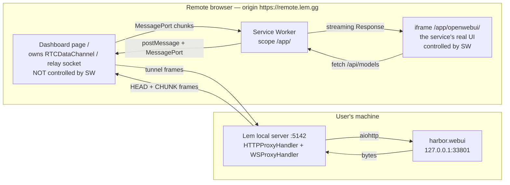
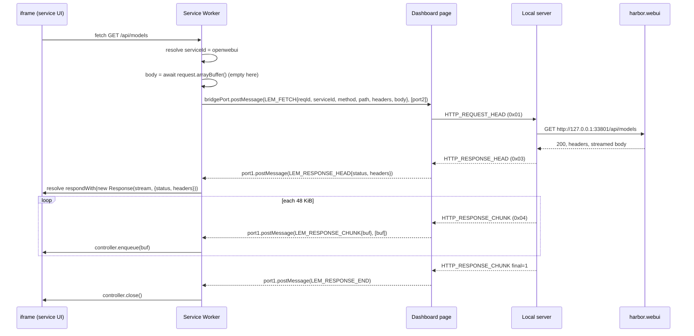
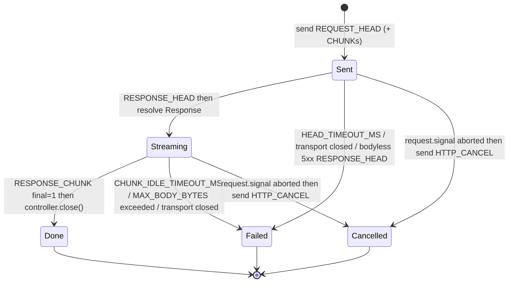
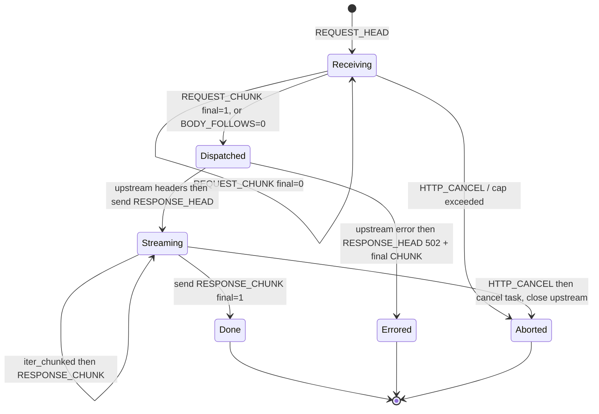
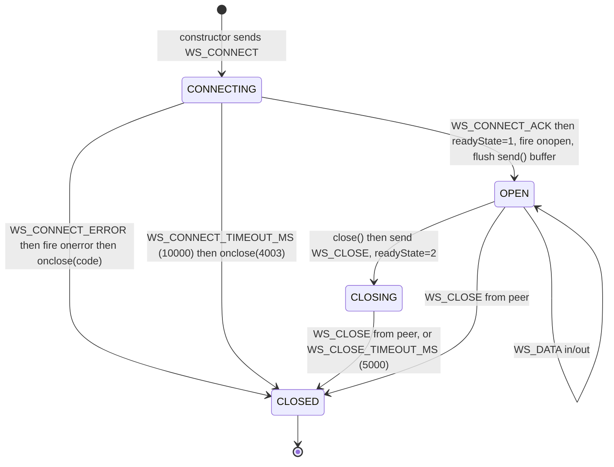
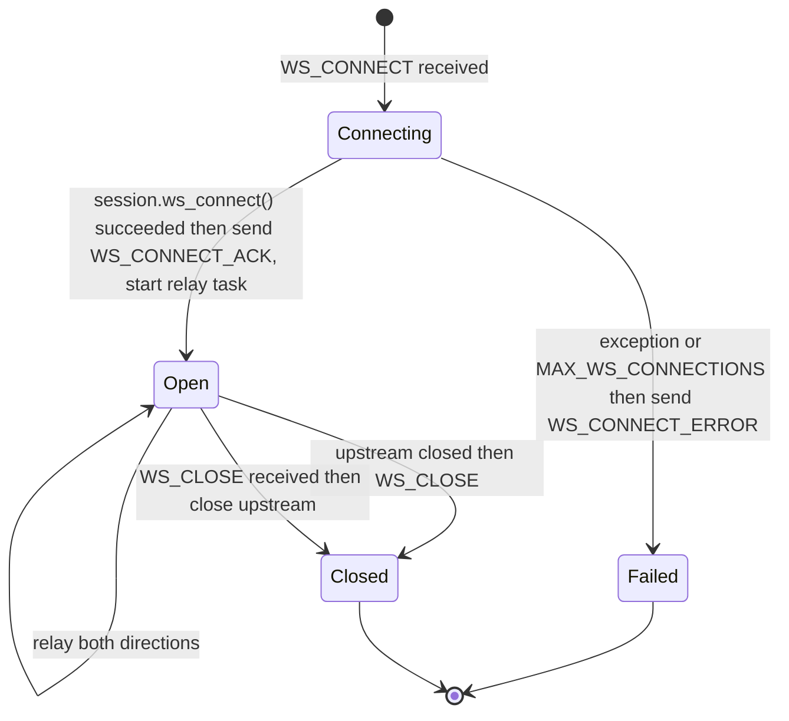

# Tunnel Proxy Spec: Same-Origin Service Worker + Tunnel Protocol v3

**Status**: Approved design, not yet implemented
**Tracks**: [#6](https://github.com/lem-app/lem/issues/6) (remote app viewing is broken), [#3](https://github.com/lem-app/lem/issues/3) (protocol v3)
**Composes with**: PR [#24](https://github.com/lem-app/lem/pull/24) (`fix/green-baseline`), PR [#25](https://github.com/lem-app/lem/pull/25) (`fix/local-api-security`)
**Audience**: the engineer implementing it. Every decision below is settled; build from it, do not re-derive it.

---

## 1. Why this document exists

Lem's headline promise is "access your home AI setup from work or travel". Today the remote
dashboard can call JSON APIs on your machine and nothing else. Opening a service shows you
*your own laptop's* localhost.

Three independent defects, each individually fatal:

1. **The iframe bypasses the tunnel entirely.**
   `web/remote/src/components/ClientViewer.tsx:281-286` renders `<iframe src={appInfo.url}>`.
   `appInfo.url` comes from the local server (`ClientViewer.tsx:83` / `:98` via `proxyFetch`)
   and is a *local-machine* URL such as `http://127.0.0.1:33801`
   (`server/app/services/status.py:247`). The remote browser resolves that against its own
   loopback. `proxyFetch` is used for metadata only — never for app content. There is no
   Service Worker, no URL rewriting, no `srcdoc`.
   Meanwhile `ClientViewer.tsx:290-293` and `ClientSelector.tsx:197-198` both tell the user
   "All HTTP requests and WebSocket connections are automatically routed through the secure
   WebRTC tunnel."

2. **Proxied WebSockets never reach OPEN.**
   `web/remote/src/lib/ws-proxy.ts:99` sends WS_CONNECT and then waits forever.
   `WSProxyManager.handleConnectionOpened()` (`ws-proxy.ts:444`) exists but nothing calls it.
   There is no ack frame type (`http-frame.ts:52-58`), and the server agrees:
   `server/app/tunnel/ws_proxy.py:146` says *"Note: We could send a WS_CONNECT_ACK frame here,
   but for simplicity, client assumes success"*. `_readyState` stays `CONNECTING`, `onopen`
   never fires, and every `send()` throws at `ws-proxy.ts:162-164`.

3. **WebSocket interception is gated on a parameter nothing sets.**
   `websocket-intercept.ts:46-79` proxies only when `?client=` is present on the page or the
   socket URL; nothing in the repo ever sets it (same dead branch at `proxy-fetch.ts:113-118`).
   And `setupWebSocketIntercept` patches `window.WebSocket` in the *parent* realm
   (`websocket-intercept.ts:140`) — a cross-origin iframe has its own realm, so the patch
   could not apply even if the flag were set.

On top of that, the wire protocol cannot carry app content even if the plumbing were right:
bodies are `str` (§4.1), a whole response is one DataChannel message (§4.2), and a 4 GiB
declared length is accepted (§4.4).

**Goal of this spec**: make "connect from another machine, open Open WebUI, stream a model
response" work, and make the wire protocol able to carry it.

---

## 2. Goals and non-goals

### Goals

| # | Goal |
|---|---|
| G1 | A remote user can open a local service's real UI in the dashboard, and every subresource (JS, CSS, fonts, images, wasm) loads through the tunnel. |
| G2 | Binary bodies survive end to end, byte for byte. |
| G3 | A response larger than the DataChannel message limit transfers successfully. |
| G4 | Streamed responses (SSE / `application/x-ndjson` / chunked LLM output) arrive **incrementally**, token by token, not buffered to completion. This is a product requirement, not a size workaround. |
| G5 | Proxied WebSockets reach `OPEN` and `send()` works, so Open WebUI's socket.io and Ollama streaming function. |
| G6 | Failures surface as errors the user can act on, promptly — never a 30 s hang or silent corruption. |
| G7 | A v2 peer and a v3 peer detect the mismatch and fail loudly instead of exchanging garbage. |
| G8 | Hard, enforced size and concurrency caps on every peer-declared length. |

### Non-goals (explicitly out of scope for v3)

| # | Non-goal | Rationale |
|---|---|---|
| N1 | Per-request flow control / credit windows on the browser→SW response stream. | Bounded by the 32 MiB per-message cap. Revisit if a real workload hits it. |
| N2 | Streaming *request* uploads from a `ReadableStream` body. | Request bodies are buffered in the Service Worker before framing. Chunked request framing exists (§5.4) so large uploads work; incremental *origination* does not. |
| N3 | HTTP/2 or HTTP/3 semantics, trailers, `100-continue`. | Nothing in the stack needs them. |
| N4 | A real security boundary between the framed app and the dashboard. | Requires per-service origins; see §8.4 and the Phase 7 note. |
| N5 | End-to-end encryption over the relay path. | Separate work; see [#12](https://github.com/lem-app/lem/issues/12). Frames are plaintext to the relay today (`server/app/tunnel/relay_client.py:141-154`). |
| N6 | Multiple simultaneous target devices in one dashboard tab. | One tunnel per tab; `/app/<serviceId>/` needs no device segment. |

---

## 3. Part 1 — Same-origin Service Worker proxy

### 3.1 The decision

**A service is viewed at a same-origin path on the dashboard's own origin. A Service Worker
scoped to that path intercepts every request the framed app makes and performs it over the
tunnel.**

```
https://remote.lem.gg/app/<serviceId>/<pathInsideService>
```

The iframe's `src` is *always* same-origin. `appInfo.url` — the local `http://127.0.0.1:PORT`
endpoint — is never given to the browser as a URL to load. It is used only server-side, by the
router, to pick an upstream.

Why a Service Worker and not the alternatives:

| Alternative | Why rejected |
|---|---|
| Rewrite HTML/CSS/JS URLs in the proxy | Cannot catch runtime-constructed URLs (`fetch('/api/' + id)`), dynamic `import()`, or worker scripts. Endless whack-a-mole. |
| `srcdoc` + inline everything | Same problem, plus opaque origin kills `localStorage`/IndexedDB that real apps need. |
| Patch `fetch`/`XMLHttpRequest` in the iframe realm | Misses ``, `<link>`, CSS `url()`, `<script src>`, wasm streaming, and anything a nested worker does. |
| Service Worker | Intercepts **every** fetch a controlled client makes, at the platform level, including subresources, workers, and navigations. |

### 3.2 The scope rule that makes it work

A Service Worker controls *documents whose URL is inside its scope*. Once it controls a
document, its `fetch` handler sees **every** request that document makes — including requests
whose URL is outside the scope, and cross-origin requests.

This single fact is what solves the absolute-path problem (§3.5) and is the reason the design
works at all.

- SW script: `web/remote/public/lem-app-sw.js`, served at `/lem-app-sw.js`.
- Registered scope: `/app/`.
  The script sits at the origin root, so it may claim any sub-path; no
  `Service-Worker-Allowed` header is needed.
- The dashboard's own document (`/`) is **outside** `/app/` and is therefore never controlled.
  The dashboard's own fetches — signaling, `proxyFetch` over the DataChannel, its own bundle —
  are untouched by the SW. This is deliberate and load-bearing (see §8.2).

### 3.3 Components



Responsibilities:

| Component | Owns |
|---|---|
| Dashboard page | The tunnel (`WebRTCConnectionManager` / `RelayClient`), the `HTTPProxy` correlation table, service session registration, the WebSocket bridge. |
| Service Worker | URL resolution, prefix stripping, the SW↔page bridge, constructing `Response` objects, the security refusals of §3.8. |
| iframe | Nothing Lem-specific except the injected WebSocket shim (§3.7). |

The Service Worker deliberately holds **no** tunnel state. It cannot: a `RTCDataChannel`
cannot be transferred into a worker, and the SW can be killed and restarted at any moment. All
tunnel ownership stays in the page.

### 3.4 Registration and session lifecycle

1. On mount, the dashboard calls
   `navigator.serviceWorker.register('/lem-app-sw.js', { scope: '/app/' })`.
   If registration rejects or `navigator.serviceWorker` is absent → degraded mode (§3.9).
2. The dashboard awaits `navigator.serviceWorker.ready`, creates a `MessageChannel`, and sends
   `{ type: 'LEM_BRIDGE_INIT' }` with `port2` transferred to the SW. The SW stores `port2` as
   `bridgePort`. The SW never searches for its page with `clients.matchAll()`; the page pushes
   the port.
3. Before rendering the iframe, the dashboard registers a **service session**:
   `bridgePort.postMessage({ type: 'LEM_SESSION_OPEN', serviceId, upstreamHint })` where
   `upstreamHint` is the `?client=` / service selector the local router needs (§3.6). The SW
   acknowledges. Only then is the iframe created.
4. On unmount, `LEM_SESSION_CLOSE` removes the session; the SW rejects further requests for it
   with 410 (§7.1).
5. On tunnel loss, the dashboard sends `LEM_TUNNEL_DOWN`; in-flight SW requests are failed with
   503 and new ones are refused until `LEM_TUNNEL_UP`.

`skipWaiting()` + `clients.claim()` are **not** used. A newly deployed SW takes over on the
next navigation. Claiming mid-session would leave an iframe controlled by a worker that never
received `LEM_SESSION_OPEN`.

### 3.5 Request resolution — the heart of the SW

The framed app issues three shapes of request:

| Shape | Example | Carries prefix? |
|---|---|---|
| Navigation into the scope | `GET /app/openwebui/` | yes |
| Root-relative from the app | `GET /api/models`, `GET /static/x.js` | **no** |
| Absolute cross-origin | `GET https://cdn.jsdelivr.net/x.js` | n/a |

The SW must resolve all three to `(serviceId, upstreamPath)`.

#### Resolution algorithm (normative)

```
onfetch(event):
  url = new URL(event.request.url)

  # A. Not our origin -> not ours.
  if url.origin != self.location.origin:
      return                                  # fall through to network, see §3.8

  # B. Explicit prefix wins, always.
  m = /^\/app\/([A-Za-z0-9._-]{1,64})(\/.*)?$/.exec(url.pathname)
  if m:
      serviceId = m[1]
      upstreamPath = (m[2] || '/') + url.search
      if event.request.mode == 'navigate':
          bindClient(event.resultingClientId, serviceId)   # NOT event.clientId
      event.respondWith(proxy(serviceId, upstreamPath, event.request))
      return

  # C. No prefix. Resolve the owning client.
  serviceId = resolveServiceForClient(event)
  if serviceId is null:
      return                                  # uncontrolled client -> network
  event.respondWith(proxy(serviceId, url.pathname + url.search, event.request))
```

`resolveServiceForClient` runs these steps **in order** and stops at the first hit:

| Step | Source | Notes |
|---|---|---|
| 1 | In-memory `Map<clientId, serviceId>` | Populated at navigation (`event.resultingClientId`) and by step 3. |
| 2 | `event.request.referrer` | For a subresource fetched by the iframe document this is the iframe's own URL, e.g. `https://remote.lem.gg/app/openwebui/`. Same-origin, so the default `strict-origin-when-cross-origin` policy sends the full path. Parse `/app/<serviceId>/` out of it and, if `event.clientId` is non-empty, cache the binding. |
| 3 | `await clients.get(event.clientId)` → `client.url` | Survives an empty referrer (`Referrer-Policy: no-referrer` set by the app, `<meta name=referrer>`, `fetch(..., {referrerPolicy:'no-referrer'})`) because it does not depend on the referrer at all. Works for `window`, `worker`, and `sharedworker` clients — a worker the app spawned was itself loaded from `/app/<serviceId>/…`, so its `client.url` carries the prefix. |
| 4 | IndexedDB store `lem-sw/clientBindings` | The in-memory map is lost every time the browser kills an idle SW. Every binding written in steps B/2/3 is mirrored here with a 24 h TTL, and this step reads it back. |
| 5 | Single-session fallback | If exactly one service session is open, use it. Log a warning with the request URL — hitting this step routinely means steps 1–4 have a bug. |
| 6 | **Fail closed** | Return a synthetic `421 Misdirected Request` (§7.1) whose body names the unresolvable URL. Never guess between two sessions. |

Why the referrer is step 2 and not step 1: it is the cheapest signal, but it is also the one an
app can switch off. Steps 3 and 4 are the ones that make the design robust; the referrer is an
optimisation that avoids an async `clients.get()` on the hot path.

**Empty-referrer worked example.** Open WebUI serves
`Referrer-Policy: no-referrer` on some builds. A request for `/static/chunk-abc.js` then
arrives with `referrer === ''`. Step 2 yields nothing. Step 3 calls
`clients.get('<clientId of the iframe document>')`, gets
`https://remote.lem.gg/app/openwebui/`, extracts `openwebui`, caches it in the map and IDB, and
the request proceeds. No user-visible difference.

**Cold-start worked example.** The SW was killed while the iframe sat idle. The user clicks a
button; the app fetches `/api/chat/completions`. The SW boots with an empty map, `LEM_BRIDGE_INIT`
has not been re-sent yet. Step 3 resolves the service. `proxy()` finds `bridgePort === null`,
so it waits up to `BRIDGE_WAIT_MS = 3000` for the page's re-`LEM_BRIDGE_INIT` (the page
re-sends it from its `navigator.serviceWorker.oncontrollerchange` and on
`onmessage` of the SW's `LEM_BRIDGE_HELLO` broadcast, which the SW emits on activation).
If the bridge does not arrive, respond `503` (§7.1).

#### `proxy()` — page round trip



The `Response` is constructed and returned **as soon as `LEM_RESPONSE_HEAD` arrives**, wrapping
a `ReadableStream` that is fed by subsequent chunk messages. This is what makes G4 real: the
`<script>` starts executing, the SSE `EventSource` starts firing, and LLM tokens paint as they
arrive.

#### SW↔page message contract

| Message | Direction | Payload |
|---|---|---|
| `LEM_BRIDGE_INIT` | page → SW | `[MessagePort]` transferred |
| `LEM_BRIDGE_HELLO` | SW → all clients | broadcast on `activate`, asks pages to re-init |
| `LEM_SESSION_OPEN` | page → SW | `{ serviceId, upstreamHint }` |
| `LEM_SESSION_CLOSE` | page → SW | `{ serviceId }` |
| `LEM_TUNNEL_UP` / `LEM_TUNNEL_DOWN` | page → SW | `{}` |
| `LEM_FETCH` | SW → page | `{ reqId, serviceId, method, path, headers: [[k,v]…], body: ArrayBuffer \| null }`, plus a transferred reply `MessagePort` |
| `LEM_RESPONSE_HEAD` | page → SW | `{ reqId, status, headers: [[k,v]…] }` |
| `LEM_RESPONSE_CHUNK` | page → SW | `{ reqId, buf }`, `buf` transferred |
| `LEM_RESPONSE_END` | page → SW | `{ reqId }` |
| `LEM_RESPONSE_ERROR` | page → SW | `{ reqId, code, message }` (§7.1) |
| `LEM_CANCEL` | SW → page | `{ reqId }` when the iframe aborts (`event.request.signal`) |

Headers travel as **arrays of `[name, value]` pairs**, never objects, in both this contract and
on the wire (§5.2). An object silently collapses duplicate `Set-Cookie` headers, which breaks
login for every real app.

### 3.6 What the page does with a `LEM_FETCH`

The page maps `serviceId` → an upstream selector the local server's router understands and
issues the request through the existing `HTTPProxy` (upgraded to v3, §5).

The current router (`server/app/tunnel/router.py:59-100`) resolves `?client=openwebui` to the
discovered Open WebUI port and otherwise falls through to `http://localhost:5142`. That is a
one-service special case (`router.py:127-131`). v3 requires a general selector; the page sends
the service id and the server resolves it through the same status machinery that `/v1/services`
uses (`server/app/services/status.py:223-249`, which already returns
`http://127.0.0.1:<hostPort>` for any running Harbor service).

**Normative**: the request path put on the wire is the *upstream* path (`/api/models`), and the
target service is carried in a request header `X-Lem-Service: <serviceId>`. Not a query
parameter — a query parameter mutates the URL the upstream app sees and has already caused one
class of bug here (`proxy-fetch.ts:112-118` injecting `?client=` into arbitrary URLs).

Server-side, `RequestRouter.route()` gains a header-aware entry point. `X-Lem-Service` is
consumed by the router and **stripped before forwarding** — add it to PR #25's
`PROXY_CONTROLLED_HEADERS` set (`server/app/tunnel/http_proxy.py`, the frozenset defined
alongside `HOP_BY_HOP_HEADERS`) so a peer cannot smuggle its own value through.

An unknown or not-running `serviceId` produces `502` with the §7.1 taxonomy, never a fall
through to `localhost:5142`. The current silent fallback (`router.py:94-96`) is how a
mistyped service id ends up hitting the privileged local API instead of erroring.

### 3.7 WebSocket shim: injection point and the race

Because the iframe is now same-origin, the parent *can* touch `iframe.contentWindow`. The
question is *when*.

**The race, stated precisely.** `iframe.onload` fires after the document has parsed and its
scripts have run. Open WebUI opens its socket.io connection during app boot. Injecting at
`load` is therefore always too late for the first connection. Setting properties on
`iframe.contentWindow` *before* load does not survive either: the synchronous initial
`about:blank` window is discarded when the real document commits, taking any properties with
it.

**Resolution — the shim is delivered by the SW, and bound by the parent.**

1. **Parent, before the iframe exists.** The dashboard installs `window.__lemWsBridge` on its
   *own* window — an object with `connect(url, protocols)`, `send`, `close`, and an event
   callback registry, backed by the `WSProxyManager`. This happens synchronously in the effect
   that opens the session, strictly before the iframe element is appended. The parent never
   reaches into the child; the child reaches *out*.

2. **Service Worker, in the response.** When `proxy()` produces a response for a **navigation**
   request whose `Content-Type` starts with `text/html`, the SW splices a single inline
   `<script>` in as the **first child of `<head>`** (or, if no `<head>` is found before the
   first `<script>` or `<body>`, immediately after the doctype). This is the injection point.
   It is race-free by construction: the browser executes scripts in document order, so the shim
   runs before any of the app's own scripts exist.

   Splicing happens on the byte stream, not on a buffered document: the SW passes the response
   through a `TransformStream` that scans only the first `HTML_SNIFF_BYTES = 65536` bytes for
   the insertion point and thereafter forwards untouched. If no insertion point is found in
   that window, the shim is not injected and the SW posts a `LEM_SHIM_SKIPPED` diagnostic —
   HTTP still works, WebSockets in that document do not.

3. **Shim behaviour in the iframe realm.** The injected script replaces
   `window.WebSocket` with a class that:
   - resolves absolute/relative URLs against the iframe's own base and normalises
     `ws://`/`wss://` against `location`;
   - calls `window.parent.__lemWsBridge.connect(...)` (same-origin, so this is a direct call,
     no `postMessage` serialization on the hot path);
   - **buffers** `send()` calls issued before the bridge reports OPEN and flushes them on
     `WS_CONNECT_ACK` — real apps do call `send()` synchronously after construction;
   - if `window.parent.__lemWsBridge` is absent (bridge torn down, dashboard reloaded), fails
     the connection with close code `4002` (§7.2) rather than falling back to a native socket
     that would hit the *remote* browser's own network.
   - copies the static `CONNECTING`/`OPEN`/`CLOSING`/`CLOSED` constants, exactly as
     `websocket-intercept.ts:122-137` already does.

4. **Parent, on `load`, as belt and braces.** The parent additionally calls
   `iframe.contentWindow.__lemAttachWsBridge?.(bridge)` in the `load` handler. The shim exposes
   that function and uses the passed bridge in preference to walking `window.parent`. This
   covers the case where the dashboard is itself framed and `window.parent` is not the
   dashboard. It is *not* the primary mechanism and must never be relied on for the first
   connection.

`websocket-intercept.ts` in its current form is deleted: its `?client=` gate
(`websocket-intercept.ts:46-79`) is dead code, and patching the parent realm
(`websocket-intercept.ts:140`) is the wrong realm. The `WSProxyManager` and `ProxiedWebSocket`
classes survive and become the bridge implementation.

### 3.8 Security boundary: what the SW must refuse

| Request | SW behaviour | Why |
|---|---|---|
| Cross-origin absolute URL from a controlled client (`https://cdn.example/x.js`) | **Do not call `respondWith`.** Let the browser fetch it normally. | The tunnel must never become an open proxy to arbitrary internet hosts on the user's behalf. Passing through is also what would happen with no SW at all, so it is the least surprising behaviour. Rejecting outright would break apps that legitimately load a public CDN. |
| Same-origin request from an **uncontrolled** client (the dashboard itself) | Do not intercept. | The dashboard's own bundle, `/lem-app-sw.js`, and its `proxyFetch` traffic must never enter the tunnel path. This is enforced structurally: `/` is outside scope `/app/`, so the dashboard is never a controlled client. |
| `GET /lem-app-sw.js` from a controlled client | `403` (§7.1). | An app must not be able to read the worker source to look for the bridge protocol, and must not be able to trigger a re-registration. |
| Same-origin path from a controlled client that resolves to no session (§3.5 step 6) | `421`. | Never guess a service. |
| Any request while `LEM_TUNNEL_DOWN` | `503`. | Fail fast instead of hanging. |
| `event.request.mode === 'navigate'` targeting `/app/…` **in the top-level frame** | Allowed, but the SW sets `Content-Security-Policy: frame-ancestors 'self'` and the dashboard treats a top-level `/app/` load as a hard-reload of the whole session. | Opening a service in a new tab is a legitimate affordance. See §8.4 for what it costs. |
| Upstream `Location:` on a 3xx | Rewritten: same-origin-to-upstream absolute URLs and root-relative paths are re-prefixed to `/app/<serviceId>/…`; anything else is passed through verbatim. | Without this, a login redirect to `/auth/callback` escapes the prefix on the *next* navigation. PR #25 already stops the *server* from following redirects (`allow_redirects: False`), which is what makes this rewrite possible. |

Response headers the SW **strips before constructing the `Response`**:
`Content-Security-Policy` and `Content-Security-Policy-Report-Only` from the upstream (they
were written for the app's own origin and will otherwise block the injected shim),
`X-Frame-Options`, `Strict-Transport-Security`, `Public-Key-Pins`. The SW substitutes its own
CSP: `frame-ancestors 'self'; base-uri 'self'`. `sandbox` directives from upstream are dropped.

### 3.9 Degradation when Service Workers are unavailable

Service Workers require a **secure context**. `https://…` and `http://localhost` qualify;
`http://192.168.1.10:5173` — the LAN case `web/remote/package.json` explicitly supports via
`"dev": "vite --host"` — does **not**. `navigator.serviceWorker` is also absent in Firefox
private windows.

Detection, in order:

```ts
const swAvailable =
  typeof navigator !== 'undefined' &&
  'serviceWorker' in navigator &&
  window.isSecureContext
```

Behaviour when `swAvailable` is false, or registration rejects, or `navigator.serviceWorker.ready`
does not settle within `SW_READY_TIMEOUT_MS = 5000`:

1. The dashboard sets `appViewing: 'unavailable'` with a machine-readable reason
   (`insecure-context` | `unsupported` | `registration-failed` | `timeout`).
2. `ServiceCard`'s Launch button is disabled with a tooltip naming the reason and the fix
   ("Serve the dashboard over HTTPS, or open it at `http://localhost`").
3. **The control plane keeps working.** Catalog listing, install/start/stop, job polling, and
   `APITester` all go through `proxyFetch` on the page and do not touch the SW. This is exactly
   what works today, so degraded mode is never worse than the status quo.
4. `ClientViewer` renders the unavailable state instead of an iframe. It must **not** fall back
   to `<iframe src={appInfo.url}>` — that is defect #1 and would silently point the user at
   their own machine.

There is no `<iframe srcdoc>` fallback and no fetch-patching fallback. Both were considered and
rejected in §3.1; shipping a half-working second path doubles the surface and hides the real
fix.

---

## 4. The v2 wire protocol, as it exists today

Documented exactly, because v3 is defined as a delta from it.

v2 = "v1 plus a leading 1-byte `frame_type`". PR #24 (`fix/green-baseline`) repaired the tests
that still asserted the v1 layout — `server/tests/tunnel/test_http_frame.py` read `request_id`
from `data[:4]`, and `web/remote/src/lib/http-frame.test.ts` read `getUint32(0)` on a response
frame for `request_id = 42` and got `33554432` (`0x02000000`: the `HTTP_RESPONSE` type byte
sitting in the top octet, with the real id shifted out of the window). Those tests now assert
the frame-type byte and read `request_id` from offset 1.

Sources: `server/app/tunnel/http_frame.py`, `ws_frame.py`, `http_proxy.py`, `ws_proxy.py`,
`message_dispatcher.py`; `web/remote/src/lib/http-frame.ts`, `ws-frame.ts`, `ws-proxy.ts`,
`proxy-fetch.ts`.

### 4.1 v2 frame types

`FrameType` — `http_frame.py:54-61`, mirrored at `http-frame.ts:52-58`:

| Code | Name |
|---|---|
| `0x01` | HTTP_REQUEST |
| `0x02` | HTTP_RESPONSE |
| `0x10` | WS_CONNECT |
| `0x11` | WS_DATA |
| `0x12` | WS_CLOSE |

All integers are **big-endian**. Dispatch is on byte 0 (`message_dispatcher.py:65-101`).

**HTTP_REQUEST (0x01)** — `serialize_request`, `http_frame.py:83-115`:

| Offset | Size | Field |
|---|---|---|
| 0 | 1 | `frame_type` = 0x01 |
| 1 | 4 | `request_id` (uint32) |
| 5 | 2 | `method_len` (uint16) |
| 7 | `method_len` | method, UTF-8 |
| … | 2 | `path_len` (uint16) |
| … | `path_len` | path, UTF-8 |
| … | 4 | `headers_len` (uint32) |
| … | `headers_len` | headers, JSON **object**, UTF-8 |
| … | 4 | `body_len` (uint32) |
| … | `body_len` | body, **UTF-8 text** |

**HTTP_RESPONSE (0x02)** — `serialize_response`, `http_frame.py:200-224`:

| Offset | Size | Field |
|---|---|---|
| 0 | 1 | `frame_type` = 0x02 |
| 1 | 4 | `request_id` (uint32) |
| 5 | 2 | `status_code` (uint16) |
| 7 | 4 | `headers_len` (uint32) |
| … | `headers_len` | headers, JSON object, UTF-8 |
| … | 4 | `body_len` (uint32) |
| … | `body_len` | body, **UTF-8 text** |

**WS_CONNECT (0x10)** — `ws_frame.py:84-110`: `type(1) | connection_id(4) | url_len(2) | url |
headers_len(4) | headers-JSON`.

**WS_DATA (0x11)** — `ws_frame.py:171-191`: `type(1) | connection_id(4) | opcode(1) |
payload_len(4) | payload` (payload is raw bytes — the one place v2 is already binary-clean).

**WS_CLOSE (0x12)** — `ws_frame.py:246-267`: `type(1) | connection_id(4) | close_code(2) |
reason_len(2) | reason`.

There is no HELLO, no ack, no version field, and no chunking.

### 4.2 v2 defect: bodies are text

- `http_proxy.py:154` does `body = await response.text()`.
- `HTTPResponseFrame["body"]` is typed `str` (`http_frame.py:80`), encoded UTF-8 at
  `http_frame.py:211`, decoded UTF-8 at `http_frame.py:189` and `:282`.
- TypeScript mirrors it: `HTTPResponseFrame.body: string` (`http-frame.ts:80`),
  `textDecoder.decode(bodyBytes)` (`http-frame.ts:186`), `new Response(frame.body)`
  (`proxy-fetch.ts:257`).

Every PNG, WOFF2, and `.wasm` is therefore mangled by UTF-8 round-tripping — or, when
`response.text()` hits invalid UTF-8, raises and turns into a 500 via `http_proxy.py:179-187`.
This alone makes app viewing impossible even if §3 were built.

### 4.3 v2 defect: one message per response

`serialize_response` produces a single `bytes` (`http_frame.py:200-224`) and
`webrtc_client.py:905` hands it to `self.data_channel.send(response_data)` in one call. There
is no fragmentation anywhere.

SCTP over WebRTC negotiates `maxMessageSize`; browsers advertise 64 KiB when the peer does not
say otherwise, and exceeding it raises or tears down the channel. Any JS bundle, any model
listing with a few dozen entries, and any long LLM answer exceeds it. On the relay path the
frame is one `ws.send_bytes` (`relay_client.py:153`), which fares slightly better but still
buffers the entire response in memory on both sides.

And because the whole response is one frame, **nothing can stream**. Token-by-token LLM output
is impossible by construction — the user waits for the full generation, then sees it appear at
once. G4 exists because of this line.

### 4.4 v2 defect: unbounded declared lengths

`http_frame.py:184` (and `:172`, `:265`, `:277`) reads a `uint32` length and then slices. A peer
may declare 4 GiB. PR #25 adds `MAX_BODY_BYTES = 32 MiB` and `MAX_HEADERS_BYTES = 256 KiB`
checks *before* the slice in all four places — v3 keeps those constants and those names.

### 4.5 v2 defect: the correlation bug

`http_proxy.py:110-118` (unchanged by PR #25):

```python
if len(data) >= 4:
    (request_id,) = struct.unpack(">I", data[:4])
    error_frame["request_id"] = request_id
```

Byte 0 is now `frame_type`. For a request with `request_id = 1`, `data[:4]` is
`01 00 00 00` → `0x01000000` = 16 777 216. The error response is therefore addressed to a
request that does not exist. `HTTPProxy.handleResponse` logs
*"No pending request for ID …"* (`proxy-fetch.ts:231`) and drops it; the real pending entry sits
in `pendingRequests` until the 30 s timeout at `proxy-fetch.ts:179-182` rejects with
`Request timeout`.

Net effect: **every proxy-level 500 is reported to the user as a 30-second hang**. The fix is
one line — read `data[1:5]`, guarded by `len(data) >= 5` — and it is worth landing on `main`
independently of v3.

### 4.6 v2 defect: WS_CONNECT is never acknowledged

`ws_proxy.py:131-147` opens the upstream socket, stores it, starts the relay task, and comments
that an ack "could" be sent. `ws-proxy.ts:99` sends WS_CONNECT and returns;
`_readyState` is left `CONNECTING` (`ws-proxy.ts:63`); `handleOpen()` (`ws-proxy.ts:291`) is
only reachable from `WSProxyManager.handleConnectionOpened()` (`ws-proxy.ts:444`), which has
no callers. `send()` throws unconditionally (`ws-proxy.ts:162-164`).

### 4.7 Other v2 sharp edges v3 must fix

- `dict(response.headers)` at `http_proxy.py:157` collapses duplicate headers. Multiple
  `Set-Cookie` become one. Login breaks.
- `aiohttp` decompresses by default, but `Content-Encoding: gzip` is forwarded verbatim, so the
  browser tries to gunzip already-gunzipped bytes.
- `Content-Length` is forwarded verbatim even though the proxy may have changed the body.
- Request bodies are stringified with `String(init.body)` for anything that is not a string or
  `FormData` (`proxy-fetch.ts:156-158`), producing `"[object Blob]"`.

---

## 5. Part 2 — Tunnel protocol v3

### 5.1 Summary of changes

| Area | v2 | v3 |
|---|---|---|
| Version negotiation | none | `HELLO` (0x00) + 2 s timeout |
| Bodies | UTF-8 `str` | raw `bytes` everywhere |
| Response delivery | one frame | `RESPONSE_HEAD` + N × `RESPONSE_CHUNK`, streamed |
| Request bodies | inline in the request frame | `REQUEST_HEAD` + N × `REQUEST_CHUNK` |
| Headers encoding | JSON object | JSON array of `[name, value]` pairs |
| Cancellation | none | `HTTP_CANCEL` (0x05) |
| WS handshake | fire and forget | `WS_CONNECT_ACK` (0x13) / `WS_CONNECT_ERROR` (0x14) |
| WS fragmentation | none | `FIN` flag on `WS_DATA` |
| Caps | none (PR #25 adds body/header caps) | PR #25's caps kept, plus chunk, in-flight, and total-bytes caps |

v3 is a **breaking** change. There is no bilingual mode; §5.8 makes the break loud.

### 5.2 Common conventions

- All multi-byte integers are **big-endian**, as in v2.
- Byte 0 of every frame is `frame_type`.
- For every HTTP-family frame, bytes 1–4 are the `request_id` (uint32). This invariant lets a
  single `peek_request_id(data) -> int | None` helper serve every HTTP frame type — the helper
  the error path in §4.5 should have been using.
- `headers` is a JSON **array** of two-element arrays: `[["Set-Cookie","a=1"],["Set-Cookie","b=2"]]`.
  Order is preserved. Names are transmitted as received; comparison is ASCII-case-insensitive.
- `request_id` and `connection_id` are allocated by the **remote** peer (the browser),
  monotonically, starting at 1, wrapping at 2³²−1 back to 1. `0` is reserved and MUST be
  rejected.
- Flags fields are bit sets; all undefined bits MUST be sent as 0 and MUST be ignored on
  receipt.

### 5.3 v3 frame type table

| Code | Name | Direction | Notes |
|---|---|---|---|
| `0x00` | `HELLO` | both | first frame on a channel |
| `0x01` | `HTTP_REQUEST_HEAD` | remote → local | layout changed from v2 |
| `0x02` | *reserved* | — | v2 `HTTP_RESPONSE`. MUST NOT be sent. Receipt is a protocol error (§7.1 `E_PROTO_V2_FRAME`). |
| `0x03` | `HTTP_RESPONSE_HEAD` | local → remote | |
| `0x04` | `HTTP_RESPONSE_CHUNK` | local → remote | |
| `0x05` | `HTTP_CANCEL` | both | |
| `0x06` | `HTTP_REQUEST_CHUNK` | remote → local | |
| `0x10` | `WS_CONNECT` | remote → local | unchanged from v2 |
| `0x11` | `WS_DATA` | both | layout changed: `flags` inserted |
| `0x12` | `WS_CLOSE` | both | unchanged from v2 |
| `0x13` | `WS_CONNECT_ACK` | local → remote | new |
| `0x14` | `WS_CONNECT_ERROR` | local → remote | new |

Reserving `0x02` rather than reusing it is deliberate: a v2 peer's response frame arriving at a
v3 peer is then unambiguously diagnosable rather than misparsed.

### 5.4 Frame layouts

#### `HELLO` — 0x00

| Offset | Size | Field | Notes |
|---|---|---|---|
| 0 | 1 | `frame_type` = 0x00 | |
| 1 | 1 | `protocol_version` (uint8) | 3 |
| 2 | 2 | `flags` (uint16) | reserved, 0 |
| 4 | 4 | `max_chunk_bytes` (uint32) | largest payload this peer will accept in one CHUNK/WS_DATA |
| 8 | 4 | `max_body_bytes` (uint32) | largest total message body this peer will accept |
| 12 | 2 | `impl_len` (uint16) | |
| 14 | `impl_len` | `impl` | UTF-8, e.g. `lem-server/0.1.0`, `lem-web/0.1.0`. Diagnostics only. |

#### `HTTP_REQUEST_HEAD` — 0x01

| Offset | Size | Field |
|---|---|---|
| 0 | 1 | `frame_type` = 0x01 |
| 1 | 4 | `request_id` (uint32) |
| 5 | 1 | `flags` (uint8) — bit 0 `BODY_FOLLOWS` |
| 6 | 2 | `method_len` (uint16) |
| 8 | `method_len` | method, UTF-8 |
| … | 2 | `path_len` (uint16) |
| … | `path_len` | path incl. query, UTF-8 |
| … | 4 | `headers_len` (uint32) |
| … | `headers_len` | headers, JSON array of pairs, UTF-8 |

No inline body. If `BODY_FOLLOWS` is 0 the request has no body; otherwise one or more
`HTTP_REQUEST_CHUNK` frames follow, the last with `FINAL` set. Dropping the inline body removes
a branch from every reader and makes the head a fixed, small frame.

#### `HTTP_REQUEST_CHUNK` — 0x06 and `HTTP_RESPONSE_CHUNK` — 0x04

| Offset | Size | Field |
|---|---|---|
| 0 | 1 | `frame_type` = 0x06 or 0x04 |
| 1 | 4 | `request_id` (uint32) |
| 5 | 1 | `flags` (uint8) — bit 0 `FINAL` |
| 6 | 4 | `payload_len` (uint32) |
| 10 | `payload_len` | payload, **raw bytes** |

A zero-length `FINAL` chunk is legal and is how a streaming source with no trailing bytes ends.

#### `HTTP_RESPONSE_HEAD` — 0x03

| Offset | Size | Field |
|---|---|---|
| 0 | 1 | `frame_type` = 0x03 |
| 1 | 4 | `request_id` (uint32) |
| 5 | 2 | `status_code` (uint16) |
| 7 | 1 | `flags` (uint8) — bit 0 `BODY_FOLLOWS` |
| 8 | 4 | `headers_len` (uint32) |
| 12 | `headers_len` | headers, JSON array of pairs, UTF-8 |

#### `HTTP_CANCEL` — 0x05

| Offset | Size | Field |
|---|---|---|
| 0 | 1 | `frame_type` = 0x05 |
| 1 | 4 | `request_id` (uint32) |
| 5 | 2 | `reason_code` (uint16) — §7.1 |

Sent by the remote peer when the iframe aborts a fetch (`event.request.signal`), or by either
peer when it abandons a message. The receiver MUST stop producing frames for that `request_id`
and MUST NOT send a further HEAD or CHUNK for it.

#### `WS_CONNECT` — 0x10 (unchanged)

| Offset | Size | Field |
|---|---|---|
| 0 | 1 | `frame_type` = 0x10 |
| 1 | 4 | `connection_id` (uint32) |
| 5 | 2 | `url_len` (uint16) |
| 7 | `url_len` | URL, UTF-8 |
| … | 4 | `headers_len` (uint32) |
| … | `headers_len` | headers, JSON array of pairs, UTF-8 (v3 changes the *encoding* of this field only) |

#### `WS_CONNECT_ACK` — 0x13

| Offset | Size | Field |
|---|---|---|
| 0 | 1 | `frame_type` = 0x13 |
| 1 | 4 | `connection_id` (uint32) |
| 5 | 2 | `protocol_len` (uint16) |
| 7 | `protocol_len` | negotiated subprotocol, UTF-8, may be empty |

#### `WS_CONNECT_ERROR` — 0x14

| Offset | Size | Field |
|---|---|---|
| 0 | 1 | `frame_type` = 0x14 |
| 1 | 4 | `connection_id` (uint32) |
| 5 | 2 | `error_code` (uint16) — WebSocket close-code space, see §7.2 |
| 7 | 2 | `reason_len` (uint16) |
| 9 | `reason_len` | reason, UTF-8 |

The reason string is **generic**, matching PR #25's policy of keeping causes in the server log
rather than in frames (it replaced `f"Connection failed: {e}"` with `"Connection failed"` at
`ws_proxy.py`).

#### `WS_DATA` — 0x11 (layout changed)

| Offset | Size | Field |
|---|---|---|
| 0 | 1 | `frame_type` = 0x11 |
| 1 | 4 | `connection_id` (uint32) |
| 5 | 1 | `opcode` (uint8) — RFC 6455 opcode |
| 6 | 1 | `flags` (uint8) — bit 0 `FIN` |
| 7 | 4 | `payload_len` (uint32) |
| 11 | `payload_len` | payload, raw bytes |

A message larger than the negotiated `max_chunk_bytes` is split: first fragment carries its
real opcode with `FIN=0`, subsequent fragments carry `CONTINUATION` (0x00) with `FIN=0`, and
the last carries `CONTINUATION` with `FIN=1`. Control frames (`CLOSE`, `PING`, `PONG`) MUST NOT
be fragmented and MUST always set `FIN`.

#### `WS_CLOSE` — 0x12 (unchanged)

| Offset | Size | Field |
|---|---|---|
| 0 | 1 | `frame_type` = 0x12 |
| 1 | 4 | `connection_id` (uint32) |
| 5 | 2 | `close_code` (uint16) |
| 7 | 2 | `reason_len` (uint16) |
| 9 | `reason_len` | reason, UTF-8 |

### 5.5 Caps, and how they compose with PR #25

PR #25 (`fix/local-api-security`) adds to `server/app/tunnel/http_frame.py`:

```python
MAX_BODY_BYTES = 32 * 1024 * 1024   # 32 MiB
MAX_HEADERS_BYTES = 256 * 1024      # 256 KiB
```

with checks placed **before** every slice, in `deserialize_request` and `deserialize_response`.
It also adds `MAX_WS_CONNECTIONS = 64` to `ws_proxy.py`.

**v3 keeps these names, values, and the check-before-allocate discipline**, and extends them:

| Constant | Value | Applies to |
|---|---|---|
| `MAX_HEADERS_BYTES` | 256 KiB | *(PR #25)* `headers_len` in every HEAD/CONNECT frame |
| `MAX_BODY_BYTES` | 32 MiB | *(PR #25, meaning extended)* total accumulated payload across all CHUNK frames of one `request_id`, in each direction |
| `MAX_CHUNK_BYTES` | 48 KiB (49 152) | `payload_len` in one CHUNK or `WS_DATA` frame |
| `MAX_URL_BYTES` | 8 KiB | `path_len`, `url_len` |
| `MAX_INFLIGHT_REQUESTS` | 128 | concurrent `request_id`s per channel, per direction |
| `MAX_WS_CONNECTIONS` | 64 | *(PR #25)* live upstream sockets |
| `MAX_WS_MESSAGE_BYTES` | 8 MiB | total across fragments of one WS message |

`MAX_CHUNK_BYTES` rationale: SCTP negotiates `maxMessageSize`; the interoperable floor is
64 KiB, and the frame header costs up to 10 bytes. 48 KiB leaves headroom and is comfortably
under every browser's advertised value. Implementations MUST additionally clamp to
`min(MAX_CHUNK_BYTES, peer.max_chunk_bytes, pc.sctp.maxMessageSize - 1024)` where
`pc.sctp` is available, and MUST use the smaller of the two peers' advertised
`max_chunk_bytes` from `HELLO`.

Exceeding any cap is a protocol error: the offending message is failed with the §7.1 code and
the channel is **not** torn down (a single oversized asset should not kill the session), except
for `MAX_INFLIGHT_REQUESTS`, which is a peer-behaviour problem and does close the channel.

### 5.6 Server-side streaming

`HTTPProxyHandler` changes shape. `handle_request(data) -> bytes` becomes a coroutine that
*emits* frames through the existing `send_frame` callable (`webrtc_client.py:910-926`, already
used by `WSProxyHandler`), rather than returning a single response blob to
`_handle_datachannel_message` (`webrtc_client.py:893-908`).

```python
async with self.session.request(method, url, **kwargs) as response:
    head = serialize_response_head(
        request_id,
        response.status,
        filter_response_headers(response.headers),   # see below
        body_follows=True,
    )
    await self.send_frame(head)

    async for chunk in response.content.iter_chunked(self.max_chunk_bytes):
        await self._send_with_backpressure(
            serialize_response_chunk(request_id, chunk, final=False)
        )
    await self.send_frame(serialize_response_chunk(request_id, b"", final=True))
```

`iter_chunked` yields as bytes arrive from the upstream socket, so an Ollama or Open WebUI
token stream is forwarded token-group by token-group. That is G4.

**Header filtering (`filter_response_headers`)** — new, symmetric with PR #25's
`filter_request_headers`:

- Iterate `response.headers.items()` (the `CIMultiDict`), **not** `dict(response.headers)`, so
  duplicate `Set-Cookie` survives. This fixes §4.7.
- Drop hop-by-hop response headers: `connection`, `keep-alive`, `proxy-authenticate`,
  `transfer-encoding`, `upgrade`, `trailer`, `te`.
- Drop `content-length` (the framing carries length) and `content-encoding` (aiohttp has
  already decompressed with its default `auto_decompress=True`; forwarding the header would
  make the browser gunzip plaintext).
- Keep everything else verbatim, including `Content-Type`, `Cache-Control`, `Set-Cookie`,
  `Location`.

**Backpressure.** Before each chunk, if the transport's buffered amount exceeds
`SEND_HIGH_WATER = 1 MiB`, await the low-water signal:

- WebRTC: `RTCDataChannel.bufferedAmount` with `bufferedAmountLowThreshold` set to
  `SEND_LOW_WATER = 256 KiB` and an `asyncio.Event` set from the `bufferedamountlow` handler.
- Relay: `ws.send_bytes` on `aiohttp` already awaits; no extra work.

Without this, a 30 MB response fills the SCTP send buffer and the channel dies.

**Cancellation.** A `HTTP_CANCEL` for an in-flight `request_id` cancels the `asyncio.Task`
driving that response and closes the upstream response. The handler keeps
`dict[int, asyncio.Task]` keyed by `request_id`, capped at `MAX_INFLIGHT_REQUESTS`.

**Error path.** The correlation bug of §4.5 is fixed by the shared helper:

```python
def peek_request_id(data: bytes) -> int | None:
    """Read the request_id that every HTTP-family v3 frame carries at bytes 1..4."""
    if len(data) < 5:
        return None
    return int(struct.unpack(">I", data[1:5])[0])
```

If `peek_request_id` returns `None`, the frame is undiagnosable and the peer is notified with a
channel-level `HELLO`-style error rather than a response addressed to id 0.

Everything PR #25 added on this path is preserved unchanged: `validate_path`,
`build_target_url` (join, never concatenate), `filter_request_headers`, `HOP_BY_HOP_HEADERS`,
`PROXY_CONTROLLED_HEADERS`, `allow_redirects=False`, `error_body()`'s `json.dumps`, and the
generic `GENERIC_PROXY_ERROR` / `GENERIC_GATEWAY_ERROR` strings. v3 adds `X-Lem-Service` to
`PROXY_CONTROLLED_HEADERS` (§3.6) and adds `filter_response_headers` alongside them.

### 5.7 Browser-side streaming

`HTTPProxy` (`web/remote/src/lib/proxy-fetch.ts`) changes from
`Map<number, {resolve, reject}>` to `Map<number, PendingExchange>`:

```ts
interface PendingExchange {
  resolveResponse: (r: Response) => void
  rejectResponse: (e: Error) => void
  controller: ReadableStreamDefaultController<Uint8Array> | null
  received: number            // total bytes, checked against MAX_BODY_BYTES
  headTimer: number           // HEAD_TIMEOUT_MS
  idleTimer: number           // CHUNK_IDLE_TIMEOUT_MS
}
```

- On `HTTP_RESPONSE_HEAD`: build `Headers` from the pair array, create a `ReadableStream` whose
  `start` stores the controller, and **resolve immediately** with
  `new Response(stream, { status, headers })`. `Response` with a stream body requires the
  `duplex` handling only for *requests*; a streamed response body is universally supported.
- On `HTTP_RESPONSE_CHUNK`: `controller.enqueue(new Uint8Array(payload))`; on `FINAL`,
  `controller.close()` and delete the entry.
- Timeouts replace the single 30 s blanket timer at `proxy-fetch.ts:179-182`:
  - `HEAD_TIMEOUT_MS = 30_000` — no HEAD ⇒ reject the `fetch` promise.
  - `CHUNK_IDLE_TIMEOUT_MS = 60_000` — a stalled stream ⇒ `controller.error()`.
  A long LLM generation is no longer killed by a global 30 s clock, because the clock resets on
  every chunk.
- On transport close: `controller.error()` every open stream and reject every unresolved head,
  replacing `clearPending()`'s blanket reject (`proxy-fetch.ts:266-271`).
- Request bodies: accept `ArrayBuffer`, `Blob`, `FormData`, `URLSearchParams`, and strings by
  normalising through `new Request(url, init).arrayBuffer()`, then splitting into
  `HTTP_REQUEST_CHUNK` frames. Delete the `String(init.body)` branch at `proxy-fetch.ts:156-158`.
- Delete the `?client=` injection at `proxy-fetch.ts:112-118`; service targeting is the
  `X-Lem-Service` header (§3.6).

Frame reading in `useWebRTC.ts:123-146` gains the new types; `0x02` routes to a loud
`E_PROTO_V2_FRAME` error rather than the current `console.warn` for unknown types.

### 5.8 Version negotiation

```mermaid
sequenceDiagram
  participant B as Browser (v3)
  participant S as Local server

  Note over B,S: DataChannel / relay socket opens
  B->>S: HELLO{version=3, max_chunk=49152, impl="lem-web/0.1.0"}
  alt server is v3
    S->>B: HELLO{version=3, max_chunk=49152, impl="lem-server/0.1.0"}
    Note over B,S: effective max_chunk = min(both); traffic begins
  else server is v2
    Note over S: MessageDispatcher raises<br/>"Unknown frame type: 0x00"<br/>(message_dispatcher.py:99-101)<br/>and logs; sends nothing
    Note over B: HELLO_TIMEOUT_MS = 2000 expires
    B->>B: surface E_PROTO_VERSION to the UI
    B->>S: close channel, code 4001
  end
```

Rules:

1. Each peer sends `HELLO` as the **first** frame on a newly opened DataChannel or relay
   socket, before anything else.
2. A peer MUST NOT act on any non-`HELLO` frame until it has validated the peer's `HELLO`.
   Frames arriving before then are queued (bounded at 16) and processed after, or dropped with
   an error if `HELLO` never arrives.
3. If no `HELLO` arrives within `HELLO_TIMEOUT_MS = 2000`, the peer is v2 or older. Close the
   channel with code `4001` and surface `E_PROTO_VERSION` (§7.1) as a **user-visible** error:
   *"Your local Lem server speaks an older tunnel protocol (v2). Update Lem on the machine you
   are connecting to."* — with the direction reversed when the server is the one timing out.
4. If `HELLO.protocol_version != 3`, close with `4001` immediately. A future v4 negotiates by
   the same mechanism; there is no "highest common version" logic in v3 because there is only
   one version to agree on.
5. Effective limits are `min(local, peer)` for `max_chunk_bytes` and `max_body_bytes`.

This satisfies G7: the mismatch is detected within 2 s, reported in words the user can act on,
and **no bytes are ever misparsed**, because v3 never sends a frame a v2 peer would accept
(HELLO is `0x00`, which v2's dispatcher rejects) and v2's `0x02` responses are explicitly
reserved as an error on the v3 side.

### 5.9 State machines

#### HTTP exchange, remote peer (browser)



#### HTTP exchange, local peer (server)



#### WebSocket, remote peer — the state machine that is missing today



`send()` in `CONNECTING` **buffers** (bounded by `MAX_WS_MESSAGE_BYTES` total) instead of
throwing as `ws-proxy.ts:162-164` does today; `send()` in `CLOSING`/`CLOSED` throws
`InvalidStateError`, matching the platform `WebSocket`.
`close()` no longer synthesises a local close event immediately (`ws-proxy.ts:226-227`); it
waits for the peer's `WS_CLOSE`, with a timeout.

#### WebSocket, local peer



The ack MUST be sent **after** `ws_connect()` returns and **before** the relay task is started,
so a fast first server message cannot arrive ahead of the ack. In `ws_proxy.py` that is exactly
where the `# Note: We could send a WS_CONNECT_ACK frame here` comment sits (`ws_proxy.py:146`)
— between `self.connections[conn_id] = ws` (`:138`) and `asyncio.create_task(...)` (`:141`).
Reorder so the ack precedes the task creation.

---

## 6. Interaction with in-flight work

| PR / branch | Overlap | How v3 composes |
|---|---|---|
| PR #24 `fix/green-baseline` | Repaired the v2 frame tests in both languages. | v3 replaces those tests wholesale, but keeps their structure (explicit byte-offset assertions, wrong-frame-type rejection). Land #24 first; do not revert it. |
| PR #25 `fix/local-api-security` | Rewrites `http_proxy.py` (SSRF, header filtering, generic errors) and adds caps to `http_frame.py`. | **Additive.** v3 keeps `validate_path`, `build_target_url`, `filter_request_headers`, `HOP_BY_HOP_HEADERS`, `PROXY_CONTROLLED_HEADERS`, `allow_redirects=False`, `error_body`, `MAX_BODY_BYTES`, `MAX_HEADERS_BYTES`, `MAX_WS_CONNECTIONS`. v3 *adds* `filter_response_headers`, `MAX_CHUNK_BYTES`, `MAX_URL_BYTES`, `MAX_INFLIGHT_REQUESTS`, `X-Lem-Service` in `PROXY_CONTROLLED_HEADERS`, and `peek_request_id`. Implement v3 **on top of** #25's branch, not on top of `main`. |
| `fix/platform-and-docker-correctness` | No tunnel overlap. | None. |
| [#12](https://github.com/lem-app/lem/issues/12) relay fallback | The relay path carries the same frames. | v3 must be exercised on both transports (§9 Phase 3 criteria). The relay's own defects are out of scope here. |

The one v2 fix worth landing **independently and immediately**: the `data[:4]` → `data[1:5]`
correlation bug (§4.5). It converts a class of 30-second hangs into instant, correct 500s, and
it is a one-line change with an obvious test.

---

## 7. Error taxonomy

### 7.1 HTTP-side codes

Carried in `LEM_RESPONSE_ERROR` between page and SW, and rendered by the SW into a synthetic
`Response` whose body is an RFC 7807 problem detail — the same shape the local server already
uses (`server/app/main.py:518-523`, `:720-724`; `server/app/services/lifecycle.py:100-108`).

| Code | HTTP status | Meaning | Raised by |
|---|---|---|---|
| `E_NO_SESSION` | 421 | Request could not be attributed to a service (§3.5 step 6) | SW |
| `E_SW_FORBIDDEN` | 403 | Controlled client asked for a dashboard-owned path | SW |
| `E_BRIDGE_UNAVAILABLE` | 503 | No `bridgePort` within `BRIDGE_WAIT_MS` | SW |
| `E_TUNNEL_DOWN` | 503 | `LEM_TUNNEL_DOWN` is in effect | page |
| `E_SESSION_CLOSED` | 410 | Session was closed while the request was in flight | page |
| `E_TIMEOUT_HEAD` | 504 | No `RESPONSE_HEAD` within `HEAD_TIMEOUT_MS` | page |
| `E_TIMEOUT_STREAM` | 504 | No chunk within `CHUNK_IDLE_TIMEOUT_MS` | page |
| `E_TOO_LARGE` | 502 | `MAX_BODY_BYTES` or `MAX_CHUNK_BYTES` exceeded | either |
| `E_PROTO_VERSION` | 502 | `HELLO` mismatch or timeout (§5.8) | either |
| `E_PROTO_V2_FRAME` | 502 | Reserved `0x02` frame received | either |
| `E_PROTO_MALFORMED` | 502 | Frame failed length or field validation | either |
| `E_UPSTREAM` | 502 | `aiohttp.ClientError` reaching the service — PR #25's `GENERIC_GATEWAY_ERROR` | server |
| `E_UNKNOWN_SERVICE` | 502 | `X-Lem-Service` names nothing running (§3.6) | server |
| `E_INTERNAL` | 500 | Anything else — PR #25's `GENERIC_PROXY_ERROR` | server |

`HTTP_CANCEL.reason_code` uses the same numeric space, allocated as
`E_* → 1000 + ordinal` in a single shared table generated from one source of truth (a JSON file
consumed by both the Python and TypeScript builds) so the two languages cannot drift — which is
exactly how `FrameType` drifted between `http_frame.py` and `http-frame.ts` in v1→v2.

### 7.2 WebSocket close codes

| Code | Meaning |
|---|---|
| 1000 | Normal closure, relayed from upstream |
| 1006 | Abnormal closure, relayed from upstream (already used at `ws_proxy.py:155`, `:308`, `:323`) |
| 1011 | Upstream error |
| 4001 | Protocol version mismatch (§5.8) |
| 4002 | Shim could not reach the parent bridge (§3.7) |
| 4003 | `WS_CONNECT_TIMEOUT_MS` elapsed with no ack |
| 4004 | `MAX_WS_CONNECTIONS` reached (PR #25's limit) |
| 4005 | `MAX_WS_MESSAGE_BYTES` exceeded |

Reason strings sent over the wire stay generic; specifics go to the local server's log.

---

## 8. Security considerations

### 8.1 The tunnel must not become an open proxy

Already the subject of [#8](https://github.com/lem-app/lem/issues/8) and PR #25. v3 preserves
every control that PR #25 introduced (§6) and adds three:

- The **service selector is a header the proxy strips** (§3.6), not a query parameter the peer
  can smuggle into an arbitrary path.
- `X-Lem-Service` resolving to nothing produces `E_UNKNOWN_SERVICE`, never a silent fall-through
  to `http://localhost:5142` (today's `router.py:94-96`). Falling through means a typo in a
  service id reaches the privileged local API.
- The SW never proxies a cross-origin URL (§3.8), so the framed app cannot use the tunnel to
  reach the wider internet from the user's home network.

### 8.2 The dashboard's own traffic never enters the tunnel

Structural, not a check: the dashboard document at `/` is outside scope `/app/`, so it is never
a controlled client, so the SW's `fetch` handler never sees its requests. A bug in the SW cannot
redirect the dashboard's signaling or auth traffic.

### 8.3 Response header laundering

Upstream `Content-Security-Policy`, `X-Frame-Options`, and `Strict-Transport-Security` are
stripped and replaced (§3.8). Retaining upstream CSP would block the injected shim; retaining
upstream HSTS would let a framed app pin the *dashboard's* origin to HTTPS-only in the user's
browser — a denial of service against Lem itself.

### 8.4 The `sandbox` attribute is not a boundary here — say so

`ClientViewer.tsx:285` sets `sandbox="allow-scripts allow-same-origin allow-forms allow-popups"`.
`allow-scripts` together with `allow-same-origin` is the documented escape hatch: the framed
document is same-origin with its parent and can therefore reach `parent.document` and remove
the `sandbox` attribute from its own `<iframe>` element, then trigger a reload. The attribute
provides **no** protection against hostile frame content.

The same-origin SW design makes this worse in one specific way and better in another:

- **Worse**: the framed app now genuinely shares an origin with the dashboard. It can read
  `localStorage`, where the dashboard currently keeps the signaling JWT
  (`web/remote/src/hooks/useAuth.ts:33`, `:44`, `:70`, `:92`). A hostile or compromised local
  service could exfiltrate the token that authorises tunnelling to the user's machine.
- **Better**: dropping `allow-same-origin` is not an option, because a document with an opaque
  origin is not controlled by a Service Worker at all — the proxy would simply not work. So the
  choice is explicit rather than accidental.

**Normative requirements that ship with Phase 6:**

1. The remote dashboard MUST NOT persist the signaling JWT (or any bearer credential) in
   `localStorage`, `sessionStorage`, or IndexedDB once the SW proxy is enabled. Hold it in a
   module-scoped variable, and persist only a refresh credential in a cookie scoped
   `Path=/; HttpOnly; Secure; SameSite=Lax` — `document.cookie` in the framed realm cannot read
   an `HttpOnly` cookie.
2. `ClientViewer` keeps `sandbox="allow-scripts allow-same-origin allow-forms"` — dropping
   `allow-popups`, which the apps we target do not need — and the code carries a comment stating
   plainly that this restrains well-behaved apps only.
3. The known limitation is documented for users: **the services you launch remotely run with
   the dashboard's origin privileges. Only launch services you trust.** This belongs in the
   README's security section, not buried here.
4. Phase 7 (post-v0.1, tracked separately): give each service its own origin
   (`<serviceId>.apps.<dashboard-domain>`) with its own SW registration. That is the only design
   that yields a real boundary, and it costs wildcard DNS and a wildcard certificate.

### 8.5 Frame-level denial of service

Every peer-declared length is validated before allocation (§5.5), continuing PR #25's pattern.
`MAX_INFLIGHT_REQUESTS` and `MAX_WS_CONNECTIONS` bound per-channel state. `HELLO`'s advertised
limits are advisory in one direction only: a peer MUST enforce **its own** caps regardless of
what the other side advertised.

---

## 9. Phased implementation plan

Each phase is independently landable and independently testable. Phases 1–3 are pure protocol
work with no UI; phases 4–6 build the Service Worker on top.

Build order note: branch from PR #25 (`fix/local-api-security`), not from `main` (§6).

### Phase 0 — Land the one-line correlation fix

**Scope**: `server/app/tunnel/http_proxy.py` error path only.

Replace `struct.unpack(">I", data[:4])` with the guarded `data[1:5]` read.

**Acceptance criteria**

- [ ] A unit test drives `handle_request` with a frame whose upstream raises, asserts the
      response frame's `request_id` equals the request's, and fails on `main` today.
- [ ] An integration test asserts that a 500 from the proxy surfaces in the browser in
      < 1 s, not at the 30 s timeout.

### Phase 1 — v3 codecs, both languages

**Scope**: `server/app/tunnel/http_frame.py`, `ws_frame.py`; `web/remote/src/lib/http-frame.ts`,
`ws-frame.ts`. New frame types, `bytes`/`Uint8Array` payloads, pair-array headers, `peek_request_id`,
the shared error-code table. No behaviour change to the proxies yet.

**Acceptance criteria**

- [ ] Round-trip property tests over random bytes (including invalid UTF-8, NUL, and 0-length
      payloads) for every frame type, in Python and TypeScript.
- [ ] Cross-language golden vectors: a fixture file of hex-encoded frames that both test suites
      decode and re-encode to the identical bytes. This is the mechanism that prevents another
      v1→v2-style drift.
- [ ] Every declared length over its cap raises before any slice; verified with a frame that
      declares 4 GiB and carries 10 bytes.
- [ ] `0x02` decodes to `E_PROTO_V2_FRAME` in both languages.
- [ ] `uv run mypy server/` and `pnpm -C web/remote tsc -p tsconfig.app.json --noEmit` clean.

### Phase 2 — Server-side streaming proxy

**Scope**: `http_proxy.py` (emit-frames shape, `iter_chunked`, `filter_response_headers`,
backpressure, cancel), `webrtc_client.py` (`_handle_datachannel_message` no longer expects a
return value), `message_dispatcher.py` (new types).

**Acceptance criteria**

- [ ] A 5 MB binary asset served by a stub upstream arrives byte-identical; SHA-256 compared.
- [ ] A stub upstream that emits one line per 100 ms for 5 s produces the first
      `HTTP_RESPONSE_CHUNK` in < 300 ms — proving no full buffering.
- [ ] No single frame exceeds `MAX_CHUNK_BYTES`.
- [ ] A response with two `Set-Cookie` headers arrives with both.
- [ ] `Content-Encoding` and `Content-Length` are absent from forwarded headers; a gzip-encoded
      upstream response decodes correctly in the browser.
- [ ] `HTTP_CANCEL` mid-stream closes the upstream connection (asserted via the stub's
      disconnect callback) within 100 ms.
- [ ] All of PR #25's `test_http_proxy_security.py` still passes unmodified.

### Phase 3 — Browser streaming client + `HELLO` negotiation

**Scope**: `proxy-fetch.ts`, `useWebRTC.ts`, plus `HELLO` on both sides.

**Acceptance criteria**

- [ ] `proxyFetch` returns a `Response` whose `body` is a live `ReadableStream`; a test reads
      the first chunk before the server has finished sending.
- [ ] `HEAD_TIMEOUT_MS` and `CHUNK_IDLE_TIMEOUT_MS` behave as specified; a 5-minute LLM
      generation with a chunk every 2 s does **not** time out.
- [ ] v3 browser + v2 server ⇒ `E_PROTO_VERSION` surfaced in the UI within 2.5 s, channel
      closed with 4001, and *no* request frames sent.
- [ ] v3 server + v2 browser ⇒ same, from the other side.
- [ ] Both transports exercised: WebRTC DataChannel and relay WebSocket.

### Phase 4 — Service Worker and `/app/<serviceId>/` routing

**Scope**: `web/remote/public/lem-app-sw.js`, the bridge in the dashboard, `ClientViewer`
rewritten to render `<iframe src={'/app/' + serviceId + '/'}>`, `ServiceCard` launch flow,
`X-Lem-Service` on the wire and in the router.

**Acceptance criteria**

- [ ] Open WebUI loads fully in the iframe from a *different machine*: HTML, JS, CSS, fonts,
      and favicon all 200, none of them touching the remote browser's own localhost (asserted
      by running the test with nothing listening on the remote's loopback).
- [ ] Absolute-path requests resolve: a request for `/static/x.js` with a referrer resolves via
      step 2; with `Referrer-Policy: no-referrer` it resolves via step 3; after
      `unregister`+re-register of the in-memory map it resolves via step 4.
- [ ] Two services open in two tabs simultaneously do not cross-talk; the single-session
      fallback (step 5) is never reached, asserted by a counter exposed for tests.
- [ ] A same-origin request from a controlled client for `/lem-app-sw.js` returns 403.
- [ ] A cross-origin request from the iframe is **not** intercepted (verified by a network-level
      assertion, not a log line).
- [ ] A 302 to `/auth/callback` is rewritten to `/app/<serviceId>/auth/callback`.
- [ ] `MAX_BODY_BYTES` exceeded produces `E_TOO_LARGE` as a real 502 in the iframe.

### Phase 5 — WebSocket ack, shim injection, and streaming apps

**Scope**: `WS_CONNECT_ACK` / `WS_CONNECT_ERROR` on both sides, `ProxiedWebSocket` state
machine, SW HTML shim injection, deletion of `websocket-intercept.ts`.

**Acceptance criteria**

- [ ] `new WebSocket(...)` inside the iframe reaches `readyState === 1` and fires `onopen`.
- [ ] `send()` called synchronously after construction is buffered and delivered after the ack.
- [ ] Open WebUI's socket.io session establishes and a chat message round-trips.
- [ ] A model response streams token by token into the UI — visually incremental, and asserted
      by timestamping the first and last DOM mutation.
- [ ] An upstream that refuses the WebSocket produces `WS_CONNECT_ERROR` and a `close` event
      with the mapped code, in < 1 s (not the 10 s timeout).
- [ ] A WS message larger than `MAX_CHUNK_BYTES` is fragmented and reassembled intact.
- [ ] The shim is the first `<script>` in the document — asserted by parsing the delivered HTML.

### Phase 6 — Degradation, security hardening, and truthful UI

**Scope**: `swAvailable` detection, degraded UI states, JWT out of `localStorage`, CSP
substitution, `sandbox` comment and README note, removal of the false "automatically routed
through the secure WebRTC tunnel" claims where they are not yet true.

**Acceptance criteria**

- [ ] Dashboard served at `http://<lan-ip>:5173` shows the degraded state with reason
      `insecure-context`; catalog, install/start/stop, and `APITester` still work.
- [ ] No `localStorage.setItem('token', …)` remains in `web/remote/src`; a lint rule enforces it.
- [ ] Upstream `Content-Security-Policy` is stripped; the injected shim executes under the
      substituted CSP.
- [ ] The strings at `ClientViewer.tsx:290-293` and `ClientSelector.tsx:197-198` describe what
      the build actually does.
- [ ] README's security section carries the §8.4 warning.

### Phase 7 — Per-service origins (post-v0.1, tracked separately)

Not part of this spec's deliverable. Recorded so the boundary work in §8.4 is not lost.

---

## 10. Open questions

These are the places where the current code did not settle the answer, and the implementer
should decide with the maintainer rather than guess.

1. **Service→upstream resolution for non-Harbor-named services.** `router.py:127-131` only
   knows `openwebui`, and `get_openwebui_url()` has a `http://127.0.0.1:3000` sentinel that the
   router treats as "not found". `services/status.py:223-249` is the general mechanism, but its
   port parsing has a fallback regex (`status.py:180`) that picks *a* port when the container
   port is unknown. Which of the two is authoritative for tunnel routing is not decided in code.
2. **Whether `/app/` should carry a device segment.** One tunnel per tab makes
   `/app/<serviceId>/` sufficient, but nothing in `App.tsx` prevents the user from changing the
   target device while an iframe is open (`App.tsx:187` "Change Device"). Either close all
   sessions on device change, or move to `/app/<deviceId>/<serviceId>/`.
3. **Relay-path chunk sizing.** The relay has no `maxMessageSize` analogue, and
   `cloud/relay/app/core/session_manager.py` was not audited for per-message limits as part of
   this spec. `MAX_CHUNK_BYTES` is chosen for the SCTP constraint and applied to both
   transports for uniformity; whether the relay wants a larger value is untested.
